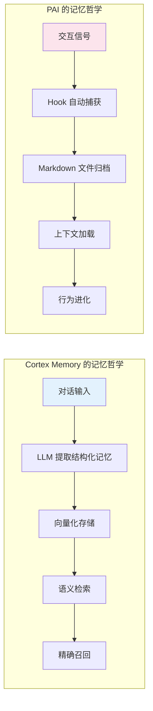
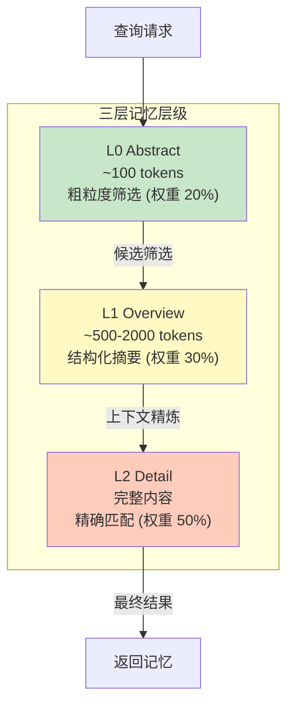
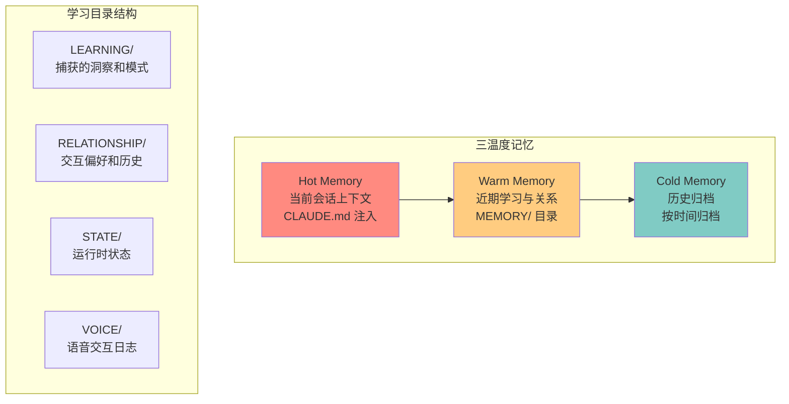
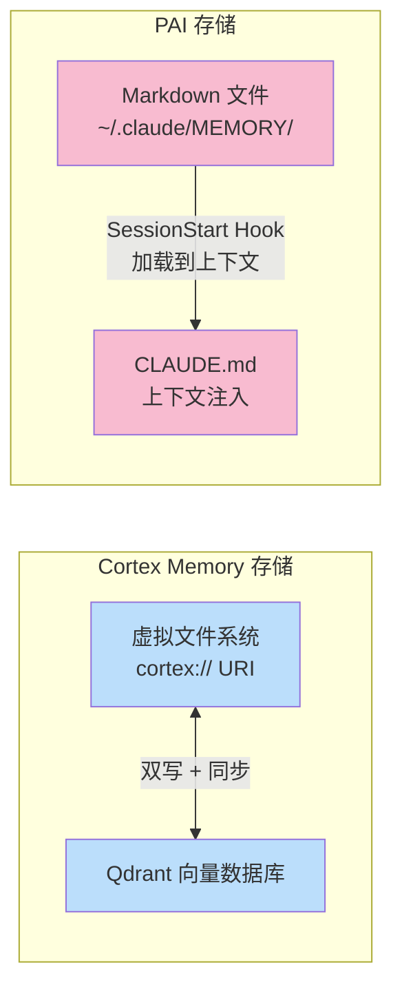
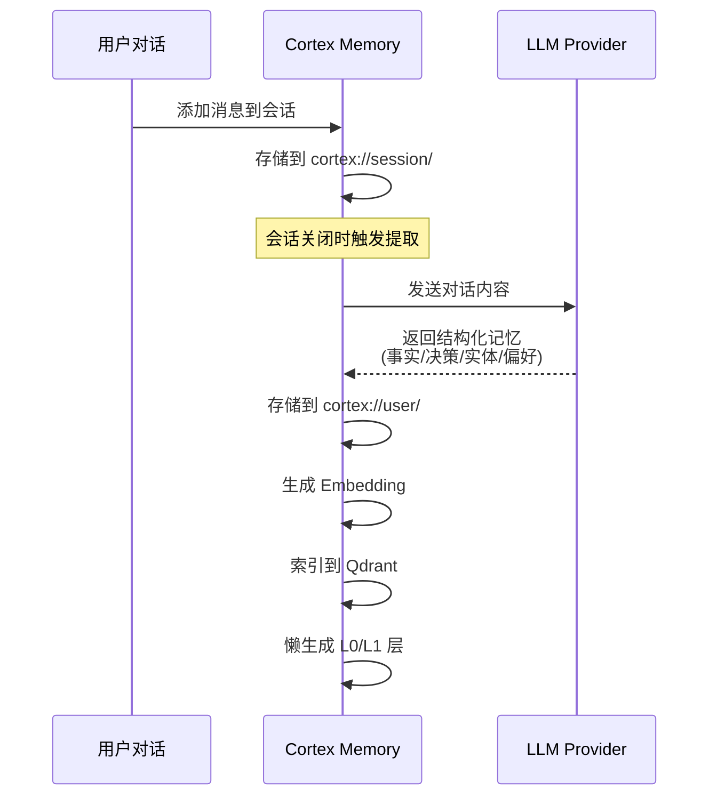
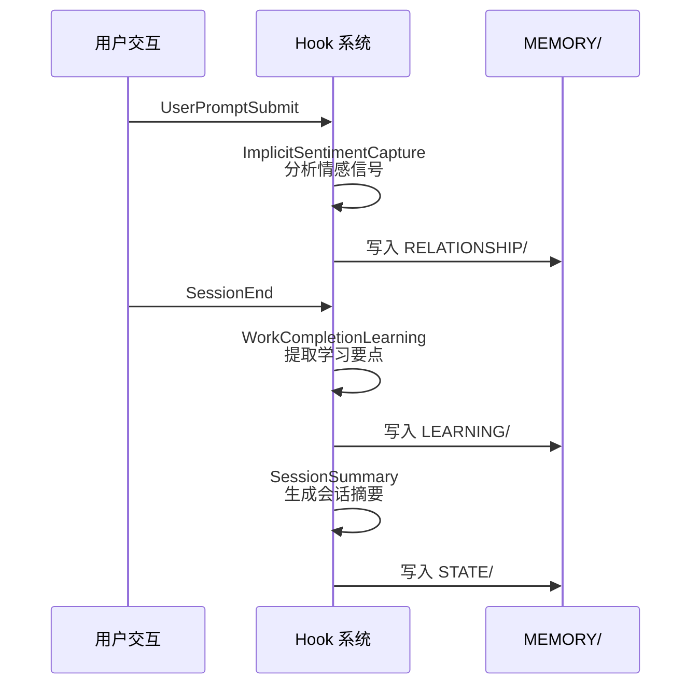
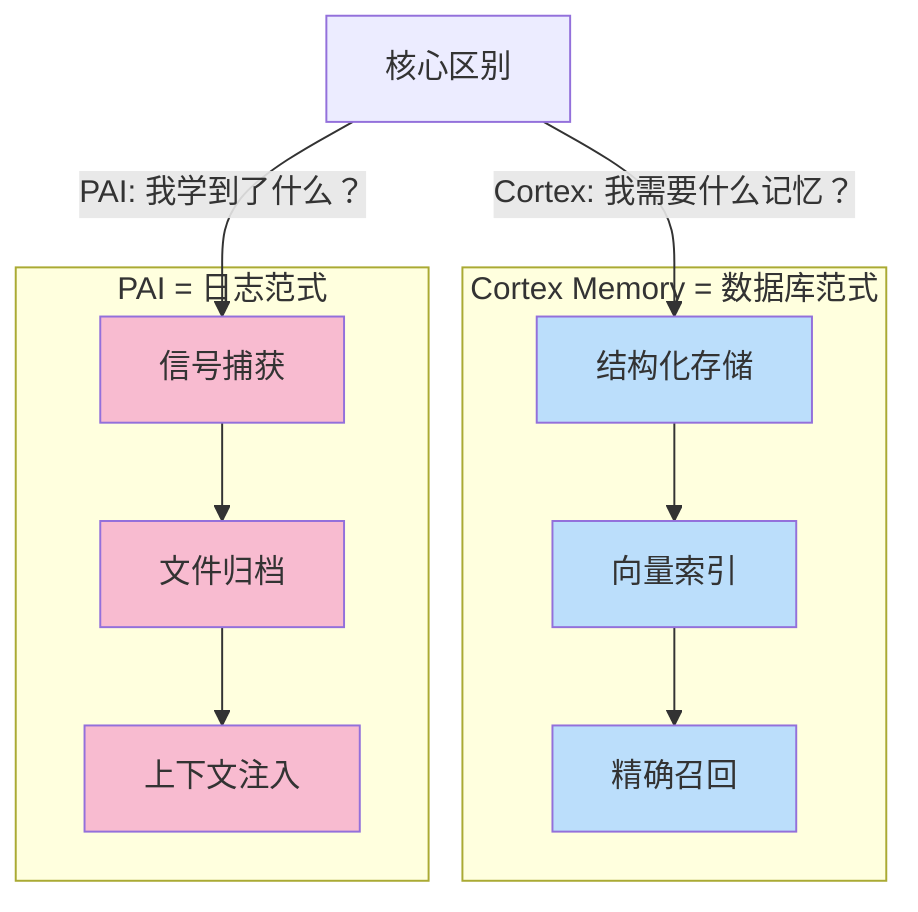

# 记忆系统设计对比：Cortex Memory vs PAI

> 对比维度：记忆的存储、组织、检索、学习机制

---

## 1. 设计哲学差异

| 维度 | Cortex Memory | PAI |
|------|--------------|-----|
| 核心定位 | 专用记忆引擎（Memory-as-a-Service） | 个人 AI 平台中的记忆子系统 |
| 设计目标 | 让任何 AI 应用拥有长期记忆 | 让 Claude Code 理解并记住"你" |
| 记忆粒度 | 结构化提取（事实、实体、偏好、事件） | 非结构化捕获（学习、情感、关系） |
| 数据主权 | 服务端集中存储（Qdrant + 文件系统） | 本地文件系统（~/.claude/MEMORY/） |



---

## 2. 记忆架构对比

### 2.1 Cortex Memory：三层记忆层级（L0/L1/L2）

Cortex Memory 的核心创新在于其**渐进式披露**（Progressive Disclosure）的三层架构，专为优化 LLM 上下文窗口而设计。



| 层级 | 用途 | Token 消耗 | 生成方式 |
|------|------|-----------|---------|
| L0 (Abstract) | 快速定位，粗筛候选 | ~100 | LLM 摘要，懒生成 |
| L1 (Overview) | 结构化摘要，关键实体 | ~500-2000 | LLM 提取，懒生成 |
| L2 (Detail) | 完整对话内容 | 可变 | 原始存储 |

搜索时通过**加权评分**（L0 20% + L1 30% + L2 50%）综合三层结果，并配合 **Cascade Layer Debouncer** 降低 70-90% 的层更新频率。

### 2.2 PAI：三温度记忆 + 阶段学习目录

PAI 的记忆系统更偏向**行为学习**而非信息检索。



PAI 的记忆由 Hook 系统驱动：

| Hook | 捕获内容 | 触发时机 |
|------|---------|---------|
| ExplicitRatingCapture | 用户显式评分 | UserPromptSubmit |
| ImplicitSentimentCapture | 隐式情感信号 | UserPromptSubmit |
| WorkCompletionLearning | 工作完成记录 | SessionEnd |
| SessionSummary | 会话摘要 | SessionEnd |
| AgentOutputCapture | Agent 输出记录 | SubagentStop |

---

## 3. 存储架构对比



### Cortex Memory 的 `cortex://` URI 体系

```
cortex://{dimension}/{scope}/{category}/{id}

维度：
  session/    - 会话记忆（时间线、对话历史）
  user/       - 用户记忆（偏好、实体、事件）
  agent/      - Agent 记忆（案例、技能）
  resources/  - 知识库资源
```

这是一套完整的**虚拟文件系统**，支持：
- 类 POSIX 的 read/write/list/delete 操作
- 与 Git 版本控制兼容
- 多租户隔离（tenant-aware collection naming）

### PAI 的目录结构

```
~/.claude/MEMORY/
  LEARNING/        - 学习洞察
  RELATIONSHIP/    - 交互偏好
  STATE/           - 运行时状态
  VOICE/           - 语音日志
```

PAI 直接使用本地文件系统，无虚拟层，也无向量搜索。记忆的检索依赖 Claude Code 自身读取 Markdown 文件的能力。

---

## 4. 记忆提取机制





### 核心差异

| 特性 | Cortex Memory | PAI |
|------|--------------|-----|
| 提取方式 | LLM 结构化分析（置信度评分） | Hook 脚本自动捕获 |
| 提取时机 | 会话关闭时批量提取 | 实时（每次交互） |
| 提取产物 | 类型化记忆对象（Fact/Entity/Preference/Event） | 非结构化 Markdown 条目 |
| 向量化 | 自动生成 Embedding + Qdrant 索引 | 无向量化 |
| 去重/合并 | 增量更新器 + 版本追踪 | 无自动去重 |

---

## 5. 记忆检索机制

```mermaid
graph TB
    subgraph "Cortex Memory 检索流程"
        Q1[自然语言查询] --> E1[生成查询 Embedding]
        E1 --> VS[Qdrant 向量搜索]
        VS --> W["加权评分<br/>L0(20%) + L1(30%) + L2(50%)"]
        W --> F1[元数据过滤<br/>dimension/scope/tenant]
        F1 --> R1[Top-K 结果 + 相关性评分]
    end

    subgraph "PAI 检索流程"
        Q2[新会话开始] --> HL[SessionStart Hook]
        HL --> LC[LoadContext.hook.ts]
        LC --> RF["读取 MEMORY/ 下<br/>最新文件"]
        RF --> INJ["注入为<br/>system-reminder"]
        INJ --> R2[Claude 自行关联]
    end

    style Q1 fill:#e3f2fd
    style Q2 fill:#fce4ec
```



| 特性 | Cortex Memory | PAI |
|------|--------------|-----|
| 检索方式 | 语义向量搜索（主动查询） | 上下文预加载（被动注入） |
| 精度控制 | min_score 阈值 + Top-K | 依赖 Claude 自身理解 |
| 跨会话 | 全量语义搜索 | 仅加载最近/相关文件 |
| 性能 | Qdrant 毫秒级响应 | 文件 I/O + 上下文窗口占用 |
| 多维度 | session/user/agent 维度过滤 | 目录分类（LEARNING/RELATIONSHIP） |

---

## 6. 总结：两种记忆范式



**Cortex Memory** 追求的是**记忆检索的精度和效率**——给定一个查询，以最少的 Token 消耗返回最相关的记忆。它是一个工程化的记忆数据库。

**PAI** 追求的是**行为的持续进化**——通过捕获每次交互的信号（评分、情感、成功/失败），让系统不断改进自身。它是一个学习反馈回路。

两者不矛盾，反而高度互补：PAI 缺少精确的语义检索能力，Cortex Memory 缺少行为学习和自我进化机制。
