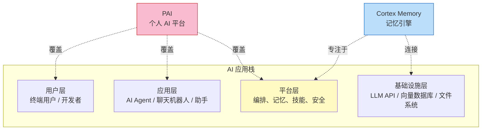
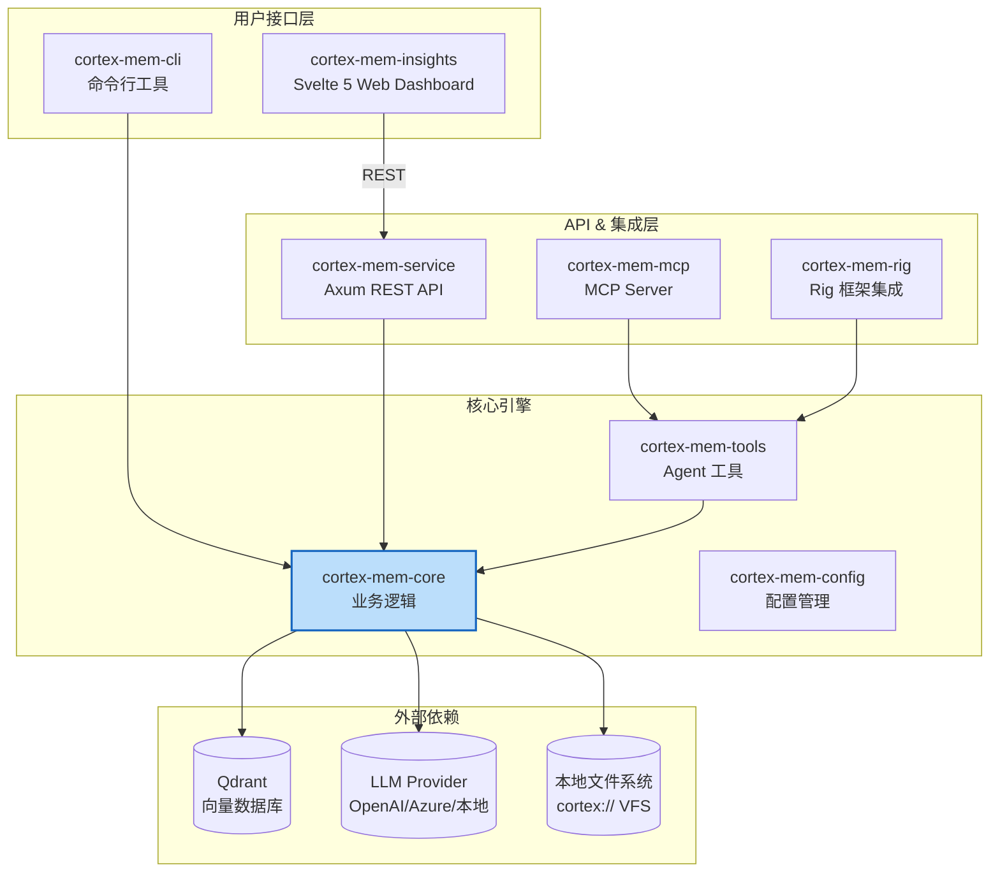
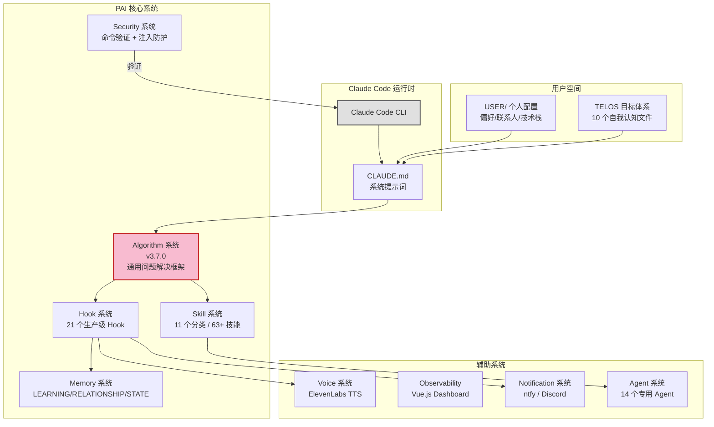
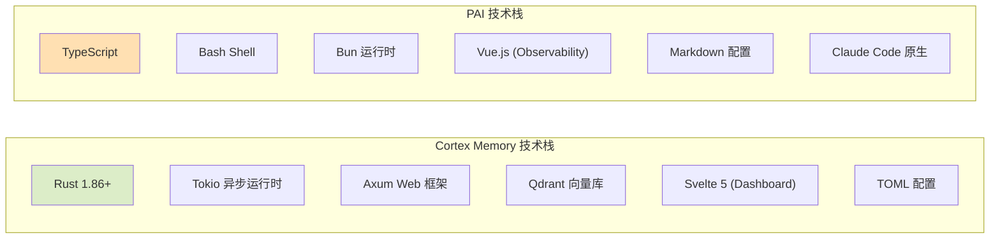
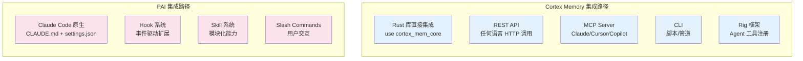
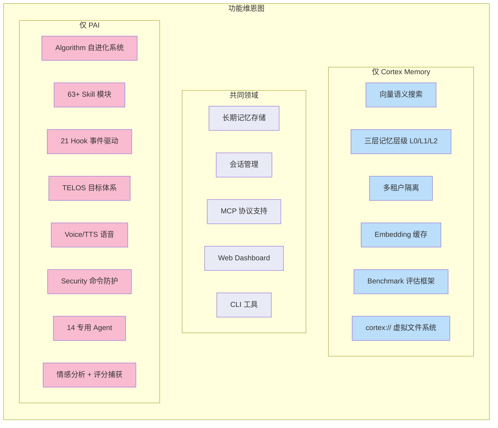
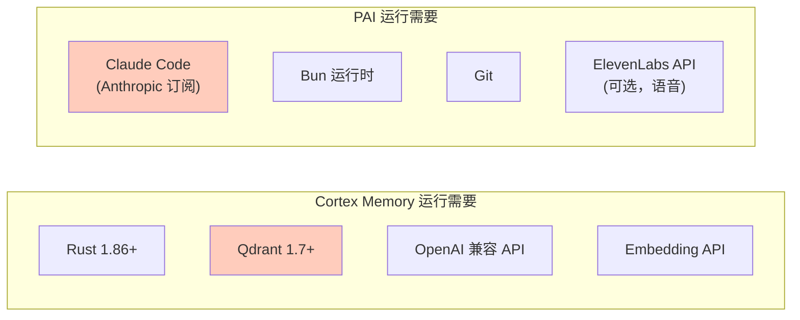
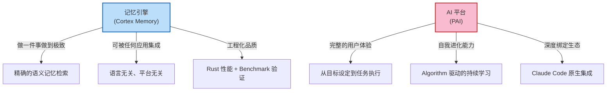

# 整体架构对比：Cortex Memory vs PAI

> 对比维度：系统定位、模块组成、技术栈、集成方式、生态成熟度

---

## 1. 项目定位全景

| 维度 | Cortex Memory | PAI |
|------|--------------|-----|
| 一句话定义 | AI 原生的长期记忆框架 | 个人 AI 基础设施平台 |
| 类比 | Redis/PostgreSQL（记忆专用） | 操作系统（AI 的 macOS） |
| 作者 | Sopaco（中国开发者/团队） | Daniel Miessler（安全专家） |
| 语言 | Rust | TypeScript + Bash |
| 版本 | v2.5.1 | v4.0.3 |
| 协议 | MIT | MIT |
| 运行方式 | 独立服务/库 | Claude Code 上层扩展 |
| 平台依赖 | 无（跨平台） | Claude Code（Anthropic 生态） |

---

## 2. 系统架构对比

### 2.1 Cortex Memory 架构

**8 个 Crate 组成的模块化 Workspace：**

| Crate | 职责 | 代码量级 |
|-------|------|---------|
| cortex-mem-core | 核心引擎：VFS、搜索、提取、会话、层级、自动化 | ~65 个 .rs 文件 |
| cortex-mem-service | Axum REST API 服务器 | ~15 个 .rs 文件 |
| cortex-mem-cli | 命令行管理工具 | ~11 个 .rs 文件 |
| cortex-mem-tools | MCP 工具定义和操作封装 | ~10 个 .rs 文件 |
| cortex-mem-mcp | MCP Server（stdio 传输） | 2 个 .rs 文件 |
| cortex-mem-rig | Rig 框架集成 | 2 个 .rs 文件 |
| cortex-mem-config | TOML 配置管理 | 1 个 .rs 文件 |
| cortex-mem-insights | Svelte 5 前端 Dashboard | 前端项目 |

### 2.2 PAI 架构

**PAI v4.0.3 组件清单：**

| 系统 | 规模 | 核心文件 |
|------|------|---------|
| Algorithm | v3.7.0，PAI 的"引力中心" | PAI/Algorithm/v3.7.0.md |
| Skills | 11 个分类（Research、Security、Telos 等） | skills/ 目录 |
| Hooks | 21 个生产级 Hook | hooks/*.hook.ts |
| Agents | 14 个专用 Agent（Architect、Engineer 等） | agents/*.md |
| Tools | 45+ TypeScript 工具脚本 | PAI/Tools/*.ts |
| Memory | 4 个子目录 | MEMORY/ |
| Voice | ElevenLabs TTS 服务 | VoiceServer/ |
| Security | 命令注入 + Prompt 注入防护 | PAISECURITYSYSTEM/ |

---

## 3. 技术栈对比

| 维度 | Cortex Memory | PAI |
|------|--------------|-----|
| 核心语言 | Rust | TypeScript + Bash |
| 运行时 | Tokio（异步） | Bun |
| Web 框架 | Axum | 无（依赖 Claude Code） |
| 前端 | Svelte 5 | Vue.js |
| 向量数据库 | Qdrant（必需） | 无 |
| LLM 集成 | OpenAI 兼容 API + Rig 框架 | Claude Code 内置 |
| 协议支持 | REST API / MCP / CLI / Rust lib | Claude Code Hooks / Slash Commands |
| 配置格式 | TOML | Markdown + JSON + YAML |
| 包管理 | Cargo (workspace) | Bun + npm |

---

## 4. 集成方式对比

| 特性 | Cortex Memory | PAI |
|------|--------------|-----|
| 语言无关 | 是（REST API） | 否（TypeScript/Bash） |
| LLM 无关 | 是（OpenAI 兼容接口） | 否（Claude Code 专属） |
| 可嵌入性 | 高（Rust crate / REST / MCP） | 低（绑定 Claude Code） |
| 多租户 | 原生支持 | 单用户设计 |
| 独立部署 | 是（独立二进制） | 否（需要 Claude Code） |

---

## 5. 功能范围对比

---

## 6. 生态与成熟度

| 维度 | Cortex Memory | PAI |
|------|--------------|-----|
| 开发阶段 | 功能完善，有 benchmark 验证 | 快速迭代，频繁 breaking changes |
| 发版节奏 | 稳定（v2.5.1） | 激进（2 个月内从 v2.3 到 v4.0.3） |
| 文档质量 | 优秀（中英双语，API 文档完整） | 良好（概念文档丰富，技术细节分散） |
| 测试覆盖 | 有单元测试 + benchmark 评估框架 | 以手动验证为主 |
| 社区 | 较小（GitHub Star 较新） | 活跃（Daniel Miessler 社区，30+ 社区贡献） |
| 平台支持 | 跨平台（Rust 编译） | macOS + Linux（无 Windows） |
| 示例应用 | Cortex TARS（TUI 聊天应用） | 内置于系统本身 |

---

## 7. 运行时依赖对比

**关键差异**：Cortex Memory 需要自建 Qdrant 向量数据库（运维成本），PAI 需要 Claude Code 订阅（费用成本）。

---

## 8. 总结：引擎 vs 平台

**Cortex Memory** 是一个遵循 UNIX 哲学的**专用工具**——做好"记忆"这一件事，通过标准接口让任何系统都能使用。

**PAI** 是一个以人为中心的**完整平台**——它不仅记忆，还理解目标、编排技能、捕获情感、驱动进化。但它深度绑定在 Claude Code 生态中。

两者的架构差异本质上反映了两种不同的产品思路：**基础设施 vs 应用平台**。
