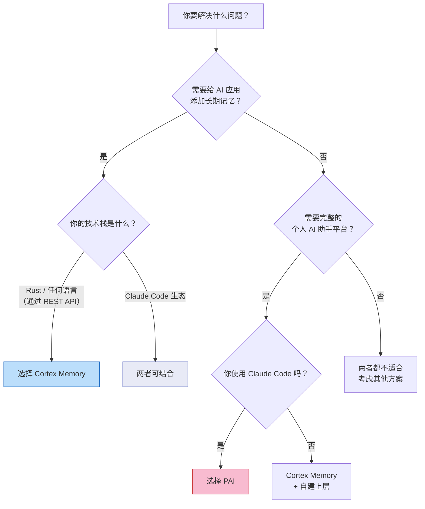
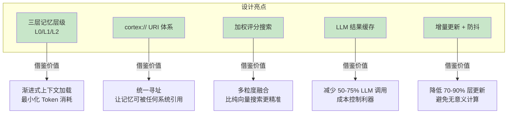
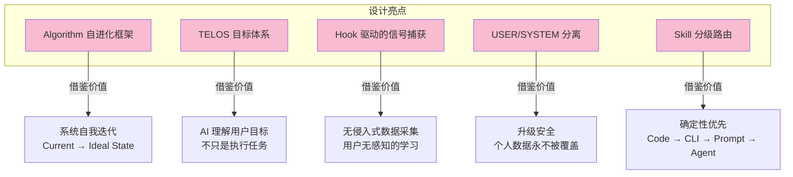
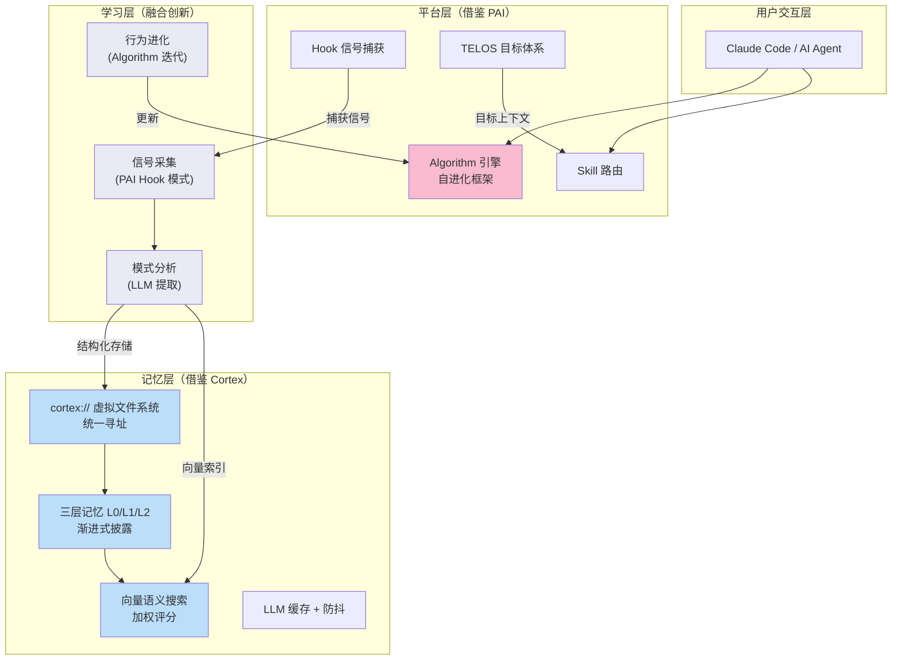
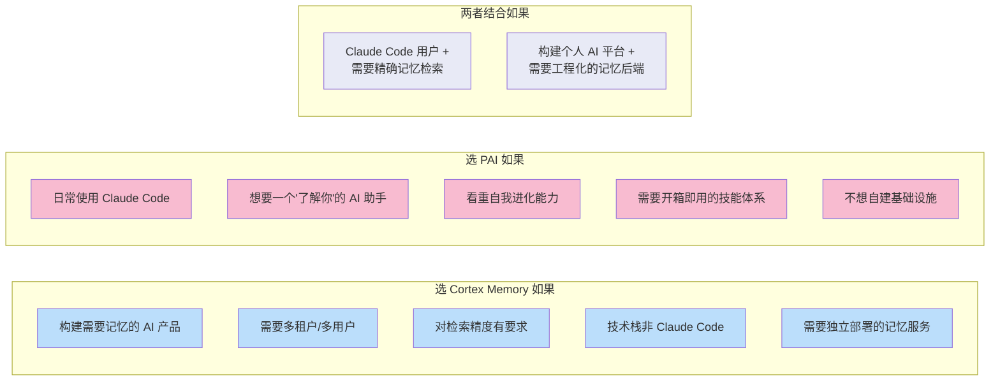

# 选型与借鉴建议：Cortex Memory vs PAI

> 对比维度：适用场景、选型决策、值得借鉴的设计模式、融合方案

---

## 1. 选型决策树



---

## 2. 场景匹配矩阵

| 场景 | Cortex Memory | PAI | 推荐 |
|------|:---:|:---:|------|
| 给聊天机器人加持久记忆 | **强** | 弱 | Cortex Memory |
| 构建多租户 AI SaaS | **强** | 不支持 | Cortex Memory |
| 个人 Claude Code 增强 | 中等 | **强** | PAI |
| AI Agent 的知识库后端 | **强** | 弱 | Cortex Memory |
| 自我进化的个人助手 | 弱 | **强** | PAI |
| 团队共享 AI 基础设施 | **强** | 弱 | Cortex Memory |
| 快速原型/低代码方案 | 弱 | **强** | PAI |
| 高性能/低延迟记忆检索 | **强** | 弱 | Cortex Memory |
| 目标管理 + AI 辅助 | 不支持 | **强** | PAI |
| 安全审计 + AI 工作流 | 弱 | **强** | PAI |

---

## 3. 各自的独特优势

### 3.1 Cortex Memory 值得借鉴的设计



#### 亮点 1：三层记忆层级（L0/L1/L2）

这是 Cortex Memory 最核心的创新。传统做法是把所有记忆扔进向量库然后搜索，Cortex 则为每条记忆生成三个抽象层级：

- **L0**（~100 tokens）：一句话摘要，用于快速筛选
- **L1**（~500-2000 tokens）：结构化概览，提取关键实体和要点
- **L2**：完整内容

搜索时三层加权融合，既保证召回率又控制 Token 消耗。Benchmark 显示 Recall@1 达到 93.33%，远超 LangMem 的 26.32%。

**借鉴建议**：任何需要从大量记忆中检索的系统，都应考虑这种"先粗后细"的分层策略。

#### 亮点 2：cortex:// 虚拟文件系统

统一的 URI 寻址方案（`cortex://{dimension}/{scope}/{category}/{id}`），让记忆可以像文件一样被寻址、浏览、版本管理。这比 key-value 或纯向量存储有更好的可观察性和可调试性。

#### 亮点 3：LLM 结果缓存 + 防抖

通过 LRU + TTL 缓存 LLM 结果减少 50-75% API 调用，通过 Cascade Layer Debouncer 减少 70-90% 层更新。这些优化对任何涉及 LLM 的系统都有参考价值。

---

### 3.2 PAI 值得借鉴的设计



#### 亮点 1：Algorithm 系统（自进化框架）

PAI 的核心是一个不断升级的"Algorithm"（当前 v3.7.0），定义了通用问题解决框架：

```
Current State → 定义 Ideal State → 迭代验证 → 学习 → 改进
```

系统可以：
- 修改自己的文档
- 更新 Skill 和工作流
- 基于累积证据改进 Algorithm 本身

这种"元学习"能力是 Cortex Memory 完全没有的。

#### 亮点 2：TELOS 目标体系

10 个自我认知文件（MISSION.md、GOALS.md、BELIEFS.md 等），让 AI 真正理解用户是谁、想要什么。这不是记忆，而是**身份**——记忆服务于身份。

#### 亮点 3：Hook 驱动的隐式学习

PAI 通过 Hook 无感知地捕获：
- 用户的显式评分
- 隐式情感信号（从用户消息中分析）
- 工作完成/失败模式

这让系统在用户无感知的情况下持续改进。

#### 亮点 4：USER/SYSTEM 分离

个人配置与系统代码严格分离，升级时用户数据不受影响。这个简单模式解决了一个核心问题：**如何让可升级的系统保持个性化**。

---

## 4. 融合方案设想

如果要构建一个兼具两者优势的系统，可以考虑以下架构：



### 融合要点

| 层次 | 借鉴来源 | 具体做法 |
|------|---------|---------|
| 记忆存储 | Cortex Memory | 采用 cortex:// VFS + Qdrant 双写架构 |
| 记忆检索 | Cortex Memory | 采用 L0/L1/L2 三层 + 加权评分 |
| 信号采集 | PAI | 通过 Hook 系统无感知捕获交互信号 |
| 目标理解 | PAI | 引入 TELOS 式的用户目标建模 |
| 自我进化 | PAI | 基于累积证据迭代系统行为 |
| 性能优化 | Cortex Memory | LLM 缓存 + 层更新防抖 |
| 配置管理 | PAI | USER/SYSTEM 分离，升级安全 |

---

## 5. 风险与注意事项

### Cortex Memory 的风险

| 风险 | 描述 | 缓解策略 |
|------|------|---------|
| Qdrant 运维 | 需要自建和维护向量数据库 | 考虑 Qdrant Cloud 或替代方案 |
| LLM 成本 | 提取 + Embedding 产生持续 API 费用 | 利用其缓存机制控制成本 |
| 生态较新 | 社区规模小，长期维护存疑 | 关注 GitHub 活跃度 |
| 过度工程 | 对简单场景可能过于复杂 | 评估是否真需要三层记忆 |

### PAI 的风险

| 风险 | 描述 | 缓解策略 |
|------|------|---------|
| 平台锁定 | 完全绑定 Claude Code | 接受，或抽象关键接口 |
| 迭代过快 | 2 个月 4 个大版本，breaking changes | 锁定版本，谨慎升级 |
| 复杂度膨胀 | 63 技能 + 21 Hook + 14 Agent | 按需启用，避免全量部署 |
| 记忆不精确 | 无向量搜索，依赖上下文注入 | 考虑引入 Cortex Memory 作为后端 |

---

## 6. 决策总结



### 一句话总结

> **Cortex Memory 解决"AI 如何精确记住信息"，PAI 解决"AI 如何理解并服务于你"。前者是大脑的海马体，后者是完整的前额叶皮层。最理想的方案是让 PAI 的学习回路驱动 Cortex Memory 的记忆引擎。**
