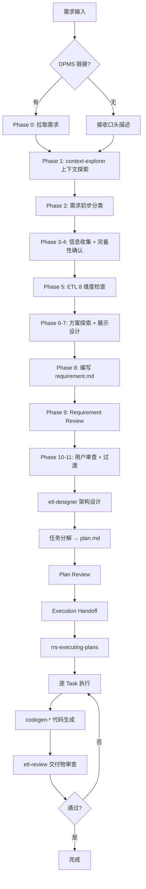
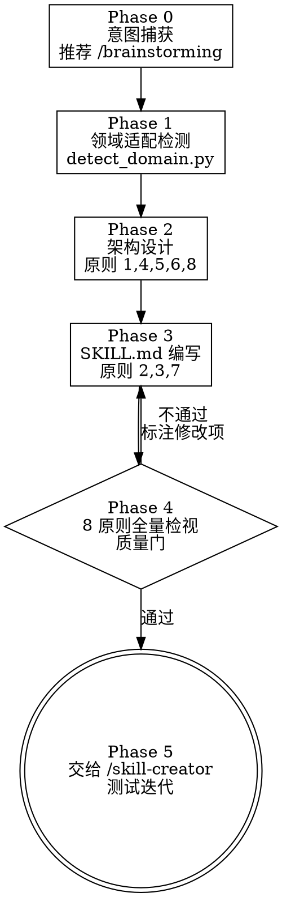

# RRS-ETL 插件全局指导手册 v3

> **版本**: 3.0
> **更新日期**: 2026-03-26
> **目标受众**: 新人培训、领导汇报
> **文档定位**: rrs-etl 插件的完整能力说明、三大核心流程对比与使用指南、Skill 设计能力

---

## 目录

- [1. 概述](#1-概述)
- [2. 三大核心流程：对比与选择](#2-三大核心流程对比与选择)
- [3. 流程一：sa-analysis 业务现状分析](#3-流程一sa-analysis-业务现状分析)
- [4. 流程二：etl-brainstorm 头脑风暴 + 完备开发](#4-流程二etl-brainstorm-头脑风暴--完备开发)
- [5. 流程三：etl-quick-dev 快速开发](#5-流程三etl-quick-dev-快速开发)
- [6. Skill 设计能力：data-dev-skill-creator](#6-skill-设计能力data-dev-skill-creator)
- [7. 支撑能力全景](#7-支撑能力全景)
- [8. 端到端开发链路示例](#8-端到端开发链路示例)
- [9. 质量保障体系](#9-质量保障体系)
- [10. 插件能力矩阵汇总](#10-插件能力矩阵汇总)
- [11. 常见陷阱与最佳实践](#11-常见陷阱与最佳实践)

---

## 1. 概述

### 1.1 插件定位

rrs-etl 是面向**监管报送数仓开发**的 Claude Code 插件，覆盖从需求分析到代码交付的全生命周期。

**技术栈**: Hive/Spark SQL + WTSS 调度 + Blanca 配置引擎

### 1.2 核心价值主张

```
┌──────────────────────────────────────────────────────────────────────────────────┐
│                              RRS-ETL 核心价值                                     │
├─────────────┬─────────────────┬─────────────────┬──────────────┬─────────────────┤
│  需求→代码   │   业务+技术      │   规范化驱动      │   质量闭环    │   能力沉淀       │
│  全链路覆盖   │   双重保障       │   参考已有写法     │   自动审查    │   重复→Skill     │
└─────────────┴─────────────────┴─────────────────┴──────────────┴─────────────────┘
```

### 1.3 能力规模

| 维度 | 数量 | 说明 |
|------|------|------|
| **Skills** | 31 | 覆盖分析、设计、生成、审查、探索全领域 + Skill 设计 |
| **Agents** | 9 | HQL/DDL/调度/DQC 四大领域设计+生成 |
| **Commands** | 5 | 需求分析 + 四类代码生成快捷入口 |

### 1.4 体系架构

```
┌──────────────────────────────────────────────────────────────────────┐
│                          用 户 层                                    │
│   sa-analysis │ etl-brainstorm │ etl-quick-dev │ /code-* commands   │
├──────────────────────────────────────────────────────────────────────┤
│                        设 计 层                                      │
│   context-explorer │ etl-designer │ rrs-executing-plans              │
├──────────────────────────────────────────────────────────────────────┤
│                      代码生成层                                      │
│   codegen-hql │ codegen-ddl │ codegen-scheduler │ codegen-blanca     │
├──────────────────────────────────────────────────────────────────────┤
│                      探索与检索层                                    │
│   kb-retriever │ table-dependency-analyzer │ table-script-finder     │
│   wtss-developer │ wtss-dependency-analyzer │ hive-data-profiling    │
├──────────────────────────────────────────────────────────────────────┤
│                      质量与交付层                                    │
│   etl-review │ rrs-git-commit │ dpms-devtools-browser                │
├──────────────────────────────────────────────────────────────────────┤
│                      能力沉淀层                                      │
│   data-dev-skill-creator → /skill-creator（测试迭代）                │
└──────────────────────────────────────────────────────────────────────┘
```

---

## 2. 三大核心流程：对比与选择

### 2.1 一张图看懂：什么时候用哪个流程

```
                        用户需求到来
                            │
                ┌───────────┼───────────┐
                ▼           ▼           ▼
         需求启动前       需求模糊      需求明确
         摸清现状        需要澄清       可直接做
                │           │           │
                ▼           ▼           ▼
          sa-analysis   etl-brainstorm  etl-quick-dev
          (业务分析)    (完备开发)       (快速开发)
                │           │           │
                ▼           ▼           ▼
          考虑点报告    requirement.md   直接产出代码
          (给SA/领导)   → plan.md       (含审查)
                        → 代码 → 审查
```

### 2.2 三流程对比矩阵

| 对比维度 | sa-analysis | etl-brainstorm | etl-quick-dev |
|---------|-------------|----------------|---------------|
| **目标** | 理解现状、评估影响 | 从模糊到清晰，全链路交付 | 快速完成明确需求 |
| **受众** | SA / 业务方 / 领导 | 开发人员 | 开发人员 |
| **输入** | 表名 / 业务场景 / DPMS | 模糊需求 / DPMS | 明确需求 / DPMS |
| **输出** | 业务分析报告 | requirement.md → plan.md → 代码 | 代码 + 审查报告 |
| **产出代码** | 否 | 是 | 是 |
| **需求文档** | 否 | 是（requirement.md） | 否 |
| **架构设计** | 否 | 是（plan.md + finding.md） | 否（动态任务拆解） |
| **流程阶段** | 5 Phase | 11 Phase + 设计 + 执行 | 6 Phase |
| **适合改动规模** | — | 大型 / 跨模块 | 1-5 文件 |
| **输出语言** | 业务语言 | 技术 + 业务 | 技术语言 |
| **典型耗时** | 短 | 长 | 中 |
| **核心约束** | 不产出代码方案 | 必须先探索再设计再编码 | 复杂度超限则熔断 |

### 2.3 流程选择决策树

```
Q1: 你的目标是什么？
├─ "了解现状 / 评估影响 / 给SA梳理考虑点"
│   → sa-analysis
│
├─ "完成一个开发需求"
│   └─ Q2: 需求是否清晰？改动范围是否可控？
│       ├─ 需求模糊 / 全新模块 / 跨多模块
│       │   → etl-brainstorm
│       │
│       └─ 需求明确 / 加字段 / 改逻辑 / ≤5 文件
│           → etl-quick-dev
│               └─ 执行中发现超出范围？
│                   → 熔断，切换 etl-brainstorm
```

---

## 3. 流程一：sa-analysis 业务现状分析

### 3.1 定位与适用

**一句话概括**: 在需求启动前，帮 SA 或领导快速摸清业务现状、影响范围和考虑点。

**触发词**: "帮我做业务分析"、"现状分析"、"考虑点"、"影响评估"

**关键特征**:
- 面向 SA / 非技术角色，输出使用**业务语言**
- 只分析、不产出代码和技术方案
- 超出分析范围的问题，建议找开发介入

### 3.2 流程全景（5 Phase）

```
Phase 0            Phase 1              Phase 2              Phase 3           Phase 4
需求获取    →    上下文探索      →    现状与变更摘要    →    考虑点分析    →    报告生成
                                                                              (可选)
│                │                    │                    │                  │
├ DPMS拉取       ├ context-explorer   ├ 转化为业务语言     ├ 触发式维度       ├ 用户说
│ 或口头描述     │  业务层(S1)        ├ 描述各表现状       │  逐项分析        │ "生成报告"
│                │  数据层(S2)        ├ 提炼变更意图       ├ 不确定→问SA      │  才触发
└ 明确分析对象   │  调度层(S3)        └ SA确认→下一步      └ 结构化清单       └ 标准模板
  (阻塞门控)     └ 三层顺序执行        偏差→回退Phase1                         输出
```

### 3.3 核心原则

| 原则 | 说明 |
|------|------|
| **业务语言优先** | 所有输出默认业务语言，技术细节不主动展开 |
| **context-explorer 优先** | 业务口径、血缘、调度统一通过 context-explorer 完成，禁止绕过 |
| **不确定必问** | 理解不确定的信息必须先与 SA 澄清 |
| **回答存疑则回退** | SA 的回答引出新的不一致时，主动回退补充探索 |
| **超出范围找开发** | 深入代码或方案设计的问题，明确告知需开发介入 |

### 3.4 与其他流程的衔接

```
sa-analysis 产出"考虑点报告"
    │
    ├─ SA确认可以开始开发 → 需求清晰？
    │   ├─ 是 → etl-quick-dev
    │   └─ 否 → etl-brainstorm
    │
    └─ 仅作信息梳理，不进入开发
```

---

## 4. 流程二：etl-brainstorm 头脑风暴 + 完备开发

### 4.1 定位与适用

**一句话概括**: 将模糊需求打磨为结构化需求文档，经架构设计后逐任务生成代码，最终自动审查。

**触发词**: "让我们讨论一下"、"帮我想想怎么做"、"头脑风暴"、"这个需求比较复杂"

**适用场景**:
- 需求模糊、需要大量业务澄清
- 全新业务模块搭建、跨多模块改动
- 需要完整需求文档和技术方案留档

**不适用场景**: 加字段、改逻辑、小范围改造 → 使用 etl-quick-dev

### 4.2 全链路流程图



### 4.3 etl-brainstorm 阶段详解（11 Phase）

#### Phase 0：DPMS 需求获取
- 检测 `dpms.weoa.com` URL → 调用 `dpms-devtools-browser` 拉取
- 拉取内容作为后续所有阶段的已知上下文

#### Phase 1：上下文探索（HARD GATE）
- **必须**加载 `context-explorer` skill
- 业务层(S1) → 数据层(S2) → 调度层(S3) 逐层探索
- 展示探索结果摘要，确认无遗漏后才能进入下一阶段
- **约束**: 在此阶段完成前，不能跳过直接进入后续 Phase

#### Phase 2：需求初步分类
- 数据加工类 vs 功能类
- 初步识别子需求，不要求精确边界

#### Phase 3-4：信息收集与完备性确认
- **自我澄清优先**：先查知识库和代码，再问用户
- 逐项确认字段口径，多轮对话
- 完备性 4 项检查：数据源 / 加工逻辑 / 输出目标 / 调度影响

#### Phase 5：ETL 8 维度检查

| # | 维度 | 检查内容 |
|---|------|---------|
| 1 | 数据源 | 上游表、外部系统 |
| 2 | 加工逻辑 | 字段映射、JOIN、过滤 |
| 3 | 数据结构 | 表变更、分区策略 |
| 4 | 增量处理 | CDC、历史数据对比 |
| 5 | 数据质量 | DQC 规则、校验阈值 |
| 6 | 调度依赖 | WTSS Job、信号、依赖链 |
| 7 | 权限与安全 | 表权限、数据脱敏 |
| 8 | 监控与告警 | 运行监控、异常告警 |

#### Phase 6-7：方案探索与展示
- 提出 2-3 种方案，含权衡和推荐
- 按章节逐步展示（需求背景 → 现状分析 → 方案对比 → 推荐方案 → 风险评估）
- 每章节获用户确认后推进

#### Phase 8：编写需求文档
- 输出 `requirement.md` 到 `docs/{version}/{requirement_id}/`
- **严禁**在需求文档中包含 SQL 代码

#### Phase 9：Requirement Review Loop
- 派发 reviewer subagent 检索知识库
- 验证字段口径一致性，补充遗漏信息

#### Phase 10-11：用户审查与过渡
- 用户确认后引导进入 `etl-designer` 架构设计

### 4.4 etl-designer 架构设计（5 Phase）

```
Phase 1           Phase 2           Phase 3           Phase 4         Phase 5
需求理解    →    血缘分析    →    任务分解    →    Plan Review →   领域设计路由
与分类                                                              + Execution
                                                                    Handoff
│                │                │                │               │
├ 读requirement  ├ table-dep      ├ 拆为独立Task   ├ 依赖合理?     ├ HQL→codegen-hql
├ 区分类型       │  -analyzer     ├ Step/Files/    ├ 路径具体?     ├ DDL→codegen-ddl
└ 识别技术维度   ├ table-script   │  Dependencies  ├ 有遗漏?       ├ 调度→codegen-scheduler
                 │  -finder       └ ≤30 Task       └ 回退Phase3    ├ DQC→codegen-blanca
                 └ 理解血缘                         或通过          └ 写plan.md+finding.md
```

**领域设计路由**:

| 领域 | 设计Agent | 加载的 Reference |
|------|----------|-----------------|
| HQL/ETL 加工 | architecture-script-task-agent | 字段映射、JOIN/过滤、CTE性能、Blanca场景判断 |
| DDL/DML 脚本 | architecture-ddl-agent | 表结构设计、脚本模板、风险评估 |
| WTSS 调度 | architecture-scheduler-agent | 依赖分析、命名设计、Flow编排 |
| DQC 校验 | architecture-dqc-agent | 一般性校验、Blanca DQC配置、指标/指标组校验 |

### 4.5 rrs-executing-plans 执行引擎

```
读取 plan.md → 逐 Task 派发对应 generator agent → 代码生成 → 自动触发 etl-review
```

- 支持内联执行和 Subagent 并行执行两种模式
- 每个 Task 对应一个 generator agent（etl-hql-generator / script-generator / wtss-job-generator / blanca-config-generator）
- 4 个回退点保障执行质量

---

## 5. 流程三：etl-quick-dev 快速开发

### 5.1 定位与适用

**一句话概括**: 需求明确时跳过重量级设计文档，直接分析→任务拆解→逐Task执行→审查。

**触发词**: "快速开发"、"直接写代码"、"这个需求很简单直接做吧"

**适用**: 加字段、改逻辑、小范围表改造（≤5 文件）
**不适用**: 全新模块、跨多模块、需求模糊 → 使用 etl-brainstorm

### 5.2 流程详解（6 Phase）

```
Phase 0          Phase 1-2            Phase 3           Phase 4-5
DPMS获取  →    快速分析+澄清    →    任务拆解    →    逐Task执行+审查
                                                       │
│               │                    │                  ├ Step 1: 查找参考
├ 有链接→拉取   ├ 按需调skill探索     ├ 动态生成Task    ├ Step 2: 详细设计
├ 无→跳过       ├ 确定性原则澄清     ├ 每Task独立      ├ Step 3: 生成代码
└ 阻塞门控      ├ 发现矛盾→挑战     └ 用户确认        ├ Step 4: 验证
                └ 复杂度熔断判断                        ├ Step 5: 提交
                  →可能切换brainstorm                   └ 全部完成→etl-review
```

### 5.3 核心机制

| 机制 | 说明 |
|------|------|
| **确定性原则** | 不确定必问、确定不问。能从代码/知识库确认的不浪费用户时间 |
| **复杂度熔断** | 发现超出快速开发范围时，主动建议切换到 etl-brainstorm |
| **参考驱动** | 每个 Task 必须先查找参考实现（table-script-finder + kb-retriever），不得凭空编写 |
| **自动审查** | 全部 Task 完成后自动加载 etl-review 审查交付物 |

### 5.4 与 etl-brainstorm 的关键区别

| 维度 | etl-quick-dev | etl-brainstorm |
|------|---------------|----------------|
| 需求文档 | **不产出** requirement.md | 必须产出 requirement.md |
| 设计文档 | **不产出** plan.md | 必须产出 plan.md + finding.md |
| 任务拆解 | 动态生成，轻量级 | 通过 etl-designer 系统化拆解 |
| 探索深度 | 按需调用，快速摸底 | context-explorer 全量三层探索 |
| 审查 | 相同（etl-review） | 相同（etl-review） |
| 安全网 | 复杂度熔断→切换brainstorm | — |

---

## 6. Skill 设计能力：data-dev-skill-creator

### 6.1 定位与核心价值

**一句话概括**: 团队的**能力沉淀引擎**——将日常重复工作流固化为高质量 Skill，8 条设计原则驱动，通用核心 + 领域适配。

三大流程解决"怎么用 AI 做事"，data-dev-skill-creator 解决"**怎么让 AI 越来越懂我们的项目**"。它不直接参与开发，而是把开发中沉淀的经验、踩过的坑、重复的流程，转化为可复用的 Skill，反哺整个团队。

```
┌─────────────────────────────────────────────────────────────────┐
│                        能力沉淀闭环                              │
│                                                                 │
│   日常开发                     能力沉淀                          │
│   ┌──────────┐   发现重复   ┌──────────────────┐                │
│   │sa-analysis│──────────→ │ /brainstorming    │                │
│   │brainstorm │   模式      │  想清楚做什么      │                │
│   │quick-dev  │             └────────┬─────────┘                │
│   └─────▲────┘                      │                           │
│         │                           ▼                           │
│   新 Skill             ┌──────────────────────┐                 │
│   反哺三大流程          │ data-dev-skill-creator│                 │
│         │              │  怎么做成高质量 Skill  │                 │
│         │              └────────┬─────────────┘                 │
│         │                      │                                │
│         │                      ▼                                │
│         │              ┌──────────────────┐                     │
│         └──────────────│ /skill-creator   │                     │
│                        │  测试/迭代/打包   │                     │
│                        └──────────────────┘                     │
└─────────────────────────────────────────────────────────────────┘
```

**触发词**: "写个 skill"、"把这个流程做成 skill"、"优化这个 skill"（上下文涉及数据开发即触发）

### 6.2 为什么 Brainstorming 是关键起点

data-dev-skill-creator 的 Phase 0 强调：**意图不清晰时，先执行 `/brainstorming`，不在信息缺失时硬猜需求**。这不是一个可选步骤，而是保证 Skill 质量的关键前提。

**Brainstorming 的核心价值**：将模糊的"我想做个 XXX"变成结构化的设计方案。AI 通过**逐个问题澄清** → **提出多种方案** → **逐章确认**的方式，帮用户想清楚三个关键问题：

1. **Skill 要解决什么痛点？**（场景 + 触发时机）
2. **需要考虑哪些维度？**（评估框架 + 关键检查项）
3. **如何与现有能力协作？**（生态定位 + 复用策略）

#### 实际案例：EAST 新产品接入 Skill

以下是团队中一个 SA 同学使用 `/brainstorming` 设计 east-onboarding skill 的真实过程：

**起点**：SA 同学只有一个模糊想法——"建一个针对 EAST 新产品接入的 skill"。

**Brainstorming 帮助澄清的过程**：

```
┌─ Q1: 主要使用场景？                    → 全流程支持（不只是评估）
├─ Q2: 核心价值是什么？                   → 综合平衡（标准化 + 自动化 + 风险管控）
├─ Q3: 上游评估模板给谁用？               → 协作式（业务方填写 → 技术团队补充）
├─ Q4: 评估模板需要哪些维度？             → 业务属性 + 数据需求 + 时效要求 + 历史与影响
├─ Q5: 内部评估需要哪些内容？             → 工作量评估 + 验证策略 + 影响范围 + 排期规划
└─ Q6: 代码库探索的目的？                 → 影响分析 + 参考借鉴（兼顾）
```

**Brainstorming 提出的 3 种方案**：

| 方案 | 结构 | 优点 | 缺点 |
|------|------|------|------|
| A. 单一 Skill + 多阶段 | 一个 skill，5 个 Phase | 流程连贯，团队熟悉 | 文件可能过大 |
| B. 主 Skill + 子 Skill | 主 skill 编排 + 3 个子 skill | 模块化可复用 | 接口设计复杂 |
| C. 分阶段独立 Skill | 3 个独立 skill，按需调用 | 最大灵活性 | 流程不连贯 |

**最终选择方案 A**（先快速落地，后续按需拆分），形成 5 Phase 完整设计：

```
Phase 0              Phase 1              Phase 2              Phase 3              Phase 4
业务需求收集    →    技术补充评估    →    代码库探索      →    开发节奏评估    →    输出报告
(上游评估模板)       (5个技术维度)        (影响分析+参考)       (工作量+验证+排期)    (评估报告+开发计划)
│                    │                    │                    │                    │
├ 业务类型            ├ 数据来源可行性      ├ context-explorer    ├ 工作量估算模型      ├ 执行摘要
├ 数据需求            ├ 技术实现复杂度      │  三层探索           │  简单/中等/复杂     ├ 决策建议
├ 时效要求            ├ WTSS调度评估       ├ 表级影响分析        ├ 验证策略            │  准入评估
├ 历史与影响          ├ 历史数据处理        ├ 调度级影响分析      │  开发自测→联调→     ├ 风险管控矩阵
└ 协作式填写          └ 风险与约束         └ 代码复用分析        │  准生产→生产       └ 排期里程碑
  (业务方→技术团队)     (kb-retriever辅助)    (血缘+可参考脚本)    └ 排期规划
                                                                  关键路径+阻塞点
```

#### Brainstorming 帮助 SA 同学澄清的关键维度

这个案例展示了 brainstorming 帮助用户系统化思考的几个关键维度，对 SA 同学尤其有价值：

| 维度类别 | 关键考虑点 | 为什么容易遗漏 |
|---------|-----------|---------------|
| **业务评估** | 业务类型、数据来源、字段清单、更新频率 | SA 熟悉业务但可能忽略技术侧的数据需求 |
| **时效与历史** | 报送频率(T+1/T+0)、SLA、是否回溯历史 | 历史数据处理往往在开发中期才暴露 |
| **技术可行性** | 来源表是否存在、分区策略、跨库关联、特殊处理 | 不探索代码库就无法评估真实复杂度 |
| **影响范围** | 表级影响（血缘下游）、调度级影响（Job 依赖链） | 仅看直接影响会低估连带影响 |
| **工作量模型** | HQL 开发 + WTSS 配置 + 测试，按复杂度分级 | 缺乏基准容易拍脑袋估时间 |
| **验证策略** | 测试分层（自测→联调→准生产→生产）、回滚预案 | 往往只想到"测一下"，没有分层计划 |
| **风险管控** | 数据质量/性能/依赖/时间四类风险 + 变更窗口 | 风险识别需要系统化框架，零散思考容易遗漏 |

**核心启示**：SA 同学在做方案评估时，brainstorming 扮演的是"**结构化思维助手**"的角色——它不替你做决策，但帮你确保**没有遗漏关键维度**、**没有跳过必要的澄清**、**方案有清晰的对比和取舍**。

### 6.3 全局流程（Phase 0-5）



**各 Phase 说明**:

- **Phase 0 意图捕获** — 检查场景、目标、约束三要素是否清晰。**推荐先执行 `/brainstorming`**（如上述 EAST 案例所示），通过逐个问题澄清、多方案对比、逐章确认，将模糊想法变成结构化设计输入。已有 brainstorming 产出可直接复用；信息不足时不硬猜需求
- **Phase 1 领域适配检测** — 运行 `detect_domain.py` 自动扫描项目特征，匹配领域适配器（如 `rrs-etl.md`）。确认后注入领域检查清单和编码约束；无匹配则使用通用流程
- **Phase 2 架构设计** — 4 步逐层推进：Description 草稿 → 文件树规划 → 协作关系表 → 步骤定义 + digraph 草稿。每步完成后向用户呈现，确认后再推进
- **Phase 3 SKILL.md 编写** — 填充内容，三条原则指导：删除模型已知的通用知识（原则 2）、构建真实踩坑 Gotchas（原则 3）、确定性操作脚本化（原则 7）
- **Phase 4 8 原则全量检视** — 质量门，逐条 pass/fail。全部通过才能进入 Phase 5，fail 项标注修改后回 Phase 3 重检
- **Phase 5 交给 /skill-creator** — 输出交接摘要（名称、目录、设计要点、领域适配情况、测试建议），后续测试迭代打包由 `/skill-creator` 负责

### 6.4 8 条设计原则速览

| # | 层级 | 原则 | 一句话要点 |
|---|------|------|-----------|
| 1 | 内容层 | Description 写触发时机 | 回答"什么时候用"而非"这是什么"，包含口语化触发表述 |
| 2 | 内容层 | 不陈述显而易见的事 | 只写项目特有上下文和易错点，删掉后模型仍能执行的段落就是多余 |
| 3 | 内容层 | Gotchas 信号最强 | 每条来自真实踩坑，不是假想边界；暂无则留空占位 |
| 4 | 结构层 | 文件系统 + 渐进式披露 | SKILL.md ≤500 行，特定分支内容放 references/，重复操作放 scripts/ |
| 5 | 结构层 | 生态定位 | 创建前盘点已有能力，输出协作关系表，避免重叠触发冲突 |
| 6 | 结构层 | 约束目标不约束路径 | 用 why 替代 MUST/NEVER，让模型理解动机后自主选择实现方式 |
| 7 | 高级技术层 | 给代码不给文档 | 确定性操作脚本化，模板放 references/ 或 scripts/，不内嵌散文 |
| 8 | 高级技术层 | 状态机 digraph | 流程超 3 步用 dot 语法 digraph，让模型精确知道当前状态和跳转条件 |

### 6.5 领域适配机制

```
┌─────────────────────────────────┐
│       通用核心（SKILL.md）        │
│  Phase 0-5 + 8 原则驱动流程      │
├─────────────────────────────────┤
│       领域适配层（references/）    │
│  domain-adapters/rrs-etl.md     │
│  domain-adapters/xxx.md  ...    │
└─────────────────────────────────┘
```

**通用核心**技术栈无关，8 条原则贯穿全流程。**领域适配层**隔离团队特有的检测信号、维度检查清单、现有能力速查表和编码约束。

**rrs-etl 适配器**是第一个参考实现，包含：
- 检测信号（目录结构 / 文件后缀 / CLAUDE.md 关键词，含置信度标注）
- 8 维度领域检查清单
- 现有 Skill 速查表（创建前确认是否已覆盖）
- 领域编码约束（Hive/WTSS/Blanca 规范）

**创建新适配器**: 运行 `scripts/init_adapter.py --name <domain-name>` 生成骨架文件，参考 `rrs-etl.md` 格式填充，放入 `references/domain-adapters/` 即可被自动发现。

### 6.6 与其他流程的协作

```
┌─────────────────────────────────────────────────────────────────────────────────┐
│                            完整协作链路                                          │
│                                                                                 │
│   ① 发现重复模式          ② Brainstorming             ③ Skill 设计              │
│   ┌──────────────┐       ┌───────────────────┐       ┌────────────────────┐     │
│   │ 开发者在日常  │  →    │ /brainstorming    │  →    │ data-dev-skill-    │     │
│   │ 使用三大流程  │       │ 逐步澄清意图       │       │ creator            │     │
│   │ 中识别出     │       │ 多方案对比         │       │ Phase 0-4          │     │
│   │ 重复工作流   │       │ 逐章确认设计       │       │ 8 原则驱动设计     │     │
│   └──────────────┘       └───────────────────┘       └─────────┬──────────┘     │
│                                                                │                │
│   ⑤ 新 Skill 反哺         ④ 测试迭代                          │                │
│   ┌──────────────┐       ┌───────────────────┐                │                │
│   │ sa-analysis  │  ←    │ /skill-creator    │  ←─────────────┘                │
│   │ brainstorm   │       │ 测试/迭代/打包     │                                 │
│   │ quick-dev    │       │ 描述优化           │                                 │
│   │ 自动触发新Skill│       └───────────────────┘                                 │
│   └──────────────┘                                                              │
└─────────────────────────────────────────────────────────────────────────────────┘
```

**关键协作边界**:

| 能力 | 关系 | 边界 |
|------|------|------|
| `/brainstorming` | 前置推荐 | brainstorming 管"想清楚做什么"——澄清场景、维度、方案取舍；data-dev-skill-creator 管"怎么做成高质量 skill" |
| `/skill-creator` | 后置交接 | 本 skill 产出 SKILL.md 初稿，skill-creator 管测试/迭代/打包 |
| 三大流程 | 消费方 + 需求来源 | 三大流程使用 skill 也催生 skill——在使用中发现重复模式，触发新 skill 的创建 |

### 6.7 端到端示例

**示例 1：血缘影响分析 Skill**（开发同学视角）

开发者发现每次做血缘分析都重复同样的步骤——查上游、查下游、找脚本、画影响链——决定固化为 skill。

```
Phase 0 意图捕获
  "我想把血缘影响分析固化为 skill，每次改表前能一键分析影响面"
  → 三要素确认：场景=改表前影响评估 / 目标=输出影响链报告 / 约束=复用现有 API
                                        │
Phase 1 领域适配检测                      │
  detect_domain.py 扫描项目 → 匹配 rrs-etl 适配器
  确认启用 → 加载 rrs-etl 领域检查清单
                                        │
Phase 2 架构设计                          │
  ├ Description: "分析表变更的影响范围... 当用户说'改这个表会影响什么'时触发"
  ├ 文件结构: SKILL.md + references/impact-template.md + scripts/trace_lineage.py
  ├ 生态定位: 调用 table-dependency-analyzer，与 sa-analysis 并行独立
  └ 流程设计: 3 步 digraph（输入→血缘追溯→影响报告）
                                        │
Phase 3 SKILL.md 编写                     │
  ├ 只写项目特有上下文（API 调用方式、影响链判定规则）
  ├ Gotchas: "视图不在 API 返回中，需 grep 兜底"
  └ trace_lineage.py 封装重复的 API 调用逻辑
                                        │
Phase 4 8 原则检视                        │
  逐条检查 → 全 pass
                                        │
Phase 5 交接                              │
  输出摘要 → 用户执行 /skill-creator      │
  测试迭代 → 发布                         ▼
                                  新 skill 上线，三大流程可调用
```

**示例 2：EAST 新产品接入评估 Skill**（SA 同学视角，真实案例）

SA 同学有一个模糊需求——"建立一个 EAST 新产品接入的全流程评估 skill"。通过 `/brainstorming` 的逐步引导：

```
Brainstorming 阶段（Phase 0 前置）
  ├ 6 轮问答澄清：使用场景 → 核心价值 → 模板受众 → 评估维度 → 评估内容 → 探索目的
  ├ 3 种方案对比：单一 Skill / 主+子 Skill / 分阶段独立 Skill
  ├ 选择方案 A（单一 Skill + 多阶段），5 章逐章确认设计
  └ 产出：完整的 5 Phase 设计方案，覆盖——
     │
     ├ Phase 0 业务需求收集（上游协作式评估模板）
     │  4 个维度：业务属性 / 数据需求 / 时效要求 / 历史与影响
     │
     ├ Phase 1 技术补充评估（5 个技术维度）
     │  来源可行性 / 实现复杂度 / WTSS调度 / 历史数据处理 / 风险与约束
     │
     ├ Phase 2 代码库探索（复用 context-explorer）
     │  表级影响分析 / 调度级影响分析 / 代码复用分析
     │
     ├ Phase 3 开发节奏评估
     │  工作量模型（简单2天/中等7天/复杂15天）
     │  验证策略（自测→联调→准生产→生产）/ 排期规划 / 风险管控
     │
     └ Phase 4 输出评估报告
        执行摘要 + 准入评估（1-5 分打分）+ 决策建议 + 关键路径
                                        │
Phase 0-5 data-dev-skill-creator         │
  基于 brainstorming 产出，按 8 原则设计 SKILL.md
                                        │
/skill-creator 测试迭代                   │
  测试 → 优化 → 发布                      ▼
                                  SA 同学每次接到新产品接入需求，
                                  直接调用 east-onboarding skill，
                                  不再遗漏关键评估维度

---

## 7. 支撑能力全景

### 7.1 上下文探索引擎（context-explorer）

三大流程共用的**统一探索引擎**，避免分散调用导致上下文碎片化。

**状态机**:

```
S0 需求解析 → S1 业务层 → S2 数据层 → S3 调度层 → S4 链式检查 → S5 输出
                                                      │
                                               发现新表/新依赖
                                               → 回溯S1/S2/S3
```

| 层级 | 目标 | 调用的 Sub-skill | 副作用 |
|------|------|-----------------|--------|
| S1 业务层 | 业务口径、字段结构、编码规范 | kb-retriever | 发现关联表→追加到探索列表 |
| S2 数据层 | 上游血缘、现有加工脚本 | table-dependency-analyzer + table-script-finder | 发现未知表→触发回溯 |
| S3 调度层 | 目录结构、Flow 层级、作业依赖 | wtss-developer + wtss-dependency-analyzer | 依赖链中未探索表→触发回溯 |

**执行顺序固定**: 业务层 → 数据层 → 调度层（前层结果收窄后层查询范围）

**链式触发规则**: 维表/码表仅执行 S1 | 一度上游触发链式 | 二度以上仅记录

### 7.2 知识库检索（kb-retriever）

**渐进式检索**，避免整文件加载浪费 Token。

```
定位知识库根目录 → 分层查看目录索引 → Grep 定位 + Read 局部读取 → 多轮迭代（≤5次）→ 答案溯源
```

### 7.3 表与任务依赖分析体系

| Skill | 功能 | 典型场景 |
|-------|------|---------|
| **table-dependency-analyzer** | API 查询表上下游血缘 | 追溯表的数据来源 |
| **table-script-finder** | 定位表的 HQL 脚本和 WTSS 节点 | 查看现有加工逻辑 |
| **table-dependency-scanner** | 批量扫描多表血缘 | 大规模影响评估 |
| **table-dependency-job-analyzer** | 查询表被哪些 Job 使用 | 评估改表影响 |
| **job-dependency-path-analyzer** | 两个 Job 间的完整依赖路径 | 调度链路排查 |
| **module-dependency-analyzer** | 模块内/间依赖分析 | 跨模块影响评估 |
| **wtss-dependency-analyzer** | Job 上下游依赖（API + 本地解析） | 调度依赖分析 |

### 7.4 WTSS 调度开发（wtss-developer）

**核心规则**: "目录即 Flow"

**三文件模式**:
```
{module}/
├── {xxx}.job           ← Flow 入口，声明外部依赖（EventChecker/DataChecker）
├── {xxx}_flow.job      ← 聚合 Job，dependencies 串联内部任务
└── {xxx}_etl.job       ← 实际执行 Job，command 指向 HQL/Blanca
```

**信号放置规则**: 顶层 Flow 入口（最常见）> 子 Flow 入口 > 具体 Job（极少见）

### 7.5 数据探查（hive-data-profiling）

生成生产环境数据探查脚本，快速了解表的数据量级、分布和质量概况。

### 7.6 DPMS 需求交互

| Skill | 技术方案 | 功能 |
|-------|---------|------|
| dpms-devtools-browser | Chrome DevTools Protocol | 拉需求、发评论、流转阶段 |
| dpms-agent-browser | agent-browser 无头浏览器 | 8步标准化需求拉取 |

### 7.7 文档与知识管理

| Skill | 功能 |
|-------|------|
| **wiki-generator** | 从0到1生成完整数仓 Wiki 文档 |
| **wiki-improvement** | 6种场景的 Wiki 增量更新 |
| **knowledge-base-reader** | 渐进式加载 knowledge_base 文档章节 |

---

## 8. 端到端开发链路示例

### 8.1 场景 A：新增报表字段（小需求 → etl-quick-dev）

```
用户: "在 rpt_xxx 表里加一个 total_amount 字段，来源是 ods_xxx 的 amt 字段"
                                        │
                                        ▼
Phase 0: 无 DPMS 链接，跳过
                                        │
Phase 1-2: 快速分析                      │
  ├ kb-retriever → 查 rpt_xxx 业务口径   │
  ├ table-script-finder → 定位现有 HQL   │
  └ 确认: 需加 DDL + 改 HQL + 改调度?    │
                                        │
Phase 3: 任务拆解                        │
  ├ Task 1: DDL — ALTER TABLE ADD COLUMN │
  ├ Task 2: HQL — 加字段映射             │
  └ Task 3: 调度 — 确认无需改动          │
                                        │
Phase 4-5: 逐 Task 执行                  │
  ├ 查找参考 → 加载 codegen-* → 生成代码  │
  └ etl-review 自动审查 → 通过           │
                                        ▼
                                  交付完成
```

### 8.2 场景 B：新业务模块（大需求 → etl-brainstorm）

```
用户: "我们要新建一个反洗钱相关的指标加工模块"
                                        │
                                        ▼
Phase 0: DPMS 拉取需求 ──────────────────│
Phase 1: context-explorer 全量探索       │
Phase 2-5: 需求分类 → 信息收集 → 8维度   │
Phase 6-7: 2-3 种方案对比 → 推荐方案     │
Phase 8: 输出 requirement.md             │
Phase 9: Requirement Review              │
Phase 10-11: 用户确认                    │
                                        │
etl-designer 架构设计 ───────────────────│
  ├ 血缘分析                             │
  ├ 任务分解 → 15 Tasks                  │
  ├ Plan Review 通过                     │
  └ 输出 plan.md + finding.md            │
                                        │
rrs-executing-plans ─────────────────────│
  ├ Task 1-5: HQL 生成                  │
  ├ Task 6-8: DDL 生成                  │
  ├ Task 9-12: WTSS Job 生成             │
  ├ Task 13-15: DQC 配置                 │
  └ 全部完成                             │
                                        │
etl-review 审查 10 维度 ─────────────────│
  ├ 脚本组: HQL业务+规范+DDL+HQL↔DDL    │
  ├ 调度组: Job+Blanca+跨产物一致性       │
  └ 全局组: 命名与路径                    │
                                        ▼
                                  审查通过，交付
```

### 8.3 场景 C：SA 问"改这个表会影响什么"（→ sa-analysis）

```
SA: "如果我们要调整 ods_trade 的 trade_type 字段含义，影响面有多大？"
                                        │
                                        ▼
Phase 0: 明确分析对象 = ods_trade.trade_type
                                        │
Phase 1: context-explorer                │
  ├ S1: kb-retriever 查 trade_type 业务口径
  ├ S2: table-dependency-analyzer 查下游  │
  └ S3: wtss-dependency-analyzer 查调度链 │
                                        │
Phase 2: 现状摘要（业务语言）             │
  "trade_type 当前含义是...              │
   被 3 张中间层表引用...                 │
   最终影响 2 个报表..."                  │
                                        │
Phase 3: 考虑点分析                      │
  ├ 下游 3 张表需同步修改口径             │
  ├ 报表 A 的校验规则需更新               │
  ├ 需与数据源系统确认字段变更范围         │
  └ 建议分批上线，先改中间层再改报表       │
                                        │
Phase 4: SA 说"生成报告" → 输出分析报告  │
                                        ▼
                                  报告交付给领导
```

---

## 9. 质量保障体系

### 9.1 etl-review 交付物审查

**两种触发模式**:
- **模式 A**: rrs-executing-plans / etl-quick-dev 完成后**自动触发**（基于 plan.md）
- **模式 B**: 用户指定目录或文件列表进行**独立审查**

### 9.2 审查维度总表（10 维度）

| # | 维度 | 前提条件 | 检查内容 |
|---|------|---------|---------|
| 1 | HQL 业务逻辑 | HQL 存在 | JOIN 粒度/数据膨胀、CASE WHEN 兜底、SQL 完整性 |
| 2 | HQL 规范验证 | HQL 存在 | 语法、字段映射、规范、性能 |
| 3 | DDL 验证 | DDL 存在 | 字段一致性、分区策略、命名、回退方案 |
| 4 | Blanca 验证 | Blanca 存在 | 结构完整性、插件正确性、参数格式 |
| 5 | Job 验证 | Job 存在 | 依赖存在性、循环依赖、层级合理性、格式 |
| 6 | HQL↔DDL 一致性 | HQL + DDL | 表名、字段、分区对齐 |
| 7 | HQL↔Blanca 一致性 | HQL + Blanca | 路径、变量、引擎、表名对齐 |
| 8 | Blanca↔Job 一致性 | Blanca + Job | conf 路径、类型、日期参数对齐 |
| 9 | Job↔血缘 一致性 | Job 存在 | 依赖顺序与数据血缘方向一致 |
| 10 | 命名与路径 | 任何产物 | 文件命名、存放路径合规 |

### 9.3 自适应分组策略

```
适用维度 ≤ 3 → 内联执行（不派发 subagent）
适用维度 > 3 → 按产物亲和性分组：
  ├ 脚本组: HQL 业务 + HQL 规范 + DDL + HQL↔DDL
  ├ 调度组: Job + Blanca + Blanca↔Job + HQL↔Blanca + Job↔血缘
  └ 全局组: 命名与路径
```

### 9.4 严重程度定义

| 级别 | 含义 | 处理方式 |
|------|------|---------|
| **FAIL** | 阻断性问题，必须修复 | 回退修复后重新审查 |
| **WARNING** | 潜在风险，建议修复 | 评估后决定 |
| **PASS** | 检查通过 | — |
| **SKIP** | 前提条件不满足，跳过 | — |

---

## 10. 插件能力矩阵汇总

### 10.1 Skills 完整清单（按功能域分类）

#### 核心流程 Skills（3 个）

| Skill | 功能 | 输入 | 输出 |
|-------|------|------|------|
| **sa-analysis** | 业务现状分析 | 表名/场景/DPMS | 考虑点报告 |
| **etl-brainstorm** | 需求分析与头脑风暴 | 模糊需求/DPMS | requirement.md |
| **etl-quick-dev** | 快速开发 | 明确需求 | 代码 + 审查报告 |

#### 设计与执行 Skills（3 个）

| Skill | 功能 |
|-------|------|
| **context-explorer** | 统一上下文探索引擎（业务+血缘+调度三层） |
| **etl-designer** | 架构设计器（任务分解 → plan.md） |
| **rrs-executing-plans** | 按 plan.md 逐 Task 执行 |

#### 代码生成 Skills（4 个）

| Skill | 生成物 |
|-------|--------|
| **codegen-hql** | Hive 加工脚本 |
| **codegen-ddl** | DDL/DML 脚本 |
| **codegen-scheduler** | WTSS Job 配置文件 |
| **codegen-blanca** | Blanca .conf 配置文件 |

#### 知识库与元数据检索 Skills（2 个）

| Skill | 功能 |
|-------|------|
| **kb-retriever** | 本地知识库渐进式检索 |
| **knowledge-base-reader** | 按需加载 knowledge_base 文档章节 |

#### 表与任务依赖分析 Skills（7 个）

| Skill | 功能 |
|-------|------|
| **table-dependency-analyzer** | 表级上下游血缘（API） |
| **table-script-finder** | 表→HQL脚本+WTSS节点定位 |
| **table-dependency-scanner** | 批量多表血缘扫描 |
| **table-dependency-job-analyzer** | 表在哪些 Job 中使用 |
| **job-dependency-path-analyzer** | 两 Job 间完整依赖路径 |
| **module-dependency-analyzer** | 模块内/间依赖分析 |
| **wtss-dependency-analyzer** | Job 上下游依赖分析 |

#### 调度与数据工具 Skills（3 个）

| Skill | 功能 |
|-------|------|
| **wtss-developer** | WTSS 调度开发（目录结构+Job创建+信号规则） |
| **hive-data-profiling** | Hive 生产数据探查脚本生成 |
| **dpms-devtools-browser** | DPMS 需求交互（拉取/评论/流转） |

#### 文档与知识管理 Skills（3 个）

| Skill | 功能 |
|-------|------|
| **wiki-generator** | 从0到1生成数仓 Wiki |
| **wiki-improvement** | Wiki 增量更新（6种场景） |
| **dpms-agent-browser** | DPMS 需求拉取（agent-browser） |

#### 质量与交付 Skills（2 个）

| Skill | 功能 |
|-------|------|
| **etl-review** | 交付物一致性审查（10维度） |
| **rrs-git-commit** | ETL 场景智能 Git Commit |

#### 元 Skills（3 个）

| Skill | 功能 |
|-------|------|
| **orchestrator-principal** | 方案设计/架构设计/方案评审的架构师角色 |
| **data-dev-skill-creator** | 为数据开发项目创建高质量的 Skill（8 原则驱动 + 领域适配） |
| **claudemd-init** | 分析仓库自动生成 CLAUDE.md |

### 10.2 Agents 完整清单（9 个）

| Agent | 角色 | 被谁调用 |
|-------|------|---------|
| **requirement-analyst** | 需求分析 | etl-brainstorm |
| **architecture-script-task-agent** | HQL/Blanca 详细设计 | etl-designer |
| **architecture-ddl-agent** | DDL/DML 详细设计 | etl-designer |
| **architecture-scheduler-agent** | WTSS 调度设计 | etl-designer |
| **architecture-dqc-agent** | DQC 数据质量设计 | etl-designer |
| **etl-hql-generator** | HQL 脚本生成 | rrs-executing-plans / /code-hql |
| **script-generator** | DDL/DML 脚本生成 | rrs-executing-plans / /code-script |
| **wtss-job-generator** | WTSS Job 生成 | rrs-executing-plans / /code-wtss |
| **blanca-config-generator** | Blanca 配置生成 | rrs-executing-plans / /code-blanca |

### 10.3 Commands

所有命令已合并到对应的 Skill 和 Agent 中，通过流程自动调用，无需手动使用命令入口。

---

## 11. 常见陷阱与最佳实践

### 11.1 高频陷阱速查表

| 类别 | 陷阱 | 影响 | 防范措施 |
|------|------|------|---------|
| **需求阶段** | 自我澄清被跳过 | 不必要的多轮对话 | 优先查知识库和代码，再问用户 |
| | 参考对象可能有 bug | 错误逻辑被复制 | 验证参考表逻辑本身是否正确 |
| | DPMS 评论区未读取 | 遗漏最新需求变更 | 优先读评论区，正文可能过时 |
| | 需求附件被忽略 | 缺少字段映射表 | 必须解析附件 |
| | 需求文档包含 SQL | 业务表达不清 | 严禁在 requirement.md 中包含代码 |
| **探索阶段** | 跳过 context-explorer | 上下文碎片化 | brainstorm 和 sa-analysis 必须先走 explorer |
| | Wiki 文档未同步更新 | 字段口径不准 | 以代码（HQL）为准，Wiki 仅作参考 |
| | 血缘 API 超时 | 上游表截断 | 缩小 depth 或分批查询 |
| | 视图/临时表不在 API 中 | 血缘断链 | 用 table-script-finder grep 兜底 |
| **调度阶段** | 调度维度被遗漏 | 缺少 WTSS Job 变更 | 主动确认"是否涉及调度变更" |
| | 用表名模糊搜索 WTSS | 优先命中 DQC 节点 | 用 HQL 文件名反查 WTSS |
| | 跳过 wtss-developer | 无法判断搜索结果优先级 | 必须先建立目录心智模型 |
| | 信号放错层级 | 信号链断裂 | 新增信号前先用 wtss-developer 探索 |
| | 忘记更新父 _flow.job | 新 Job 不被调度 | 检查父 Flow 的 dependencies |
| **代码阶段** | LEFT JOIN 后未做空值处理 | 下游校验失败 | 使用 COALESCE/NVL |
| | 分区裁剪失效 | 性能问题 | WHERE 中避免对分区字段做函数转换 |
| | CASE WHEN 缺 ELSE | 未匹配变 NULL | 始终添加 ELSE 兜底 |
| | ALTER ADD COLUMNS 改类型 | 类型修改失败 | 改类型必须重建表 |
| | ORC 表删列后旧分区保留旧 schema | 查询错位 | 警惕旧分区问题 |
| | delete_days_ago 配错 | 分区被误删 | 上线前必须确认 |
| | DML 缺回退方案 | 高频问题 | 始终提供回退方案 |
| **DQC 阶段** | CMN INSERT 前未 DELETE | 校验重复执行 | 先 DELETE 再 INSERT |
| | 指标组 GROUP BY 缺分区字段 | 数据混淆 | 检查 GROUP BY 字段 |
| | 波动校验无基线 | 新表首次上线报警 | 设初始阈值 |

### 11.2 最佳实践

#### 开发准则

1. **项目中已有的写法就是最好的规范** — 必须用 `table-script-finder` 查找同类参考，不得凭空编写
2. **修改处必须注释** — `-- {版本号} {需求编号} 修改说明`
3. **不确定必问，确定不问** — 绝不擅自假设，也不浪费用户时间
4. **发现矛盾直接挑战** — 发现逻辑矛盾、潜在风险、更优方案时直接提出

#### 流程准则

1. **选对流程比做对事情更重要** — 先用决策树判断该走哪个流程
2. **context-explorer 是起点** — brainstorm 和 sa-analysis 必须先走 context-explorer
3. **复杂度感知** — quick-dev 发现超出范围时果断熔断切换
4. **审查不可跳过** — etl-review 是质量的最后一道防线

#### 交付准则

1. **代码生成后必须验证** — 按 codegen-* 的验证清单逐项检查
2. **跨产物一致性** — HQL↔DDL↔Blanca↔Job 必须交叉验证
3. **回退方案** — DML 操作始终提供回退方案
4. **信号与依赖** — 新增/修改 Job 后检查父 Flow 和信号链

#### 能力沉淀准则

1. **重复即信号** — 同一工作流手动执行超过 3 次，考虑固化为 Skill
2. **先设计后实现** — 使用 data-dev-skill-creator 走完 Phase 0-4 再交给 /skill-creator，不要直接写 SKILL.md
3. **生态优先** — 创建新 Skill 前必须盘点已有能力，避免重叠冲突
4. **真实验证** — 测试 prompt 用真实表名、路径、业务场景，不用抽象描述

---

## 附录 A：术语表

| 术语 | 含义 |
|------|------|
| **WTSS** | 调度系统（Workflow Task Scheduling System） |
| **Blanca** | 配置驱动的数据加工引擎 |
| **DQC** | 数据质量校验（Data Quality Check） |
| **DPMS** | 需求管理系统 |
| **Flow** | WTSS 中的任务流，对应目录结构 |
| **EventChecker** | WTSS 信号检查节点（SEND/RECEIVE） |
| **DataChecker** | WTSS 数据就绪检查节点 |
| **CDC** | 变更数据捕获（Change Data Capture） |
| **CMN** | 数据质量校验配置表 |
| **SA** | 系统分析师（System Analyst） |
| **bdp** | 数据加工脚本目录 |
| **plan.md** | 任务分解与执行计划文档 |
| **finding.md** | 发现的问题与待澄清项文档 |
| **requirement.md** | 结构化需求文档 |

## 附录 B：Skill 调用关系图

```
                           ┌─────────────────┐
                           │   sa-analysis    │
                           └────────┬────────┘
                                    │
                           ┌────────▼────────┐
              ┌────────────┤ context-explorer ├────────────┐
              │            └────────┬────────┘            │
              │                     │                     │
     ┌────────▼──────┐    ┌────────▼──────┐    ┌─────────▼─────┐
     │  kb-retriever  │    │ table-dep-    │    │ wtss-developer │
     │               │    │  analyzer     │    │               │
     └───────────────┘    └───────┬───────┘    └───────┬───────┘
                                  │                     │
                          ┌───────▼───────┐    ┌───────▼───────┐
                          │ table-script- │    │ wtss-dep-     │
                          │  finder       │    │  analyzer     │
                          └───────────────┘    └───────────────┘

                           ┌─────────────────┐
                           │ etl-brainstorm   │
                           └────────┬────────┘
                                    │
                           ┌────────▼────────┐
                           │ context-explorer │  (同上调用链)
                           └────────┬────────┘
                                    │
                           ┌────────▼────────┐
                           │  etl-designer   │
                           └────────┬────────┘
                                    │
              ┌─────────────────────┼─────────────────────┐
              │                     │                     │
     ┌────────▼──────┐    ┌────────▼──────┐    ┌─────────▼─────┐
     │ arch-script   │    │ arch-ddl      │    │ arch-scheduler │
     │  -task-agent  │    │  -agent       │    │  -agent        │
     └───────────────┘    └───────────────┘    └───────────────┘
              │                                         │
              ▼                                         ▼
     ┌────────────────┐                       ┌─────────────────┐
     │ arch-dqc-agent │                       │rrs-executing-   │
     └────────────────┘                       │  plans          │
                                              └────────┬────────┘
                                                       │
              ┌────────────────┬───────────────┬───────┴────────┐
              │                │               │                │
     ┌────────▼──────┐ ┌──────▼──────┐ ┌──────▼─────┐ ┌───────▼──────┐
     │ etl-hql-      │ │ script-     │ │ wtss-job-  │ │ blanca-conf- │
     │  generator    │ │  generator  │ │  generator │ │  generator   │
     └───────────────┘ └─────────────┘ └────────────┘ └──────────────┘
              │                │               │                │
              └────────────────┴───────────────┴────────────────┘
                                       │
                              ┌────────▼────────┐
                              │   etl-review    │
                              └─────────────────┘

                    ┌───────────────────────────────┐
                    │    data-dev-skill-creator      │
                    │    (能力沉淀闭环)               │
                    └───────────────┬───────────────┘
                                    │
                    ┌───────────────▼───────────────┐
                    │      /skill-creator           │
                    │   (测试/迭代/打包)              │
                    └───────────────┬───────────────┘
                                    │
                                    ▼
                          新 Skill 融入上述流程
```
