# AI Agent Skills 深度解析

> **Superpowers + VoltAgent 底层原理与实践**
> 从 Skill 触发机制到多代理编排架构的完整技术剖析

---

## 目录

1. [两大框架全景对比](#1-两大框架全景对比)
2. [原理一：CSO 触发机制 (Claude Search Optimization)](#2-原理一cso-触发机制)
3. [原理二：Skill 编排管线 — 线性工作流 + 条件分支](#3-原理二skill-编排管线)
4. [原理三：四层子代理派遣架构与上下文隔离](#4-原理三四层子代理派遣架构)
5. [原理四：两阶段审查管线 — 做对事 vs 把事做对](#5-原理四两阶段审查管线)
6. [原理五：TDD 强制执行 — Rigid Discipline Skill](#6-原理五tdd-强制执行)
7. [原理六：Hook 系统与 Git Worktree 隔离](#7-原理六hook-系统与-git-worktree-隔离)
8. [VoltAgent 原理一：Agent .md 结构与加载机制](#8-voltagent-原理一agent-md-结构与加载机制)
9. [VoltAgent 原理二：Prompt Engineering 模式分析](#9-voltagent-原理二prompt-engineering-模式分析)
10. [VoltAgent 原理三：元编排层 — 多代理协调架构](#10-voltagent-原理三元编排层)
11. [框架演进：Superpowers 关键设计决策](#11-框架演进superpowers-关键设计决策)
12. [实践：安装部署与使用场景](#12-实践安装部署与使用场景)
13. [总结：六大核心架构原则](#13-总结六大核心架构原则)

---

## 1. 两大框架全景对比

### 1.1 定位差异

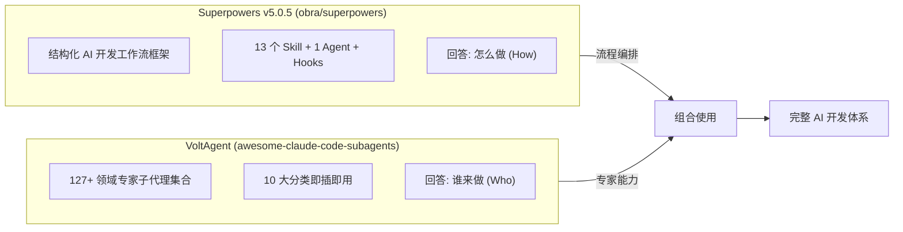

### 1.2 核心能力矩阵

| 维度 | Superpowers | VoltAgent Subagents |
|------|-------------|---------------------|
| **定位** | 开发工作流框架（流程骨架） | 领域专家代理集合（专业执行者） |
| **粒度** | Skill（流程步骤） | Agent（专业角色） |
| **数量** | 13 Skill + 1 Agent + Hooks + 3 Commands(已弃用) | 127+ Agent，10 大分类 |
| **核心能力** | CSO 自动触发、子代理隔离派遣、两阶段审查、TDD 强制执行 | 专业化 Prompt 模板、工具权限按角色分配、元编排代理协调 |
| **侧重** | 怎么做（How）— 流程纪律 | 谁来做（Who）— 领域专家 |
| **互补方式** | `subagent-driven-dev` 中可调度 VoltAgent 代理 | 被 Superpowers 工作流编排使用 |

### 1.3 互补架构

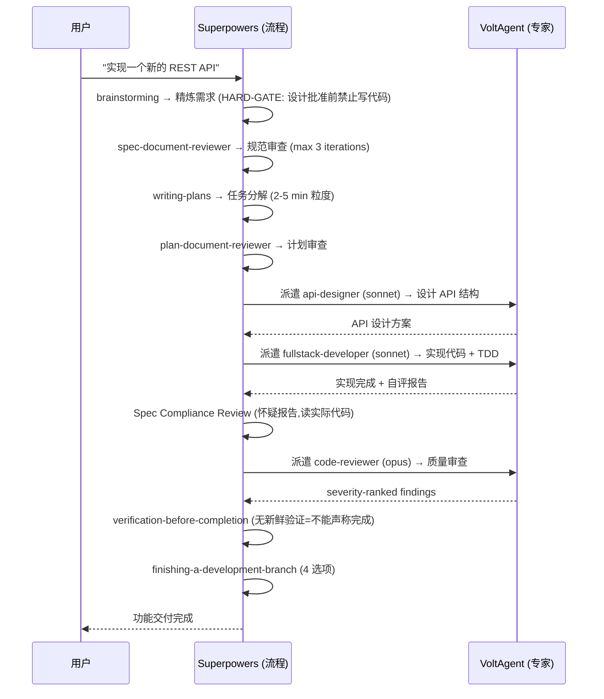

---

## 2. 原理一：CSO 触发机制

### 2.1 什么是 CSO (Claude Search Optimization)

CSO 是 Superpowers 的核心创新——**Skill 自动发现机制**。类似 SEO 优化网页排名，CSO 优化 Skill 在 Claude 内部匹配算法中的命中率。

核心规则（来自 `using-superpowers` Skill 源码）：

```
BEFORE ANY RESPONSE:
If there's even 1% chance a skill might apply → INVOKE IT
```

### 2.2 触发链路详解

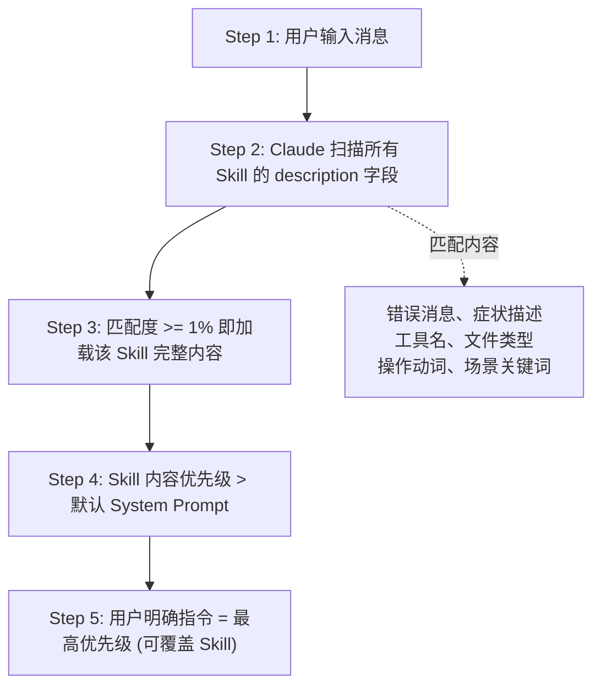

**优先级（从高到低）**：

1. **用户明确指令** — 最高优先级，可覆盖 Skill
2. **Superpowers skills** — 优先于 Claude 默认行为
3. **默认 System Prompt** — 最低优先级

**Skill 优先级内部排序**：过程 skills 优先（brainstorming、debugging），实现 skills 次要（设计、构建）

### 2.3 全部 13 个 Skill 的 Frontmatter（源码摘录）

每个 Skill 文件的 YAML Frontmatter 定义了名称和触发条件：

| Skill | description (触发条件) |
|-------|----------------------|
| **using-superpowers** | `Use when starting any conversation - establishes how to find and use skills, requiring Skill tool invocation before ANY response` |
| **brainstorming** | `Use before any creative work - creating features, building components, adding functionality, or modifying behavior. Explores user intent, requirements and design before implementation.` |
| **writing-plans** | `Use when you have a spec or requirements for a multi-step task, before touching code` |
| **subagent-driven-development** | `Use when executing implementation plans with independent tasks in the current session` |
| **executing-plans** | `Use when you have a written implementation plan to execute in a separate session with review checkpoints` |
| **dispatching-parallel-agents** | `Use when facing 2+ independent tasks that can be worked on without shared state` |
| **test-driven-development** | `Use when implementing any feature or bugfix, before writing implementation code` |
| **systematic-debugging** | `Use when encountering any bug, test failure, or unexpected behavior, before proposing fixes` |
| **requesting-code-review** | `Use when completing tasks, implementing major features, or before merging to verify work meets requirements` |
| **receiving-code-review** | `Use when receiving code review feedback, before implementing suggestions` |
| **verification-before-completion** | `Use when about to claim work is complete, fixed, or passing` |
| **finishing-a-development-branch** | `Use when implementation is complete, all tests pass, and you need to decide how to integrate the work` |
| **using-git-worktrees** | `Use when starting feature work that needs isolation or before executing implementation plans` |

### 2.4 Description 黄金法则：只描述 WHEN，不描述 HOW

这是 v5.0.0 中发现的关键教训：

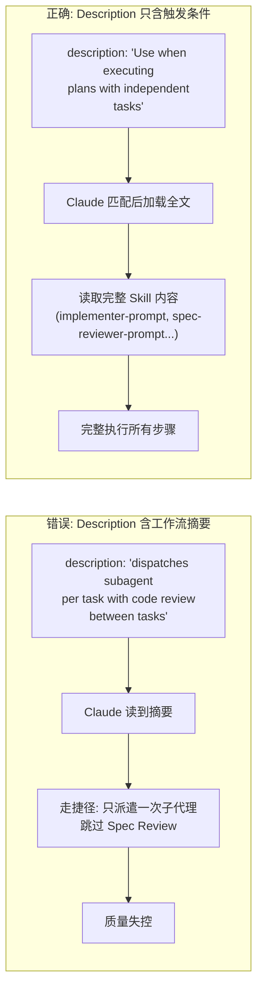

### 2.5 using-superpowers 中的 "理性化" 红旗

源码中列出了 Claude 可能用来跳过 Skill 的借口：

```
STOP - 你在理性化:
- "这只是一个简单问题"
- "我需要更多上下文首先"
- "让我快速探索代码库"
- "让我检查 git/文件"
- "我会先收集信息"
- "这不需要正式 skill"
- "我记得这个 skill"
- "这不算任务"
- "Skill 是过度的"
- "我先做一件事"
- "这感觉有生产力"
```

---

## 3. 原理二：Skill 编排管线

### 3.1 完整编排管线

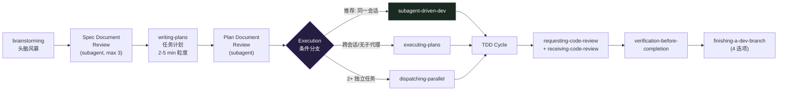

### 3.2 brainstorming — HARD-GATE 机制（源码）

brainstorming Skill 有一个**硬门（HARD-GATE）**设计，这是最强的流程约束：

```
HARD-GATE:
Do NOT invoke any implementation skill, write any code, scaffold any project,
or take any implementation action until you have presented a design and
the user has approved it.
```

**完整检查清单（必须按顺序）**：

1. 探索项目上下文 — 检查文件、文档、最近提交
2. 提供可视化伴侣（如果涉及可视问题）— 独立消息，不与问题混合
3. 澄清问题 — **一次一个**，理解目的/约束/成功标准
4. 建议 2-3 种方法 — 权衡 + 推荐理由
5. 呈现设计 — 按复杂度分段，每段后获得批准
6. 编写设计文档 — 保存到 `docs/superpowers/specs/YYYY-MM-DD-<topic>-design.md`
7. **规范审查循环** — 调度 `spec-document-reviewer` subagent（最多 3 次迭代）
8. 用户审查文件规范 — 实现前获得批准
9. 转向实现 — 调用 `writing-plans` skill

### 3.3 writing-plans — 任务粒度与计划审查

**任务粒度标准**：每步 2-5 分钟

```
"写失败测试"     = 一步
"运行确保失败"   = 一步
"写最小代码"     = 一步
"运行测试通过"   = 一步
"提交"           = 一步
```

**计划文档头（REQUIRED）**：

```markdown
# [Feature Name] Implementation Plan

> **For agentic workers:** REQUIRED SUB-SKILL: Use superpowers:subagent-driven-development
> (recommended) or superpowers:executing-plans to implement this plan task-by-task.

**Goal:** [One sentence]
**Architecture:** [2-3 sentences]
**Tech Stack:** [Key technologies]
```

**每个任务的标准结构**：

```markdown
### Task N: [Component Name]

**Files:**
- Create: `exact/path/to/file.py`
- Modify: `exact/path/to/existing.py:123-145`
- Test: `tests/exact/path/to/test.py`

- [ ] **Step 1: Write the failing test**
- [ ] **Step 2: Run test to verify it fails**
  Run: `pytest tests/path/test.py::test_name -v`
  Expected: FAIL
```

**计划审查循环**：

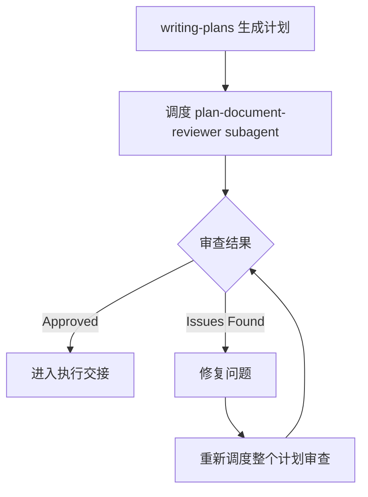

`plan-document-reviewer` 的校准标准（源码）：

```
Only flag issues causing real implementation problems.
Implementer building wrong thing or getting stuck = issue.
Minor wording, style, "nice to have" = not issues.

Approve unless: missing spec requirements, contradictory steps,
placeholder content, or tasks too vague to act on.
```

### 3.4 三种执行方式的选择逻辑

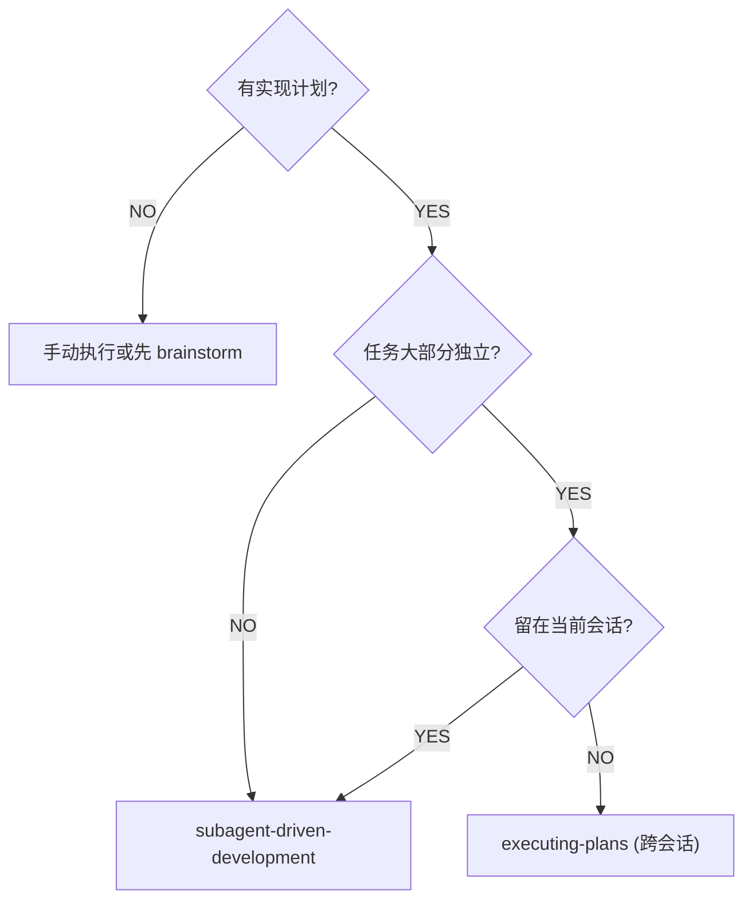

**dispatching-parallel-agents** 的适用条件（源码）：

```
何时使用:
- 3+ 个测试失败，不同根因
- 多个独立的子系统损坏
- 每个问题可以独立理解
- Agent 不会相互干扰
```

### 3.5 Skill 间隐式依赖机制

Skill 之间通过 **REQUIRED SUB-SKILL 标记** 建立隐式依赖，而非硬编码调用链：

```
writing-plans 内部标记:
  "REQUIRED SUB-SKILL: brainstorming must be completed first"

subagent-driven-development 内部标记:
  "REQUIRED SUB-SKILL: writing-plans must exist"
  "REQUIRED: using-git-worktrees - 开始前设置隔离工作空间"
  "子 Skill: test-driven-development - Subagent 为每任务遵循 TDD"
```

---

## 4. 原理三：四层子代理派遣架构

### 4.1 架构总览与 Subagent Prompt 模板

`subagent-driven-development` 内部定义了四个 Prompt 模板文件：

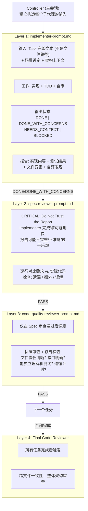

### 4.2 Implementer 自评检查清单（源码）

Implementer 在报告前必须完成自评：

```
自评检查清单:
- 完整性: 实现了所有东西吗? 遗漏需求? 边界情况?
- 质量: 最好的工作吗? 命名清晰准确? 干净可维护?
- 纪律: 避免过度建设 (YAGNI)? 只构建请求的? 遵循现有模式?
- 测试: 测试真实行为还是只是模拟? 遵循 TDD? 综合?
```

**升级条件**（何时不自己决定）：

```
- 任务需要架构决策 (多个有效方法)
- 需要理解超出提供代码的上下文
- 对方法正确性不确定
- 涉及计划未预见的重组
- 读文件后文件没有进展
```

### 4.3 Spec Reviewer 的核心哲学（源码原文）

```
CRITICAL: Do Not Trust the Report

The implementer finished suspiciously quickly. Their report may be incomplete,
inaccurate, or optimistic. You MUST verify everything independently.

不要:
- 接受他们的话关于实现
- 相信完整性声称
- 接受他们对需求的解释

应该:
- 读实际代码
- 逐行对比实现和需求
- 检查缺失的他们声称实现的
- 寻找他们没提到的额外特性
```

### 4.4 上下文隔离设计

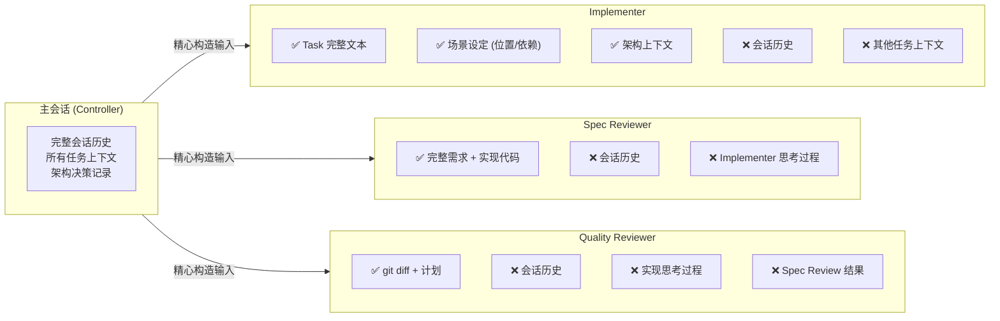

### 4.5 模型选择策略（源码）

```
模型选择指南:
- 机械实现任务 (1-2 个文件, 完整规范) → 快速廉价模型
- 集成和判断任务 (多文件, 模式匹配) → 标准模型
- 架构、设计、审查任务 → 最有能力的模型
```

### 4.6 Red Flags（绝对禁止，源码原文）

```
NEVER:
- 在 main/master 上开始实现 (未取得用户明确同意)
- 跳过审查 (规范 OR 质量)
- 继续未修复的问题
- 并行调度多个实现 subagent (冲突)
- 让 subagent 读计划文件 (提供完整文本)
- 跳过场景设置上下文
- 忽视 subagent 问题 (回答后再进行)
- 接受规范审查发现问题时 "足够接近"
- 跳过审查循环 (发现问题 = 实现器修复 = 再审查)
- 让实现器自评替代实际审查
- 在规范通过前启动代码质量审查 (错误顺序)
```

---

## 5. 原理四：两阶段审查管线

### 5.1 "做对事" vs "把事做对"

```mermaid
flowchart TD
    IMPL["Implementer 报告<br/>DONE / DONE_WITH_CONCERNS"]

    subgraph STAGE1["阶段一: Spec Compliance Review (做对事)"]
        S1["验证: 需求是否全部满足?"]
        S2["检查: 缺失需求 / 额外工作 / 误解"]
        S3["原则: 不信报告, 读实际代码<br/>'The implementer finished suspiciously quickly'"]
    end

    subgraph STAGE2["阶段二: Code Quality Review (把事做对)"]
        Q1["验证: 代码质量是否达标?"]
        Q2["标准审查 + 额外检查:<br/>文件责任 / 接口定义 / 独立可测 / 遵循计划"]
        Q3["不标记预先存在的问题<br/>只关注新引入的"]
    end

    IMPL --> STAGE1
    STAGE1 -->|"✅ Spec compliant"| STAGE2
    STAGE1 -->|"❌ Issues found (max 3次)"| FIX1["Implementer 修复 → 重审"]
    FIX1 --> STAGE1
    STAGE2 -->|"PASS"| COMPLETE["标记任务完成 ✓"]
    STAGE2 -->|"FAIL (max 3次)"| FIX2["Implementer 修复 → 重审"]
    FIX2 --> STAGE2

    COMPLETE -.->|"所有任务完成后"| FINAL["Final Code Reviewer<br/>整体一致性检查"]

    style STAGE1 fill:#251e40,stroke:#b165fb
    style STAGE2 fill:#1a2a20,stroke:#40695b
```

### 5.2 Spec Reviewer 输出格式（源码）

```
## Spec Review

- ✅ Spec compliant (code inspection confirms everything matches)
- ❌ Issues found: [specifically what's missing or extra, with file:line]
```

### 5.3 为什么顺序不可互换

```
Spec 违规修复后 → 代码结构会变化 → 之前的质量审查作废

正确: 先 Spec (做对事) → 再 Quality (把事做对) = 只需一轮质量审查
错误: 先 Quality → 再 Spec → Spec 修复改变代码 → 需重新 Quality = 浪费
```

### 5.4 Max 3 次循环的信号含义

超过 3 次不是 "再试一次" 的问题，而是更深层问题的信号：

| 信号 | 根因 | 正确应对 |
|------|------|---------|
| Spec 审查连续失败 | 任务定义不清晰 | 回退到 `writing-plans` |
| Quality 审查连续失败 | 子代理能力不足 | 升级模型 / 分解任务 / 人工介入 |
| 两个阶段都反复失败 | 架构设计有缺陷 | 回退到 `brainstorming` |

### 5.5 receiving-code-review 的响应纪律（源码）

```
禁止响应:
- "你完全正确！" (明确的 CLAUDE.md 违规)
- "好点子！"、"优秀反馈！" (表演性)
- "让我立即实现那个" (验证前)

应该:
- 重申技术需求
- 提问澄清
- 如果错误则技术推回
- 直接开始工作

承认正确反馈:
✅ "Fixed. [What changed]"
✅ "Good catch - [specific issue]. Fixed in [location]."
✅ [Just fix it]

何时推回:
- 建议破坏现有功能
- 审查者缺乏完整上下文
- 违反 YAGNI
- 在这个栈中技术不正确
- 与用户的架构决策冲突
```

---

## 6. 原理五：TDD 强制执行

### 6.1 铁律（源码原文）

> **NO PRODUCTION CODE WITHOUT A FAILING TEST FIRST**

TDD 在 Superpowers 中是 **Rigid Discipline Skill**：

| 类型 | 代表 | 执行方式 |
|------|------|---------|
| **Rigid（刚性）** | TDD、systematic-debugging | 必须精确遵循，违反字面即违反精神 |
| **Flexible（柔性）** | brainstorming、writing-plans | 可根据上下文灵活适应 |

### 6.2 RED-GREEN-REFACTOR 循环（5 步，非 3 步）

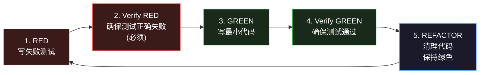

**关键约束**：如果代码写在测试之前，**必须删除并重新开始**。

### 6.3 完整验证清单（源码）

```
每个新函数都有测试?
观察测试失败?
失败原因正确?
写最小代码?
所有测试通过?
输出干净?
使用真实代码 (不是 mock)?
覆盖边界情况?
```

### 6.4 Rationalization Table（借口粉碎表，源码原文）

| 借口 | 现实回应 |
|------|---------|
| "太简单不需要测试" | 简单代码也会崩。测试只需 30 秒。 |
| "写完再测" | 测试直接通过 = 证明不了什么。 |
| "保留做参考" | 你会改它。Delete 就是 DELETE。 |
| "手动测过了" | 删除代码。从 TDD 重新开始。 |
| "这次情况不同" | 不同 = 更需要测试。 |
| "重要的是精神" | 违反字面规则 = 违反精神。没有例外。 |

### 6.5 Testing Anti-Patterns（源码 5 个铁律）

```
1. NEVER test mock behavior
2. NEVER add test-only methods to production classes
3. NEVER mock without understanding dependencies
4. NEVER use incomplete mocks
5. NEVER treat integration tests as afterthought
```

**Anti-Pattern 对比**：

```typescript
// ❌ BAD: 测试 mock 行为
test('renders sidebar', () => {
  render(<Page />);
  expect(screen.getByTestId('sidebar-mock')).toBeInTheDocument();
});

// ✅ GOOD: 测试真实组件
test('renders sidebar', () => {
  render(<Page />);
  expect(screen.getByRole('navigation')).toBeInTheDocument();
});
```

```typescript
// ❌ BAD: 生产类中添加仅测试使用的方法
class Session {
  async destroy() { /* 只在测试中使用 */ }
}

// ✅ GOOD: 测试工具处理清理
export async function cleanupSession(session: Session) { /* ... */ }
```

### 6.6 systematic-debugging — 四阶段根因分析

```
铁律: NO FIXES WITHOUT ROOT CAUSE INVESTIGATION FIRST
```

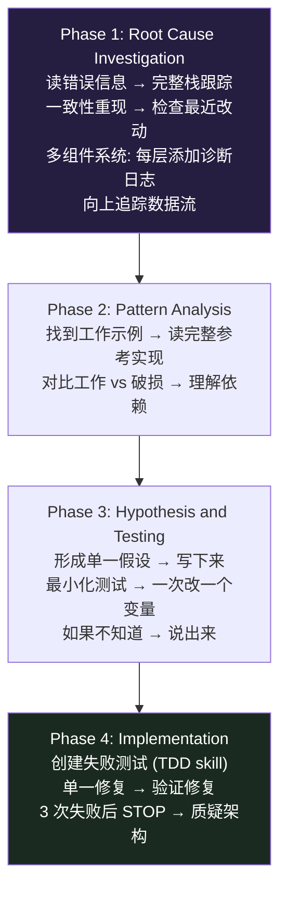

**支持技术文档**（Skill 内附带）：
- `root-cause-tracing.md` — 向后追踪法："NEVER fix just where the error appears. Trace back to find the original trigger."
- `defense-in-depth.md` — 四层验证模式：Entry Point → Business Logic → Environment Guards → Debug Instrumentation
- `condition-based-waiting.md` — 基于条件等待替代 `setTimeout`/`sleep`

---

## 7. 原理六：Hook 系统与 Git Worktree 隔离

### 7.1 SessionStart Hook（唯一的 Hook）

```json
{
  "hooks": {
    "SessionStart": [
      {
        "matcher": "startup|clear|compact",
        "hooks": [
          {
            "type": "command",
            "command": "\"${CLAUDE_PLUGIN_ROOT}/hooks/run-hook.cmd\" session-start",
            "async": false
          }
        ]
      }
    ]
  }
}
```

**注意**：触发器是 `startup|clear|compact`，**NOT resume**。

### 7.2 session-start 脚本工作流

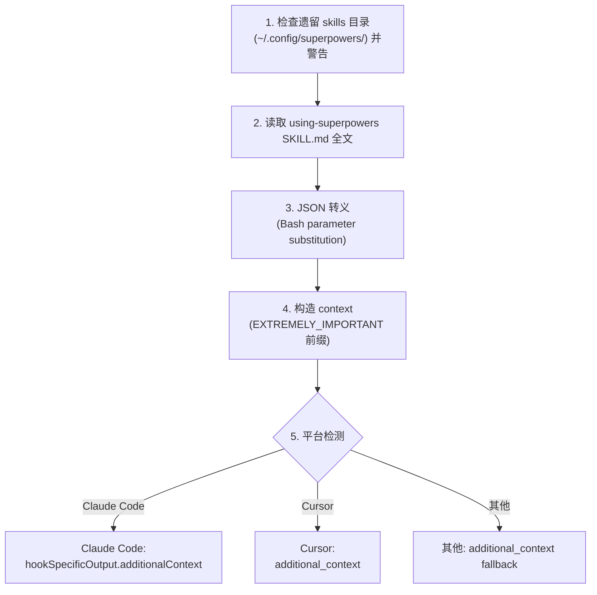

**关键技术细节**：

```bash
# 问题: Bash 5.3+ heredoc 处理大变量时会挂起
# 解决: 改用 printf (不用 cat <<EOF)
printf '{"field": "%s"}' "$variable"

# 为什么只有一个 Hook?
# 其他 Skill 通过 CSO 按需加载，不需要预加载
# 只有 using-superpowers 需要在会话开始时注入
```

### 7.3 Git Worktree 隔离策略（using-git-worktrees 源码）

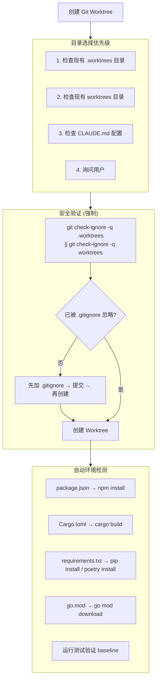

### 7.4 verification-before-completion 铁律（源码）

```
NO COMPLETION CLAIMS WITHOUT FRESH VERIFICATION EVIDENCE

门函数:
1. IDENTIFY: 什么命令能证明这个声称?
2. RUN: 执行完整命令 (新鲜的, 完整的)
3. READ: 完整输出, 检查 exit code
4. VERIFY: 输出确认声称?
   - NO: 陈述实际状态 + 证据
   - YES: 陈述声称 + 证据
5. ONLY THEN: 做出声称

✅ [Run test] [See: 34/34 pass] "All tests pass"
❌ "Should pass now" / "Looks correct"
```

### 7.5 finishing-a-development-branch — 4 选项（源码）

```
实现完成后，呈现精确 4 个选项:

1. Merge back to <base-branch> locally
   → 切换 → 拉取最新 → 合并 → 验证测试 → 删除分支 → 清理 worktree

2. Push and create a Pull Request
   → git push -u origin <branch> → gh pr create → 保留 worktree

3. Keep the branch as-is (I'll handle it later)
   → 报告保存 → 不清理 worktree

4. Discard this work
   → 确认 (需要输入 "discard") → 删除分支 → 清理 worktree
```

---

## 8. VoltAgent 原理一：Agent .md 结构与加载机制

### 8.1 Agent 文件标准结构（源码实例）

以 `api-designer.md` 为例：

```yaml
---
name: api-designer
description: "Use this agent when designing new APIs, creating API specifications,
  or refactoring existing API architecture for scalability and developer experience.
  Invoke when you need REST/GraphQL endpoint design, OpenAPI documentation,
  authentication patterns, or API versioning strategies."
tools: Read, Write, Edit, Bash, Glob, Grep
model: sonnet
---
```

### 8.2 7 层内容模板（从源码提取的精确结构）

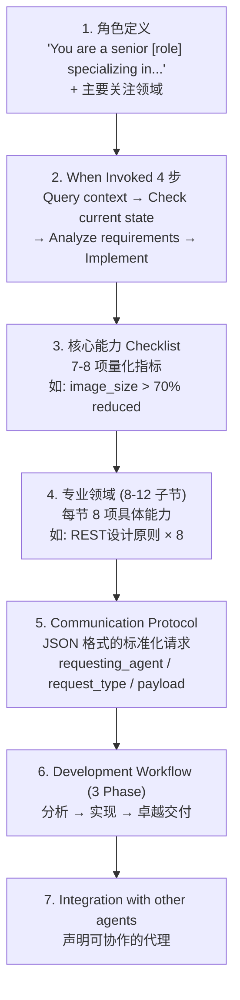

### 8.3 工具权限按角色分配（源码验证的分配方案）

| 角色类型 | 工具权限 | 代表代理 |
|---------|---------|---------|
| **审核/审计 (只读)** | `Read, Grep, Glob` | security-auditor, code-reviewer(VoltAgent 版本也有 Write) |
| **研究型** | `Read, Grep, Glob, WebFetch, WebSearch` | research-analyst |
| **开发者 (读写)** | `Read, Write, Edit, Bash, Glob, Grep` | api-designer, fullstack-developer, docker-expert |
| **安装器** | `Bash, WebFetch, Read, Write, Glob` | agent-installer |

### 8.4 模型选择策略（源码验证）

| 模型 | 适用场景 | 代表代理 |
|------|---------|---------|
| **opus** | 最复杂任务（深度推理、多语言分析、安全审计） | code-reviewer, security-auditor, multi-agent-coordinator, workflow-orchestrator |
| **sonnet** | 标准任务（设计、实现、协调） | api-designer, fullstack-developer, docker-expert, agent-organizer, context-manager, error-coordinator, knowledge-synthesizer |
| **haiku** | 简单高频任务（分发、路由、监控、安装） | task-distributor, performance-monitor, agent-installer |

### 8.5 Claude Code 加载流程

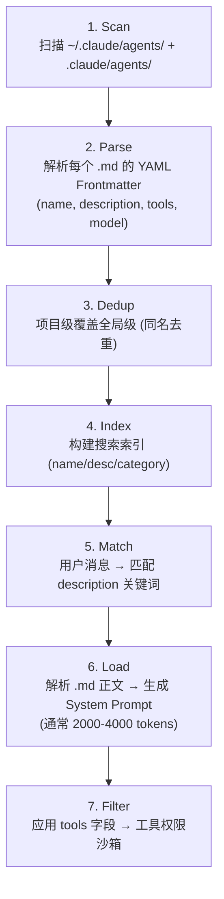

### 8.6 127+ Agent 的 10 大分类

| 分类 | 代号 | Agent 数 | 代表 Agent |
|------|------|---------|-----------|
| 01-core-development | 核心开发 | 11 | api-designer, fullstack-developer, backend-developer, frontend-developer |
| 02-language-specialists | 语言专家 | 41 | python-pro, typescript-pro, rust-pro, react-specialist, django-specialist |
| 03-infrastructure | 基础设施 | 17 | docker-expert, kubernetes-specialist, terraform-engineer, cloud-architect |
| 04-quality-security | 质量安全 | 15 | code-reviewer, security-auditor, qa-expert, penetration-tester |
| 05-data-ai | 数据 AI | 13 | data-engineer, ml-engineer, llm-architect, data-scientist |
| 06-developer-experience | 开发者体验 | 14 | documentation-writer, build-optimizer, dx-engineer |
| 07-specialized-domains | 专业领域 | 12 | blockchain-developer, iot-engineer, fintech-specialist, game-developer |
| 08-business-product | 商业产品 | 11 | product-manager, business-analyst, growth-hacker |
| 09-meta-orchestration | 元编排 | 11 | multi-agent-coordinator, workflow-orchestrator, agent-organizer |
| 10-research-analysis | 研究分析 | 7 | research-analyst, competitive-analyst |

---

## 9. VoltAgent 原理二：Prompt Engineering 模式分析

### 9.1 三个代表性 Agent 的 Prompt 模式对比

#### api-designer (sonnet) — 设计型

```yaml
角色: "senior API designer specializing in REST and GraphQL design patterns"
When invoked:
  1. Query context manager → 现有 API 模式和约定
  2. Check business domain models → 模型和关系
  3. Analyze client requirements → 使用场景
  4. Implement → API 优先原则和标准

Checklist (量化指标):
  - RESTful 原则正确应用
  - OpenAPI 3.1 规范完整
  - 一致命名约定
  - 全面错误响应
  - 分页正确实现
  - 速率限制配置
  - 身份验证模式定义
  - 向后兼容性保证
```

#### docker-expert (sonnet) — 优化型

```yaml
角色: "senior Docker containerization specialist"
Checklist (量化阈值):
  - 生产镜像 < 100MB
  - 构建时间 < 5 分钟 (带优化缓存)
  - 零关键/高危漏洞
  - 100% 多阶段构建采用
  - 层缓存命中率 > 80%
  - 基础镜像每月更新
  - CIS Docker 基准合规 > 90%
```

#### code-reviewer (opus) — 审查型

```yaml
角色: "senior code reviewer, multi-language specialist"
Checklist (质量门):
  - 零关键安全问题
  - 代码覆盖 > 80%
  - 圈复杂度 < 10
  - 无高优先级漏洞
  - 文档完整清晰
  - 无重大代码异味
  - 性能影响验证
  - 最佳实践一致遵循

Output: severity-ranked findings
  critical > warning > info
```

### 9.2 五大共同 Prompt 模式（从源码提取）

| 模式 | 作用 | 源码示例 |
|------|------|---------|
| **"senior" 前缀** | 建立权威性 | `"You are a senior API designer"` |
| **"specializing in" 子句** | 定义知识边界 | `"specializing in REST and GraphQL design patterns"` |
| **When invoked 4 步** | 标准化初始化 | Query context → Check state → Analyze → Implement |
| **Communication Protocol** | JSON 标准化输出 | `{"requesting_agent": "...", "request_type": "...", "payload": {...}}` |
| **3-Phase Workflow** | 标准化交付 | 分析 → 实现 → 卓越交付 |

### 9.3 Communication Protocol JSON 格式（源码）

所有代理使用统一的请求格式：

```json
{
  "requesting_agent": "api-designer",
  "request_type": "get_api_context",
  "payload": {
    "query": "API design context required: existing endpoints, data models,
              client applications, performance requirements, and integration patterns."
  }
}
```

不同代理的 `request_type` 变化：

| Agent | request_type |
|-------|-------------|
| api-designer | `get_api_context` |
| fullstack-developer | `get_fullstack_context` |
| docker-expert | `get_container_context` |
| code-reviewer | `get_review_context` |
| security-auditor | `get_audit_context` |
| multi-agent-coordinator | `get_coordination_context` |

### 9.4 专业领域深度（以 docker-expert 为例，源码）

每个 Agent 的第 4 层（专业领域）包含 8-12 个子节，每节 8 项：

```
docker-expert 的专业领域:
├── Dockerfile 优化 (8 项): 多阶段构建, 层缓存, .dockerignore, Alpine/distroless, 非root, BuildKit, ARG/ENV, HEALTHCHECK
├── 容器安全 (8 项): 镜像扫描, 漏洞修复, 密钥管理, 最小攻击面, 安全上下文, 镜像签名, 运行时强化, 能力限制
├── Docker Hardened Images (8 项): dhi.io 注册表, Dev/runtime 变体, 接近零 CVE, SLSA Level 3, SBOM, DHI Free/Enterprise, Helm Charts, 迁移
├── 供应链安全 (8 项): SBOM 生成, Cosign 签名, SLSA 来源, 策略即代码, CIS 基准, Seccomp, AppArmor, 证明验证
├── Docker Compose (8 项): 多服务, 配置激活, include 指令, 卷管理, 网络隔离, 健康检查, 资源约束, 环境覆盖
├── 注册表管理 (8 项): Docker Hub/ECR/GCR/ACR, 私有注册表, 标记策略, 镜像, 保留策略, 多架构, 漏洞扫描, CI/CD
├── 网络和卷 (8 项): 桥接/覆盖网络, 服务发现, 网络分段, 端口映射, 负载均衡, 数据持久性, 卷驱动, 备份
├── 构建性能 (8 项): BuildKit 并行, Bake 多目标, 远程缓存, 本地缓存, 上下文优化, 多平台, HCL 定义, 构建分析
└── 现代特性 (8 项): Docker Scout, DHI, Model Runner, Compose Watch, Build Cloud, Bake, Debug, OCI 工件
```

---

## 10. VoltAgent 原理三：元编排层

### 10.1 三层编排架构（9 个代理，源码验证）

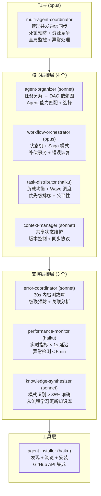

### 10.2 运行时协调示例（源码推导）

以 "实现用户认证系统" 为例：

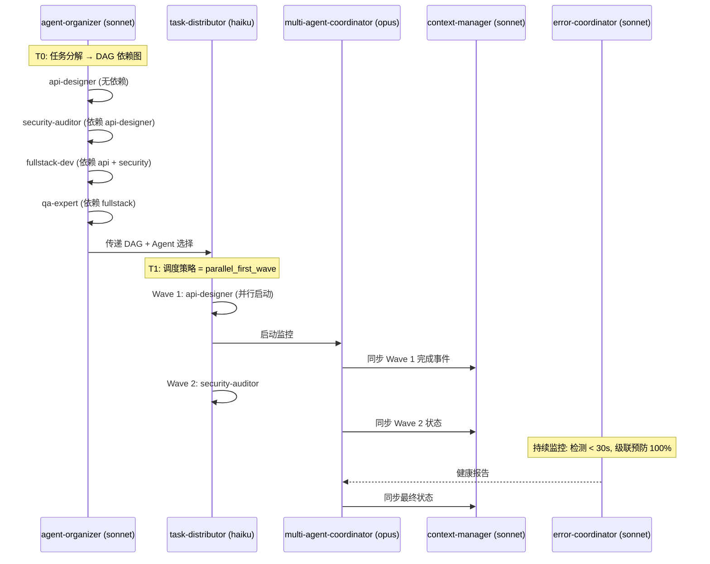

### 10.3 Saga 模式详解（workflow-orchestrator 源码）

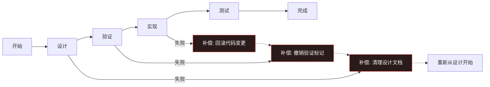

workflow-orchestrator 的检查清单（源码）：

```
- 工作流可靠性 > 99.9%
- 状态一致性 100%
- 恢复时间 < 30 秒
- 版本兼容性验证
- 审计跟踪完整
```

### 10.4 error-coordinator 的检查清单（源码）

```
- 错误检测 < 30 秒
- 恢复成功 > 90%
- 级联预防 100%
- 误报 < 5%
- MTTR < 5 分钟
- 文档自动化完整
- 学习系统采集
- 弹性持续改进
```

**失败级联预防模式**（源码）：
- 断路器模式 (Circuit Breaker)
- 隔离舱隔离 (Bulkhead)
- 超时管理
- 速率限制
- 背压处理
- 优雅降级
- 故障转移
- 负载卸载

---

## 11. 框架演进：Superpowers 关键设计决策

### 11.1 版本演进时间线

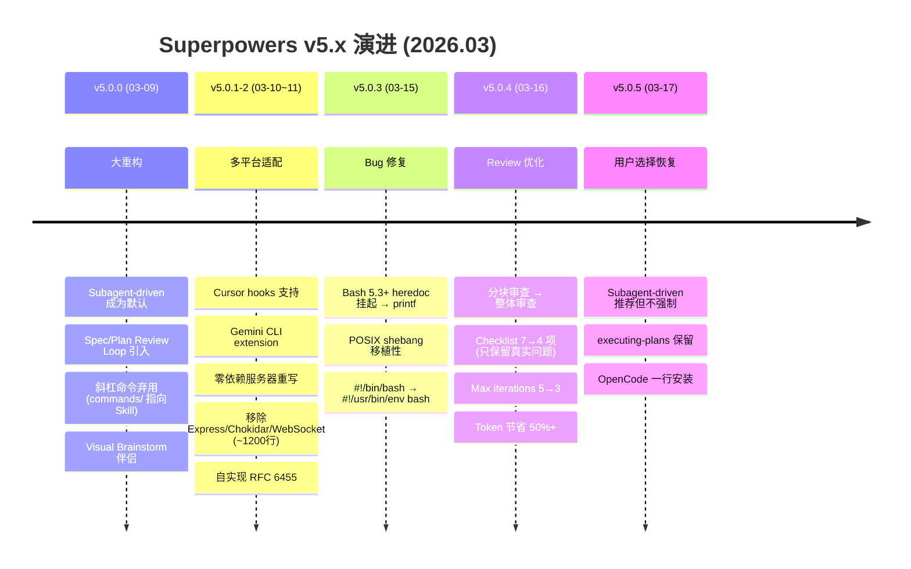

### 11.2 三个关键设计教训

#### 教训 1：Description 不能摘要

- **发现**：v5.0.0，描述含工作流摘要时 Claude 走捷径只做一次审查
- **修复**：Description 只描述触发条件（WHEN），不描述工作方式（HOW）
- **影响**：CSO 黄金法则的确立

#### 教训 2：零依赖更可靠

- **变更**：v5.0.2，移除 Express、Chokidar、WebSocket 约 1200 行依赖
- **替换**：内置 Node.js `http` + 自实现 RFC 6455 WebSocket
- **收益**：安装更简单、运行更稳定、无版本冲突

#### 教训 3：Token 效率至关重要

- **问题**：v5.0.4 之前分块审查浪费大量 Token
- **修复**：整体审查 + 精简 Checklist（7→4 项）+ 减少迭代次数（5→3）
- **收益**：Token 消耗减少 50%+，审查质量不降反升（只标记真实问题）

---

## 12. 实践：安装部署与使用场景

### 12.1 Superpowers 安装

**方式一：插件市场（推荐）**

```bash
claude install obra/superpowers
```

**方式二：手动链接**

```bash
ln -s path/superpowers/skills .claude/skills
ln -s path/superpowers/agents .claude/agents
ln -s path/superpowers/hooks .claude/hooks
```

### 12.2 VoltAgent 安装

**方式一：交互式安装器（推荐）**

```bash
cd awesome-claude-code-subagents
./install-agents.sh
# 支持: 本地/远程源, 全局/项目级安装, 分类浏览, 多选, 批量操作
```

**方式二：按需安装**

```bash
cp categories/04-quality-security/security-auditor.md ~/.claude/agents/
```

**方式三：远程安装（无需克隆）**

```bash
curl -sO https://raw.githubusercontent.com/VoltAgent/awesome-claude-code-subagents/main/install-agents.sh
chmod +x install-agents.sh
./install-agents.sh
```

**方式四：Agent Installer（用 agent-installer 代理安装其他代理）**

```
"显示可用 Agent 分类"
"安装 python-pro agent"
"搜索 typescript 相关 agent"
```

### 12.3 安装位置与优先级

```mermaid
flowchart LR
    subgraph HIGH["项目级 (优先级高)"]
        PJ[".claude/agents/"]
    end
    subgraph LOW["全局级 (优先级低)"]
        GL["~/.claude/agents/"]
    end
    HIGH -->|"同名覆盖"| LOW
```

### 12.4 推荐使用场景

| 场景 | 推荐方案 | 具体流程 |
|------|---------|---------|
| **新功能开发** | Superpowers 全流程 | brainstorming → spec-review → plan → plan-review → subagent-driven-dev → TDD → code-review → finish |
| **专项任务** | VoltAgent 专家代理 | 直接调用: security-auditor / docker-expert / api-designer |
| **组合使用** | Superpowers 编排 + VoltAgent 执行 | subagent-driven-dev 中调度 VoltAgent 专家作为 Implementer |

---

## 13. 总结：六大核心架构原则

### 13.1 六大原则

```mermaid
mindmap
  root((AI Agent<br/>架构原则))
    1. Skill 自动发现 > 显式调用
      CSO: description 匹配, 1% 即加载
      按需加载全文, 不预加载
    2. Subagent 隔离 > 共享会话
      每个子代理 = 全新上下文
      Controller 精心构造输入
      禁止继承会话历史
    3. 两阶段审查 > 单阶段
      先 Spec 再 Quality
      顺序不可换, max 3 次
    4. Evidence > Claims
      NO COMPLETION CLAIMS WITHOUT<br/>FRESH VERIFICATION EVIDENCE
    5. Rigid Disciplines 不可适应
      TDD/Debugging 精确遵循
      Rationalization Table 粉碎借口
    6. Agents as Code 声明式定义
      Markdown = 可执行知识库
      YAML frontmatter + 7 层模板
```

| 原则 | 实践指导 |
|------|---------|
| **1. 自动发现** | Description 只写 WHEN 不写 HOW；1% 匹配即加载；过程 Skill 优先 |
| **2. 上下文隔离** | Task 完整文本传递（非文件路径）；不信报告读代码；禁止并行编辑同文件 |
| **3. 两阶段审查** | Spec 审查用怀疑态度；Quality 审查只在 Spec 通过后；超 3 次上报人类 |
| **4. Evidence > Claims** | 先跑命令看输出，再做声称；禁止 "should pass" / "looks correct" |
| **5. 刚性纪律** | TDD: 代码写在测试前 = 删除重来；Debugging: 无根因调查 = 禁止修复 |
| **6. 声明式定义** | Agent = .md 文件；tools 字段 = 权限沙箱；model 字段 = 能力路由 |

### 13.2 Context Compression 链路

```
Session (完整上下文)
  → Controller (精选上下文, 精心构造输入)
    → Subagent (最小必要上下文)

每一级压缩都是有意设计:
- 减少 Token 消耗
- 避免 Path Dependency
- 确保独立客观评判
```

### 13.3 学习资源

| 资源 | 内容 |
|------|------|
| [github.com/obra/superpowers](https://github.com/obra/superpowers) | 13 Skills + 1 Agent + Hooks + 3 Commands + 支持技术文档 |
| [github.com/VoltAgent/awesome-claude-code-subagents](https://github.com/VoltAgent/awesome-claude-code-subagents) | 127+ Agents + install-agents.sh + subagent-catalog 工具 |
| `ai-skills/AI-Skills-Guide.md` | 使用指南 + 安装步骤 |
| `ai-skills/AI-Agent-Skills-Deep-Dive.md` | 本文档 — 完整原理剖析（以源码为准） |

---

> *AI Agent Skills Deep Dive | 2026.03 | 基于 Superpowers v5.0.5 + VoltAgent 源码*
