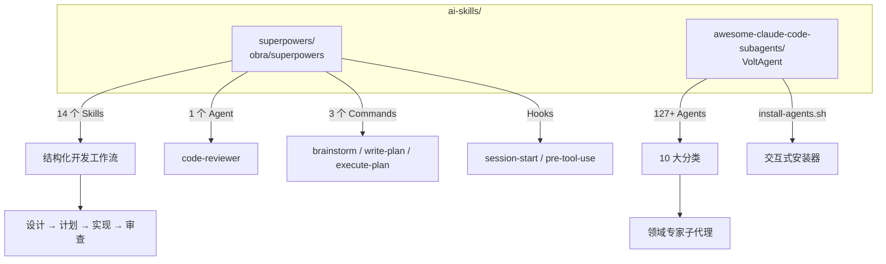
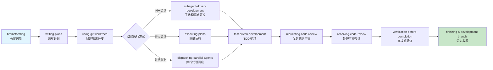
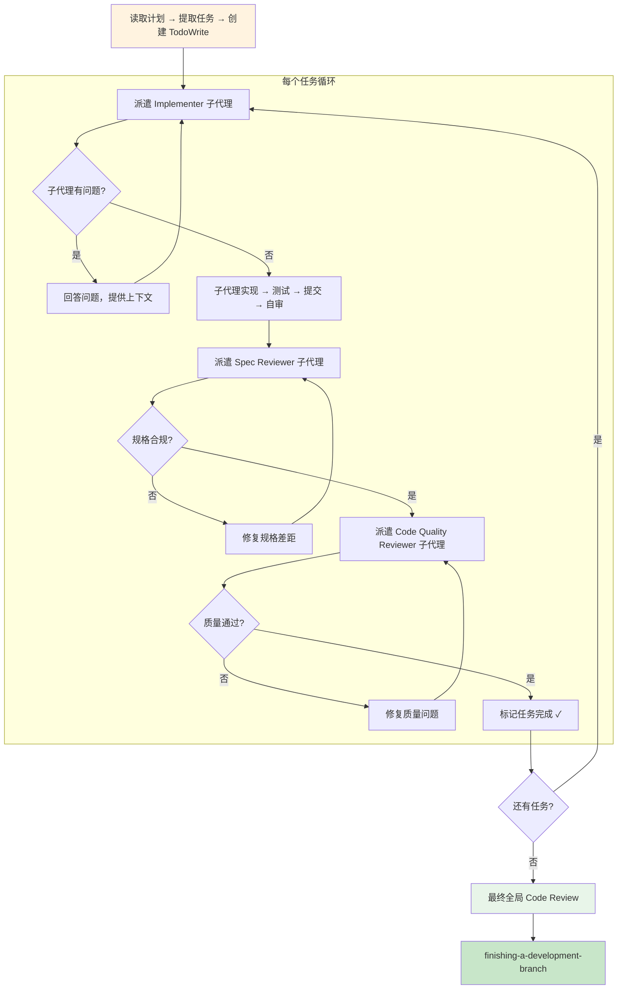
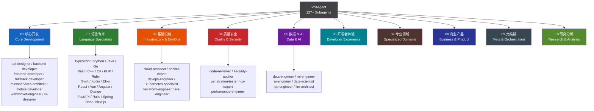
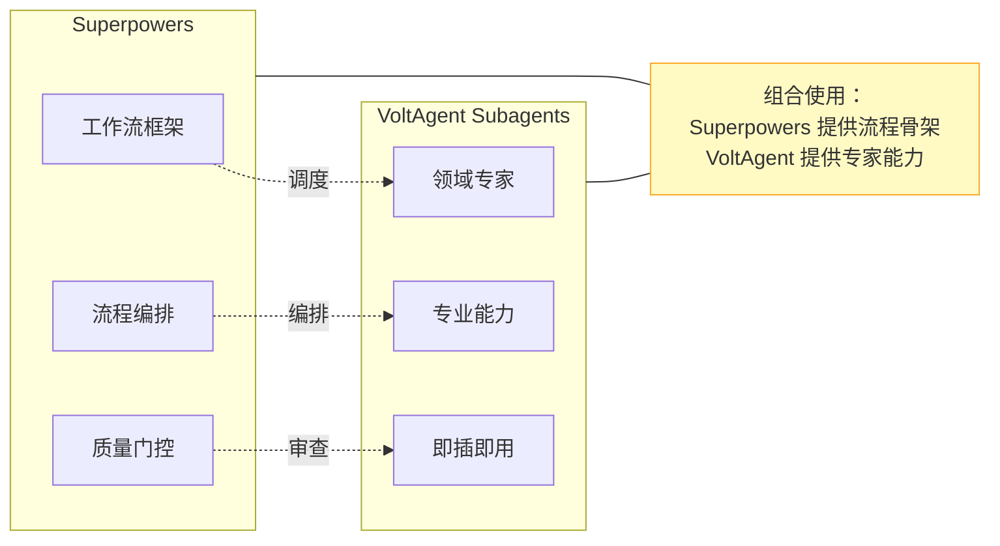
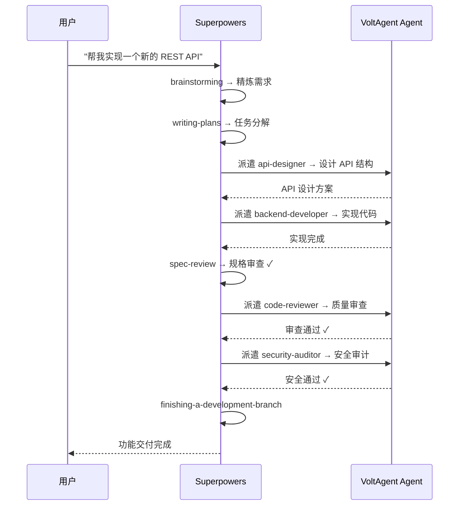

# AI Skills 工具集使用指南

> 本文档涵盖两个 Claude Code 技能框架的使用说明与安装步骤：**Superpowers** 和 **VoltAgent Awesome Claude Code Subagents**。

---

## 项目总览



---

## 1. Superpowers — 结构化 AI 开发工作流

**仓库**: [github.com/obra/superpowers](https://github.com/obra/superpowers)
**版本**: v5.0.4
**定位**: 为 AI 编码代理提供系统化的开发流程框架，包含从设计到交付的完整 Skill 链。

### 1.1 核心理念

Superpowers 将开发过程拆解为可组合的 Skill，每个 Skill 在特定场景自动触发。核心哲学：

- **系统化流程 > 即兴发挥** — 每一步都有清晰的进入/退出条件
- **隔离上下文** — 每个子代理拥有独立上下文，避免污染
- **两阶段审查** — 先规格合规审查，再代码质量审查
- **测试优先** — TDD 作为不可妥协的实践

### 1.2 完整工作流



### 1.3 全部 14 个 Skills

| Skill | 用途 | 触发场景 |
|-------|------|----------|
| **brainstorming** | 通过提问精炼想法，分段呈现设计方案 | 需求不明确时，启动设计讨论 |
| **writing-plans** | 创建 2-5 分钟粒度的任务分解，含文件路径和验证步骤 | 设计确认后，开始规划 |
| **using-git-worktrees** | 在独立 git worktree 中创建隔离开发环境 | 开始实现前，隔离工作区 |
| **subagent-driven-development** | 每任务派遣独立子代理 + 两阶段审查 | 任务独立、同一会话内执行 |
| **executing-plans** | 批量执行任务，人工检查点介入 | 跨会话并行执行 |
| **dispatching-parallel-agents** | 管理并发子代理工作流 | 多个独立任务需并行处理 |
| **test-driven-development** | 强制 RED → GREEN → REFACTOR 循环 | 编写任何功能代码时 |
| **systematic-debugging** | 4 阶段根因分析流程 | 遇到 Bug 需要系统排查 |
| **requesting-code-review** | 生成审前检查清单，按严重程度报告问题 | 代码完成准备审查 |
| **receiving-code-review** | 处理审查反馈，逐项回应 | 收到 review 意见后 |
| **verification-before-completion** | 在声明完成前确认修复/功能正确 | 即将标记任务完成 |
| **finishing-a-development-branch** | 处理合并决策和分支清理 | 开发分支工作全部完成 |
| **writing-skills** | 按最佳实践创建新的 Skill | 需要扩展框架能力 |
| **using-superpowers** | 框架使用介绍 | 首次使用或需要引导 |

### 1.4 子代理驱动开发流程（核心 Skill）



---

## 2. VoltAgent Awesome Claude Code Subagents — 领域专家代理集合

**仓库**: [github.com/VoltAgent/awesome-claude-code-subagents](https://github.com/VoltAgent/awesome-claude-code-subagents)
**定位**: 127+ 个专业化子代理集合，按领域分类，提供即插即用的专家能力。

### 2.1 核心理念

- **隔离上下文** — 每个子代理在独立上下文空间运行，防止任务间污染
- **专业指令** — 针对特定领域精心编写的系统提示，比通用代理表现更优
- **灵活安装** — 支持全局或项目级安装，可按需挑选

### 2.2 10 大分类架构



### 2.3 重点代理说明

| 分类 | 代理 | 能力 |
|------|------|------|
| 核心开发 | `api-designer` | REST/GraphQL API 架构设计 |
| 核心开发 | `fullstack-developer` | 端到端功能开发 |
| 基础设施 | `docker-expert` | 容器化优化、多阶段构建 |
| 基础设施 | `kubernetes-specialist` | K8s 编排、Helm Chart |
| 质量安全 | `security-auditor` | 漏洞扫描、安全审计 |
| 质量安全 | `code-reviewer` | 代码质量审查 |
| 数据 AI | `llm-architect` | LLM 应用架构设计 |
| 元编排 | `multi-agent-coordinator` | 多代理协调编排 |
| 元编排 | `workflow-orchestrator` | 复杂工作流自动化 |

---

## 3. 两者对比与互补关系



| 维度 | Superpowers | VoltAgent Subagents |
|------|-------------|---------------------|
| **定位** | 开发工作流框架 | 领域专家代理集合 |
| **粒度** | Skill（流程步骤） | Agent（专业角色） |
| **数量** | 14 个 Skill | 127+ 个 Agent |
| **侧重** | 怎么做（流程） | 谁来做（专家） |
| **典型场景** | TDD、Code Review、计划执行 | 特定语言/框架/领域任务 |
| **互补方式** | 在 subagent-driven-dev 中调度 VoltAgent 代理 | 被 Superpowers 工作流编排使用 |

---

## 4. 安装步骤

### 4.1 Superpowers 安装

**方式一：Claude Code 插件市场（推荐）**

```bash
# 在 Claude Code 中直接安装
claude install obra/superpowers
```

**方式二：手动安装（已完成克隆）**

```bash
# 仓库已克隆至：
# /Users/polarischen/code/ai-coding/ai-skills/superpowers/

# 方式 A: 复制到全局 Claude 配置
cp -r ai-skills/superpowers/.  ~/.claude/

# 方式 B: 在项目中创建软链接
ln -s /Users/polarischen/code/ai-coding/ai-skills/superpowers/skills .claude/skills
ln -s /Users/polarischen/code/ai-coding/ai-skills/superpowers/agents .claude/agents
ln -s /Users/polarischen/code/ai-coding/ai-skills/superpowers/hooks .claude/hooks
```

**兼容平台**: Claude Code / Cursor / Codex / OpenCode / Gemini CLI

### 4.2 VoltAgent Subagents 安装

**方式一：交互式安装器（推荐）**

```bash
cd /Users/polarischen/code/ai-coding/ai-skills/awesome-claude-code-subagents
chmod +x install-agents.sh
./install-agents.sh
```

安装器支持：
- 选择全局安装（`~/.claude/agents/`）或项目级安装（`.claude/agents/`）
- 按分类浏览和选择代理
- 安装/卸载单个或整个分类

**方式二：手动安装指定代理**

```bash
# 全局安装某个代理
mkdir -p ~/.claude/agents
cp ai-skills/awesome-claude-code-subagents/categories/01-core-development/api-designer.md \
   ~/.claude/agents/

# 项目级安装某个分类
mkdir -p .claude/agents
cp ai-skills/awesome-claude-code-subagents/categories/04-quality-security/*.md \
   .claude/agents/
```

**方式三：远程安装（无需克隆）**

```bash
curl -sO https://raw.githubusercontent.com/VoltAgent/awesome-claude-code-subagents/main/install-agents.sh
chmod +x install-agents.sh
./install-agents.sh
```

---

## 5. 使用说明

### 5.1 Superpowers 使用

Skills 根据上下文自动触发，无需手动调用。典型使用流程：

```
1. 告诉 Claude 你想实现什么功能
2. brainstorming skill 自动触发 → 通过提问精炼需求
3. 需求明确后 → writing-plans 生成任务计划
4. 确认计划 → subagent-driven-development 逐任务执行
5. 每个任务完成后自动进行两阶段审查
6. 全部完成 → finishing-a-development-branch 收尾
```

也可以直接请求特定 Skill：

```
"请使用 superpowers 的 systematic-debugging 来排查这个 Bug"
"用 test-driven-development 的方式来实现这个功能"
"帮我做一个 code review（requesting-code-review）"
```

### 5.2 VoltAgent Subagents 使用

安装后，在 Claude Code 中直接引用代理名称：

```
"使用 security-auditor 审计一下这个项目的安全性"
"让 docker-expert 帮我优化 Dockerfile"
"用 rust-pro agent 帮我重构这个模块"
"调用 data-engineer 设计数据管道"
```

### 5.3 组合使用示例



---

## 6. 目录结构

```
ai-skills/
├── AI-Skills-Guide.md                    ← 本文档
├── superpowers/                           ← Superpowers 框架
│   ├── skills/                            ← 14 个 Skill 定义
│   │   ├── brainstorming/
│   │   ├── writing-plans/
│   │   ├── subagent-driven-development/
│   │   ├── test-driven-development/
│   │   ├── systematic-debugging/
│   │   └── ...
│   ├── agents/                            ← Agent 定义
│   │   └── code-reviewer.md
│   ├── commands/                          ← 命令（已弃用，指向 Skill）
│   ├── hooks/                             ← 钩子配置
│   └── docs/                              ← 平台文档
└── awesome-claude-code-subagents/         ← VoltAgent 子代理集合
    ├── categories/                        ← 10 大分类
    │   ├── 01-core-development/           ← 核心开发代理
    │   ├── 02-language-specialists/       ← 语言专家代理
    │   ├── 03-infrastructure/             ← 基础设施代理
    │   ├── 04-quality-security/           ← 质量安全代理
    │   ├── 05-data-ai/                    ← 数据 AI 代理
    │   ├── 06-developer-experience/       ← 开发者体验代理
    │   ├── 07-specialized-domains/        ← 专业领域代理
    │   ├── 08-business-product/           ← 商业产品代理
    │   ├── 09-meta-orchestration/         ← 元编排代理
    │   └── 10-research-analysis/          ← 研究分析代理
    ├── install-agents.sh                  ← 交互式安装器
    └── tools/                             ← 辅助工具
```
