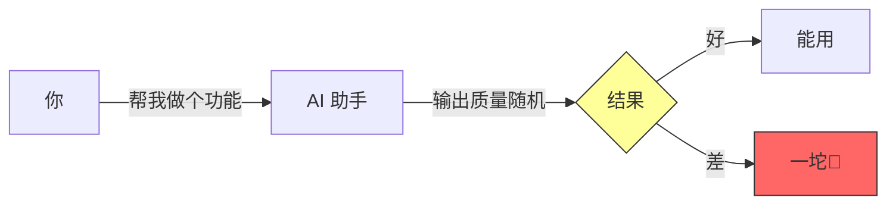
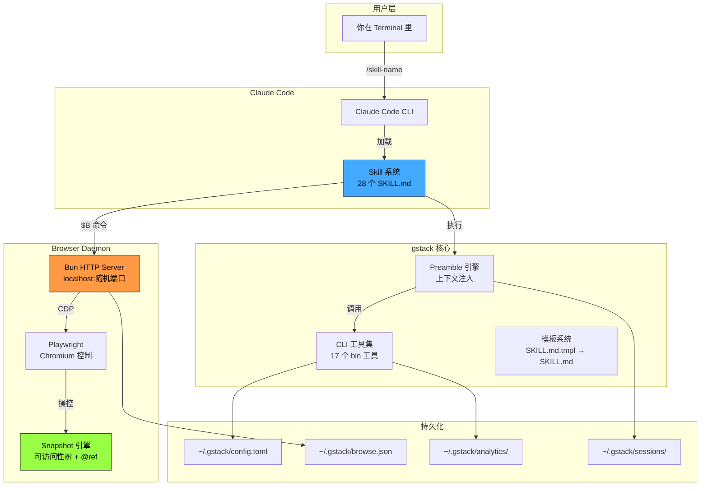
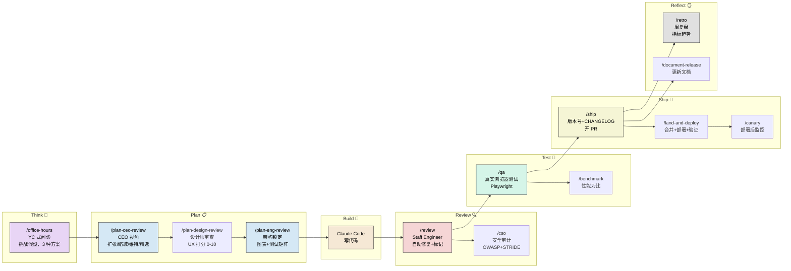
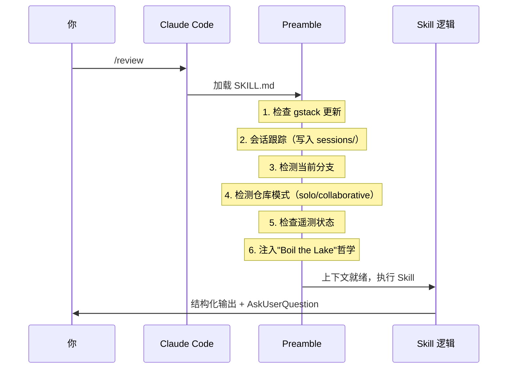
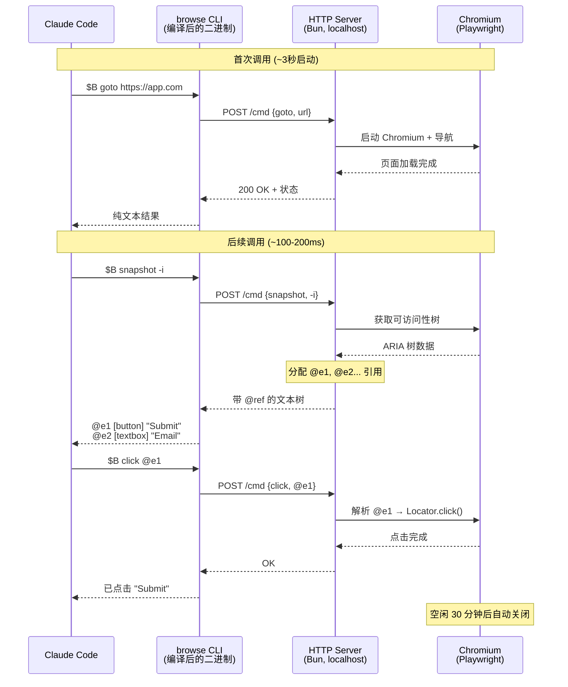
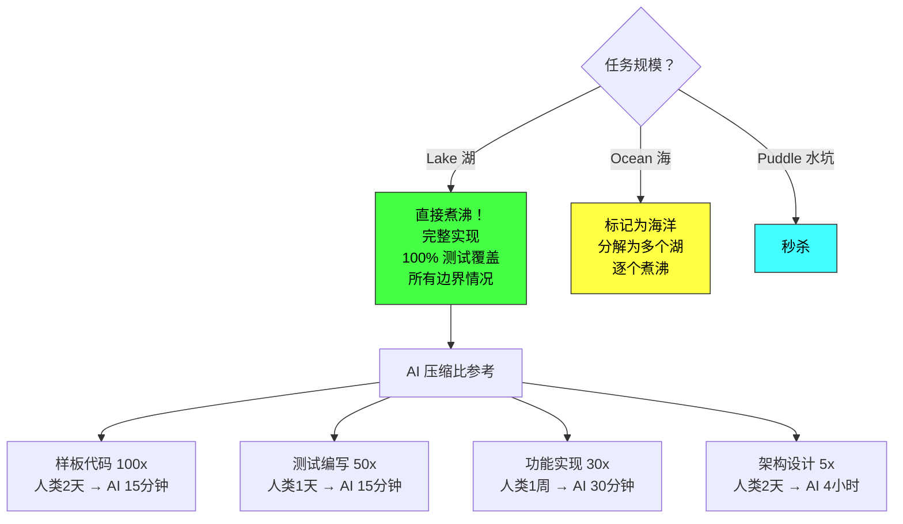
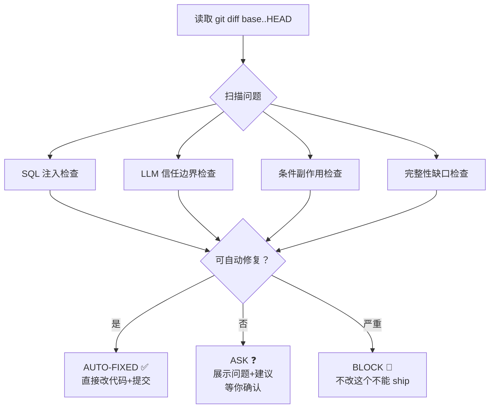
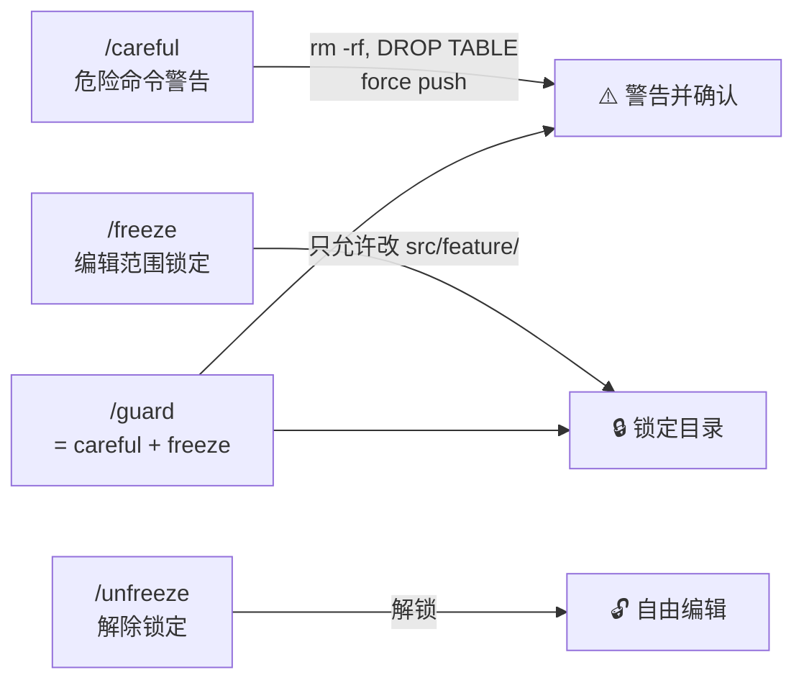
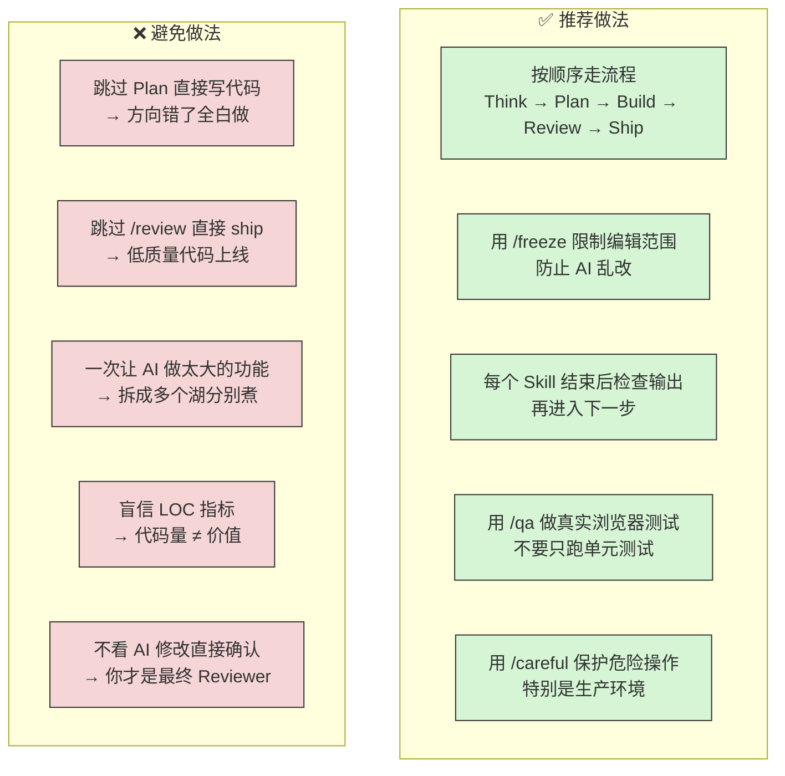
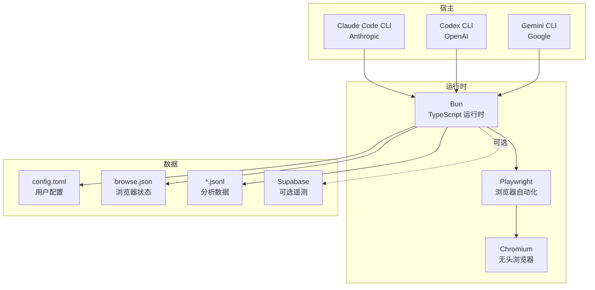

# gstack 深度解析：把 Claude Code 变成你的虚拟工程团队

> **一句话总结**：gstack 是 Y Combinator CEO Garry Tan 开源的 Claude Code 工作流系统，通过 28 个结构化 Skill 把 AI 编码助手从"随机对话"升级为**完整的软件工程团队模拟** —— Think → Plan → Build → Review → Test → Ship → Reflect。

---

## 1. 背景：为什么需要 gstack？

### 1.1 AI 编码的核心痛点



直接用 AI 写代码的问题：
- **输出不稳定**：同一个需求，不同 prompt 写法结果天差地别
- **缺乏审查**：AI 写完就完了，没有 Code Review、没有 QA、没有安全审计
- **上下文丢失**：每次对话都是从零开始，前面做的决策后面不知道
- **完整性不足**：AI 倾向于给你"最小可行"方案，而不是"生产级"方案

### 1.2 gstack 的核心洞察

> **真实的软件团队不是一个人在写代码，而是多个角色在协作。**

一个正经的功能从想法到上线，经历的角色：

| 角色 | 职责 | gstack 对应 Skill |
|------|------|------------------|
| 产品经理/CEO | 定方向、砍需求 | `/office-hours` `/plan-ceo-review` |
| 设计师 | UX 审查、设计系统 | `/plan-design-review` `/design-consultation` |
| 技术负责人 | 架构设计、技术选型 | `/plan-eng-review` |
| 开发工程师 | 写代码 | （你自己 + Claude Code） |
| Code Reviewer | 审查代码质量 | `/review` |
| QA 工程师 | 测试、找 bug | `/qa` `/qa-only` |
| 安全工程师 | 安全审计 | `/cso` |
| 发布工程师 | 打版本、发 PR | `/ship` |
| SRE | 部署后监控 | `/canary` `/land-and-deploy` |
| 技术文档 | 更新文档 | `/document-release` |

gstack 让 **一个人 + Claude Code** 扮演以上所有角色。

---

## 2. 架构全景

### 2.1 整体架构



### 2.2 Sprint 工作流



---

## 3. 核心机制深度解析

### 3.1 Skill 是什么？

每个 Skill 本质上是一个**精心设计的 Markdown 文件**（SKILL.md），定义了：

```yaml
# Skill 文件结构
name: review                    # Skill 名
preamble-tier: 4               # 执行频率 1=总是 4=很少
version: 1.0.0
description: "Pre-landing code review"
allowed-tools:                  # 限制 AI 可用工具
  - Bash
  - Read
  - Edit
  - AskUserQuestion
benefits-from:                  # 上游依赖
  - plan-eng-review
```

**核心理念**：不是给 AI 一个模糊的 prompt，而是给它一个**角色剧本** —— 包含流程、检查清单、输出格式、决策框架。

### 3.2 Preamble（序言引擎）

每个 Skill 执行前都会运行一段标准化的序言，注入关键上下文：



**仓库模式**自动检测特别聪明：
- **solo 模式**（你拥有 80%+ 提交）：AI 主动修复问题
- **collaborative 模式**（多人协作）：AI 只标记问题，问你再改

### 3.3 Browser Daemon（浏览器守护进程）

这是 gstack 最硬核的技术组件 —— 一个**持久化的无头 Chromium 浏览器**。



**为什么要持久化？**
- 登录态保持：不用每次重新登录
- Cookie/Tab/存储持久：测试流程连贯
- 亚秒级响应：不用每次启动浏览器

**@ref 系统**是精华：

```
传统方式：click("#app > div:nth-child(3) > button.submit")  ← 脆弱，一改就挂
gstack 方式：click @e5                                        ← 基于可访问性树，框架无关
```

### 3.4 Completeness 原则（"煮沸湖水"）

gstack 最具争议也最有价值的理念：



**核心逻辑**：当 AI 让边际成本趋近于零时，"做完整"比"做最小"更合理。多写 70 行代码只多花几秒钟，但能省你以后几小时的修补时间。

---

## 4. 关键 Skill 详解

### 4.1 /office-hours — YC 式问诊

**模拟场景**：你去 YC 的 Office Hours，Partner 挑战你的每一个假设。

```
你: 我想做一个日报 App
AI:
  - 谁是目标用户？你自己还是团队？
  - 为什么不用现有方案（Notion、Slack recap）？
  - 核心价值假设是什么？

  3 种方案：
  A) 最小 MVP — 纯命令行日报生成（工作量：15min AI / 2h 人类）
  B) 中等方案 — Web App + AI 摘要（工作量：30min AI / 1周 人类）
  C) 完整方案 — 多源聚合 + 团队面板（工作量：2h AI / 1月 人类）

  RECOMMENDATION: 选 B，因为 [理由]
  Completeness: 7/10
```

### 4.2 /review — Staff Engineer 级代码审查



### 4.3 /qa — 真实浏览器 QA

不是模拟测试，是**真的打开浏览器点点点**：

```bash
$B goto https://staging.myapp.com/login
$B snapshot -i                    # 看到 @e1 用户名, @e2 密码, @e3 登录按钮
$B fill @e1 "test@example.com"
$B fill @e2 "password123"
$B click @e3
$B snapshot -D                    # diff 模式：看登录后变了什么
$B screenshot /tmp/after-login.png
```

发现 bug → 修代码 → 原子提交 → 重跑测试 → 验证修复。循环直到全绿。

### 4.4 /cso — 首席安全官审计

按 OWASP Top 10 + STRIDE 威胁模型逐项审查：

- 注入攻击（SQL、XSS、命令注入）
- 认证/授权漏洞
- 敏感数据暴露
- 安全配置错误
- 已知漏洞依赖

### 4.5 安全守卫组合



---

## 5. 使用场景与最佳实践

### 5.1 适合的场景

| 场景 | 推荐流程 | 预期效果 |
|------|----------|----------|
| **独立开发者做 MVP** | `/office-hours` → `/plan-eng-review` → 写代码 → `/review` → `/ship` | 一天内从想法到 PR |
| **小团队没有专职 QA** | 写完代码 → `/review` → `/qa https://staging...` → `/ship` | 自动化 QA 流程 |
| **CEO 亲自写代码** | `/office-hours` → `/plan-ceo-review` → `/plan-eng-review` → 全流程 | 模拟完整团队 |
| **安全审计** | `/cso` 单独跑 | OWASP + STRIDE 审计报告 |
| **遗留代码排查** | `/investigate` | 系统化根因分析 |
| **周报/复盘** | `/retro` | 自动生成指标趋势 |

### 5.2 最佳实践



### 5.3 快速上手路径

**30 秒安装**：
```bash
git clone https://github.com/garrytan/gstack.git ~/.claude/skills/gstack
cd ~/.claude/skills/gstack && ./setup
```

**第一次使用（5 分钟上手）**：
```bash
# 1. 打开你的项目
cd your-project

# 2. 在 Claude Code 中试试
/office-hours    # 先用这个，把你的想法说出来，让 AI 挑战你
/review          # 写完代码后用这个审查
/ship            # 审查通过后用这个发 PR
```

**进阶使用**：
```bash
/autoplan        # 一键跑完 CEO → 设计 → 工程 全部 Plan 审查
/qa https://localhost:3000   # 真实浏览器测试
/cso             # 安全审计
/guard           # 开启安全护栏（careful + freeze）
```

---

## 6. 技术栈与依赖



**关键依赖**：
- **Bun**（必须）— TypeScript 编译+运行时
- **Playwright + Chromium**（随 setup 安装）— 浏览器测试
- **Claude Code**（主要）/ Codex / Gemini CLI — AI 引擎

---

## 7. 社区评价与争议

### 7.1 正面

- **46,000+ Star**，48 小时内破万
- "将 SDLC 流程注入 AI 编码" 的概念被认为有创新意义
- 有 CTO 称之为 "God Mode"
- 浏览器自动化 + 真实 QA 的集成确实解决了实际问题

### 7.2 争议

- **LOC 指标争议**："60 天 60 万行" —— 批评者认为代码行数是负债不是资产
- **过度工程化质疑**：有人认为这就是 "一堆结构化的 prompts"
- **名人效应**：如果不是 YC CEO 发的，关注度会低很多
- **健康问题**：Garry Tan 自称每晚只睡 4 小时来写代码，社区表示担忧

### 7.3 客观评价

```
gstack 的真正价值不在于让你写更多代码，
而在于给 AI 编码加上了"工程纪律" ——
Code Review、QA、安全审计、发布流程，
这些东西即使在 AI 时代也不应该被跳过。
```

---

## 8. 与类似工具对比

| 特性 | gstack | 裸 Claude Code | Cursor | Copilot |
|------|--------|---------------|--------|---------|
| 结构化工作流 | ✅ 28 个 Skill | ❌ 自由对话 | ❌ | ❌ |
| 真实浏览器测试 | ✅ Playwright | ❌ | ❌ | ❌ |
| 自动 Code Review | ✅ /review | ❌ | ❌ | ❌ |
| 安全审计 | ✅ /cso | ❌ | ❌ | ❌ |
| 角色模拟 | ✅ CEO/设计/QA/SRE | ❌ | ❌ | ❌ |
| 上下文链式传递 | ✅ | ❌ | 部分 | ❌ |
| 开源免费 | ✅ MIT | — | ❌ 付费 | ❌ 付费 |

---

## 9. 谈资速查（帮你吹的要点）

1. **"这是 YC CEO 的工程工作流"** —— Garry Tan 亲自用这套系统，60 天产出 60 万行代码
2. **"不是 AI 写代码，是 AI 模拟整个工程团队"** —— Think/Plan/Build/Review/Test/Ship/Reflect 完整 SDLC
3. **"核心创新是给 AI 加工程纪律"** —— 不跳过 Code Review、不跳过 QA、不跳过安全审计
4. **"真的会打开浏览器测试"** —— 不是 mock，是 Playwright 控制真实 Chromium，亚秒级响应
5. **"Boil the Lake 哲学"** —— 当 AI 让边际成本趋近于零，做完整比做最小更合理
6. **"一个人就是一支团队"** —— Solo founder 的终极武器，适合早期创业快速迭代
7. **"跨 AI 平台"** —— 不绑定 Claude，也支持 Codex 和 Gemini CLI
8. **"争议很大"** —— LOC 指标被业界怼，但工作流结构化的理念被广泛认可

---

## 10. 项目文件结构速览

```
gstack/
├── office-hours/        # Think: YC 式问诊
├── plan-ceo-review/     # Plan: CEO 视角审查
├── plan-eng-review/     # Plan: 工程架构锁定
├── plan-design-review/  # Plan: 设计审查
├── design-consultation/ # Plan: 从零建设计系统
├── review/              # Review: Staff Engineer 代码审查
├── cso/                 # Review: 安全审计
├── qa/                  # Test: 浏览器 QA（修复模式）
├── qa-only/             # Test: 浏览器 QA（只报告）
├── benchmark/           # Test: 性能对比
├── investigate/         # Debug: 根因分析
├── ship/                # Ship: 发版+PR
├── land-and-deploy/     # Ship: 合并+部署+监控
├── canary/              # Ship: 部署后金丝雀监控
├── retro/               # Reflect: 周复盘
├── document-release/    # Reflect: 更新文档
├── autoplan/            # 自动化: 一键全流程 Plan
├── careful/             # 安全: 危险命令警告
├── freeze/              # 安全: 编辑范围锁定
├── guard/               # 安全: careful + freeze
├── unfreeze/            # 安全: 解除锁定
├── codex/               # 跨模型: Codex 二次确认
├── gstack-upgrade/      # 维护: 自动升级
├── browse/              # 核心: 浏览器守护进程
│   ├── src/             #   TypeScript 源码
│   └── dist/            #   编译后二进制 (~58MB)
├── bin/                 # CLI 工具集 (17 个)
├── scripts/             # 构建工具
├── test/                # 测试套件 (3 层)
├── setup                # 安装脚本
├── README.md            # 愿景文档 (17K 字)
├── ARCHITECTURE.md      # 架构文档 (21K 字)
├── SKILL.md             # 主 Skill 文档 (29K 字)
└── ETHOS.md             # 建造者哲学
```
