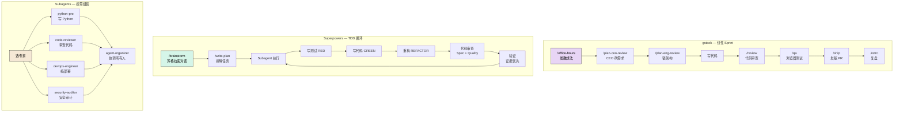
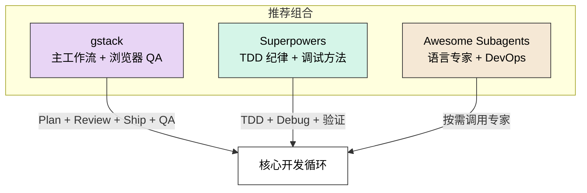

# gstack vs Superpowers vs Awesome Claude Code Subagents 对比分析

## 一句话定位

| 项目 | 定位 | 作者 |
|------|------|------|
| **gstack** | AI 编码的"虚拟工程团队" — 28 个角色化 Skill + 持久化浏览器 | Garry Tan (YC CEO) |
| **Superpowers** | AI 编码的"工程纪律框架" — 15 个方法论 Skill，TDD 驱动 | Jesse Vincent (Prime Radiant) |
| **Awesome Subagents** | AI 编码的"专家人才库" — 127+ 专业领域 Agent | VoltAgent 社区 |

---

## 功能重叠矩阵

```
                    gstack    Superpowers    Subagents
                    ──────    ───────────    ─────────
规划/设计            ✅✅✅      ✅✅✅          ✅
代码审查             ✅✅        ✅✅           ✅✅
QA/测试             ✅✅✅      ✅✅            ✅
真实浏览器测试       ✅✅✅      ❌             ❌
安全审计             ✅✅        ❌             ✅✅
发布/部署            ✅✅✅      ✅              ✅
调试排查             ✅          ✅✅✅          ✅
TDD 流程             ❌          ✅✅✅          ❌
子代理编排           ❌          ✅✅✅          ✅✅✅
语言专家             ❌          ❌             ✅✅✅
基础设施/DevOps      ❌          ❌             ✅✅✅
业务/产品角色        ❌          ❌             ✅✅
```

**重叠度评估：约 30%**。三者的核心差异远大于重叠。

---

## 维度详细对比

### 1. 设计哲学

| | gstack | Superpowers | Awesome Subagents |
|---|--------|-------------|-------------------|
| **核心理念** | "一个人 = 一个团队"<br/>角色模拟 SDLC 全流程 | "纪律胜于混乱"<br/>TDD + 证据驱动 | "专家按需调用"<br/>领域专精 + 模块化 |
| **方法论** | Boil the Lake<br/>（做完整，因为边际成本低） | RED-GREEN-REFACTOR<br/>（先写测试，再写代码） | 按需组装<br/>（需要什么专家调什么） |
| **风格** | 意见强烈、流程固定<br/>CEO 视角的顶层设计 | 严格的工程纪律<br/>不容许跳过任何步骤 | 灵活的工具箱<br/>你决定用什么、怎么用 |
| **比喻** | 雇了一支完整团队<br/>有 CEO、设计师、QA、SRE | 请了一个严格的技术教练<br/>逼你写测试、做验证 | 开了一个人才市场<br/>127 个专家随时待命 |

### 2. 工作流对比



### 3. 核心能力对比

#### 规划/设计

| | gstack | Superpowers | Subagents |
|---|--------|-------------|-----------|
| **方式** | 3 层审查：CEO → 设计 → 工程<br/>每层输出供下层消费 | 苏格拉底对话 + 视觉伴侣<br/>交互式 mockup | product-manager Agent<br/>单次输出 |
| **深度** | 极深：挑战假设、砍需求、锁架构 | 很深：一次只问一个问题<br/>直到完全理解 | 一般：按 Agent 定义执行 |
| **独特点** | `/autoplan` 一键走完全部 Plan | Visual Companion 浏览器 mockup | 有专门的 UX Researcher |

#### 代码审查

| | gstack | Superpowers | Subagents |
|---|--------|-------------|-----------|
| **方式** | `/review` — Staff Engineer 视角<br/>自动修复 + 标记 + 阻塞 | 两阶段审查：<br/>1. Spec 合规 → 2. 代码质量 | code-reviewer Agent<br/>安全+质量+性能 |
| **自动修复** | ✅ AUTO-FIXED 直接改 | ❌ 只提反馈 | ❌ 只提反馈 |
| **独特点** | SQL 注入、LLM 信任边界专项检查 | 必须先理解再回应<br/>（Receiving Code Review skill） | 可选 Opus 模型深度推理 |

#### QA/测试

| | gstack | Superpowers | Subagents |
|---|--------|-------------|-----------|
| **方式** | 真实浏览器：Playwright + 持久化 Chromium<br/>`$B goto` / `$B click @e3` | TDD 流程：先写失败测试<br/>再写最小代码 | qa-expert Agent<br/>策略规划 + 框架推荐 |
| **浏览器** | ✅ 亚秒级响应，登录态保持 | ❌ 无 | ❌ 无 |
| **独特点** | @ref 系统，基于可访问性树 | 删除没有测试的代码 | 覆盖率目标 >90% |

#### 安全

| | gstack | Superpowers | Subagents |
|---|--------|-------------|-----------|
| **方式** | `/cso` — OWASP Top 10 + STRIDE | 无专门安全 Skill | security-auditor (Opus)<br/>penetration-tester |
| **防护** | `/careful` 危险命令警告<br/>`/freeze` 编辑范围锁定 | 无 | compliance-auditor |

#### 发布/部署

| | gstack | Superpowers | Subagents |
|---|--------|-------------|-----------|
| **方式** | `/ship` → `/land-and-deploy` → `/canary`<br/>完整流水线 | `/finishing-a-development-branch`<br/>4 选项：merge/PR/keep/discard | devops-engineer<br/>deployment-engineer |
| **独特点** | 自动 bump VERSION + CHANGELOG | Git worktree 隔离 | CI/CD 自动化专家 |

### 4. 技术实现对比

| | gstack | Superpowers | Subagents |
|---|--------|-------------|-----------|
| **技术栈** | TypeScript + Bun + Playwright | Markdown + Bash + Node.js | 纯 Markdown |
| **复杂度** | 高（编译二进制、HTTP daemon） | 中（脚本+hooks） | 低（只是 md 文件） |
| **安装** | `git clone` + `./setup`<br/>需要 Bun | `claude plugin install` | `./install-agents.sh`<br/>或手动复制 |
| **体积** | ~58MB（编译后浏览器二进制） | 轻量 | 极轻量 |
| **平台** | Claude Code / Codex / Gemini | Claude Code / Codex / Gemini / Cursor / OpenCode | Claude Code 为主 |
| **子代理** | ❌ 不使用子代理 | ✅ 核心机制<br/>implementer + reviewer | ✅ 全是子代理 |
| **模型路由** | ❌ | ✅ 按任务选模型 | ✅ Opus/Sonnet/Haiku |

### 5. 适用场景对比

| 场景 | 最佳选择 | 原因 |
|------|----------|------|
| **独立开发者做 MVP** | **gstack** | 全流程覆盖，一个人走完 Think→Ship |
| **需要严格 TDD** | **Superpowers** | TDD 是核心，不写测试不让写代码 |
| **需要特定语言专家** | **Subagents** | 29 种语言专家，框架级深度 |
| **需要浏览器 QA** | **gstack** | 唯一有真实浏览器集成的 |
| **团队协作标准化** | **Subagents** | 127+ Agent 可按团队需求组装 |
| **安全审计** | **gstack** + **Subagents** | gstack 有 /cso，Subagents 有 penetration-tester |
| **复杂调试** | **Superpowers** | systematic-debugging 4 阶段法最系统 |
| **DevOps/基础设施** | **Subagents** | 17 个基础设施 Agent |
| **代码审查** | **gstack** | 唯一会自动修复的 |
| **新手上手** | **Superpowers** | 流程最清晰，纪律最强 |

---

## 能否组合使用？

**可以，而且推荐。三者互补性很强。**



**组合策略**：

| 阶段 | 用谁 | 为什么 |
|------|------|--------|
| 想法探索 | gstack `/office-hours` | 最好的发散→收敛流程 |
| 架构设计 | gstack `/plan-eng-review` | 图表+测试矩阵最完整 |
| 写代码 | Superpowers TDD + Subagents 语言专家 | TDD 纪律 + 语言深度 |
| 代码审查 | gstack `/review` | 自动修复能力独家 |
| 浏览器测试 | gstack `/qa` | 唯一选项 |
| 安全审计 | gstack `/cso` + Subagents security-auditor | 双重保险 |
| 调试 | Superpowers systematic-debugging | 4 阶段法最系统 |
| 部署 | Subagents devops-engineer | 基础设施专家最全 |
| 发版 | gstack `/ship` | VERSION + CHANGELOG + PR 一条龙 |

---

## 总结评价

| 维度 | gstack | Superpowers | Subagents |
|------|--------|-------------|-----------|
| **广度** | ★★★★☆ | ★★★☆☆ | ★★★★★ |
| **深度** | ★★★★★ | ★★★★★ | ★★★☆☆ |
| **创新性** | ★★★★★ | ★★★★☆ | ★★★☆☆ |
| **易上手** | ★★★☆☆ | ★★★★☆ | ★★★★★ |
| **工程纪律** | ★★★★☆ | ★★★★★ | ★★☆☆☆ |
| **灵活性** | ★★☆☆☆ | ★★★☆☆ | ★★★★★ |
| **技术门槛** | ★★★★☆ | ★★☆☆☆ | ★☆☆☆☆ |

**如果只能选一个**：
- **想快速出活** → gstack（全流程最完整）
- **想写高质量代码** → Superpowers（TDD + 验证最严格）
- **想要最大灵活性** → Subagents（127+ 专家随便挑）

**最佳答案**：三个都装，按场景切换。功能重叠只有 ~30%，互补远大于冲突。
