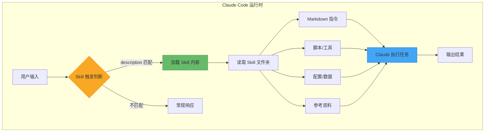
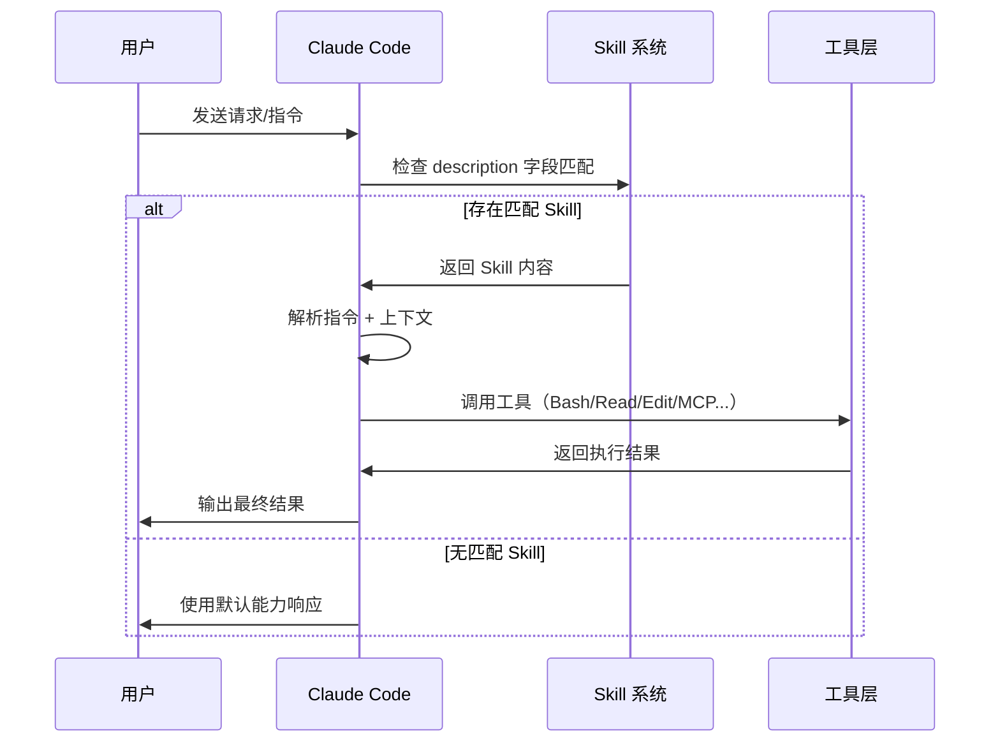
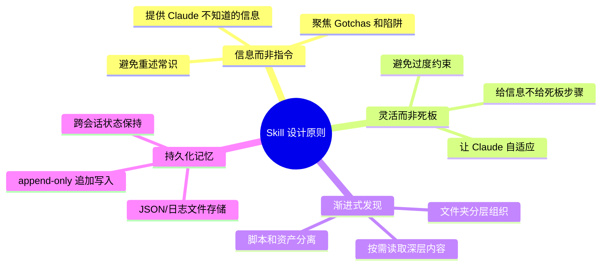
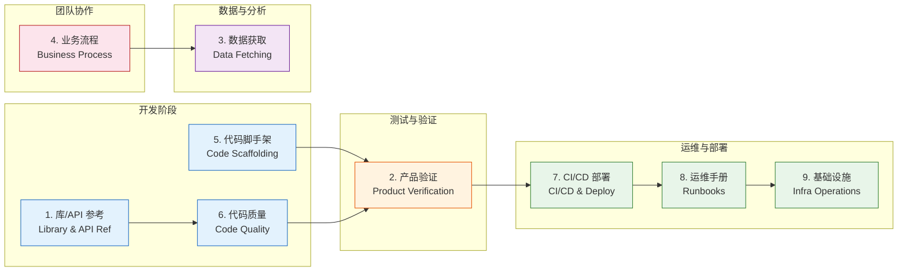
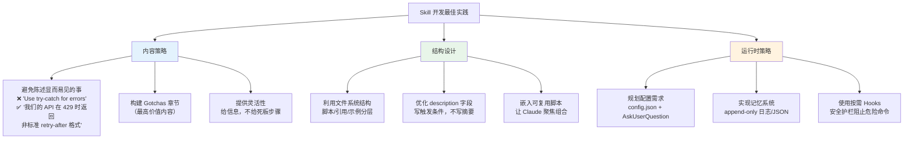
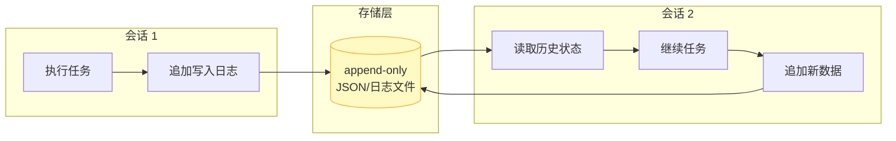
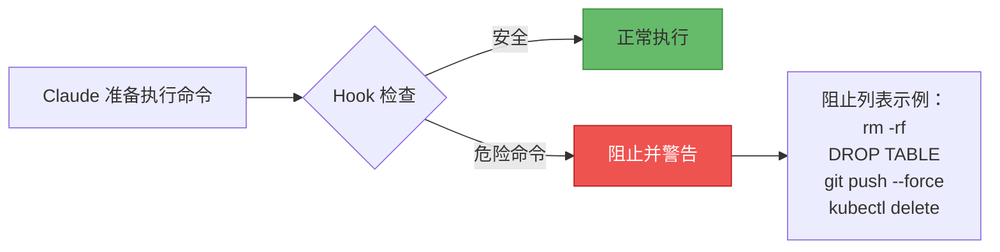
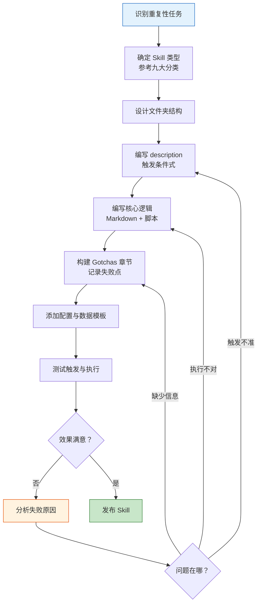
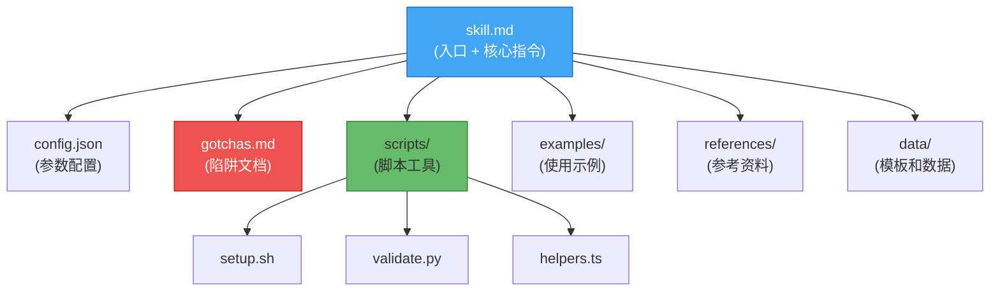

# Claude Code Skills 实践指南

> 基于 Thariq (Anthropic) 文章 *"Lessons from Building Claude Code: How We Use Skills"* (2026-03-17) 整理

## 目录

- [1. Skills 是什么](#1-skills-是什么)
- [2. 核心原理：Skills 的运行机制](#2-核心原理skills-的运行机制)
- [3. 九大 Skills 分类体系](#3-九大-skills-分类体系)
- [4. 各类型详解与示例](#4-各类型详解与示例)
- [5. Skills 最佳实践](#5-skills-最佳实践)
- [6. Skill 开发流程](#6-skill-开发流程)
- [7. 文件系统结构设计](#7-文件系统结构设计)

---

## 1. Skills 是什么

Skills 是 Claude Code 最核心的扩展机制之一。它**不是简单的 Markdown 提示文件**，而是一个可以包含脚本、资产文件、数据和配置的**文件夹**。Claude 能够发现、探索和操作这些资源，从而实现复杂的工程自动化。

**关键认知转变：**

| 初级理解 | 正确理解 |
|----------|----------|
| Skill = 一个 Markdown 文件 | Skill = 一个完整的工具包（文件夹） |
| 写好提示词就行 | 需要设计触发条件、脚本、数据结构 |
| 告诉 Claude 怎么做 | 给 Claude 信息和灵活性，让它自己决定怎么做 |
| 重复常识性知识 | 聚焦 Claude 不知道的"陷阱"和特殊逻辑 |

---

## 2. 核心原理：Skills 的运行机制

### 2.1 Skills 在 Claude Code 中的位置



### 2.2 Skill 触发流程



### 2.3 核心设计原则



---

## 3. 九大 Skills 分类体系



---

## 4. 各类型详解与示例

### 4.1 库/API 参考 (Library & API Reference)

**用途：** 说明库、CLI 或 SDK 的正确用法，包含参考代码片段和常见陷阱。

**典型场景：**
- 内部 billing-lib 的边界案例文档
- internal-platform-cli 子命令指导
- 前端设计系统改进指南

**原理：** Claude 对公开库有较好的知识，但对内部库、私有 API 完全不了解。此类 Skill 填补了这一知识空白。

```
my-lib-skill/
├── skill.md          # 主要使用说明 + 陷阱
├── examples/
│   ├── basic.ts      # 基础用法
│   └── advanced.ts   # 高级模式
└── gotchas.md        # 常见错误和修复
```

---

### 4.2 产品验证 (Product Verification)

**用途：** 用外部工具（Playwright、tmux）测试和验证代码正确性。

**典型场景：**
- `signup-flow-driver` — 无头浏览器测试注册流程
- `checkout-verifier` — Stripe 集成测试
- `tmux-cli-driver` — 交互式 CLI 测试

**原理：** Claude 默认无法"看到"运行中的应用。通过 Playwright 等工具，Skill 让 Claude 获得了对运行时行为的感知能力。

---

### 4.3 数据获取与分析 (Data Fetching & Analysis)

**用途：** 连接数据和监控基础设施，配合凭证和工作流模式。

**典型场景：**
- `funnel-query` — 用户转化漏斗指标
- `cohort-compare` — 留存分析
- Grafana 数据源查询

**原理：** 将数据查询凭证、连接方式、查询模板封装在 Skill 中，Claude 按需组合查询，而非硬编码每种分析场景。

---

### 4.4 业务流程与团队自动化 (Business Process & Team Automation)

**用途：** 自动化重复性工作流，存储结果以保持一致性。

**典型场景：**
- `standup-post` — 聚合站会信息
- 工单创建（含 schema 校验）
- `weekly-recap` — 周报生成

---

### 4.5 代码脚手架与模板 (Code Scaffolding & Templates)

**用途：** 基于自然语言需求生成框架特定的样板代码。

**典型场景：**
- 新框架工作流脚手架
- 数据库迁移文件模板
- 预配置应用初始化

---

### 4.6 代码质量与审查 (Code Quality & Review)

**用途：** 执行组织标准、促进代码审查。

**典型场景：**
- `adversarial-review` — 对抗式审查 + 迭代修复
- 代码风格强制执行
- 测试实践指南

---

### 4.7 CI/CD 与部署 (CI/CD & Deployment)

**用途：** 管理代码推送、拉取和部署流程。

**典型场景：**
- `babysit-pr` — 监控 PR 并解决冲突
- `deploy-service` — 渐进式发布
- `cherry-pick-prod` — 隔离变更的生产热修复

---

### 4.8 运维手册 (Runbooks)

**用途：** 根据症状产出结构化排查报告，使用多种工具组合。

**典型场景：**
- `service-debugging` — 症状映射排查
- `oncall-runner` — 告警分诊
- `log-correlator` — 请求链路追踪

---

### 4.9 基础设施运维 (Infrastructure Operations)

**用途：** 执行维护任务，对破坏性操作设置安全护栏。

**典型场景：**
- `resource-orphans` — 孤立资源清理
- `dependency-management` — 依赖审批
- `cost-investigation` — 成本分析

---

## 5. Skills 最佳实践

### 5.1 实践总览



### 5.2 Description 字段：触发条件而非摘要

这是决定 Skill 是否被调用的关键字段。

```markdown
# ❌ 错误写法（摘要式）
description: 这个 Skill 帮助处理数据库迁移

# ✅ 正确写法（触发条件式）
description: >
  Use when creating, modifying, or rolling back database migrations.
  Trigger on mentions of "migration", "schema change", "ALTER TABLE",
  or when editing files in db/migrations/.
```

**原理：** Claude 会将用户输入与 description 进行语义匹配。描述越像触发条件，匹配越精准。

### 5.3 Gotchas 章节：最高价值内容

Gotchas 文档记录的是 Claude 在使用你的 Skill 时**常见的失败点**。这是将 Claude 推出其"默认思维模式"的关键。

```markdown
## Gotchas

### ❌ 不要直接调用 billing.charge()
billing.charge() 在金额 < $0.50 时会静默失败。
必须先调用 billing.validate_amount() 检查最小值。

### ❌ 日期字段不是 ISO 8601
我们的 API 返回 "MM/DD/YYYY" 格式（历史遗留），
不是 Claude 默认假设的 ISO 8601。解析前必须转换。
```

### 5.4 记忆持久化策略



**关键点：**
- 使用 **append-only** 模式（追加写入），避免覆盖历史数据
- 存储在 **稳定目录** 中（如 `.claude/` 下），确保跨会话可访问
- 使用 JSON 格式便于结构化读取

### 5.5 安全 Hooks：按需护栏



Hooks 是会话级别的安全机制，在 Skill 中定义后，自动拦截危险操作。

---

## 6. Skill 开发流程



---

## 7. 文件系统结构设计

一个成熟 Skill 的典型文件结构：

```
my-skill/
├── skill.md              # 主指令文件（入口）
├── config.json           # 配置参数
├── gotchas.md            # 陷阱与常见错误
├── scripts/
│   ├── setup.sh          # 环境准备脚本
│   ├── validate.py       # 验证脚本
│   └── helpers.ts        # 可复用工具函数
├── examples/
│   ├── basic-usage.md    # 基础示例
│   └── advanced-usage.md # 高级示例
├── references/
│   └── api-spec.yaml     # API 规范参考
└── data/
    └── templates/        # 模板文件
        └── default.json
```



**渐进式发现原理：** Claude 首先读取 `skill.md` 入口文件，根据任务需要再深入读取子目录中的脚本、示例和参考资料。这种分层设计避免了一次性加载过多内容，同时确保所有资源都可被发现。

---

## 参考来源

- 原文：*Lessons from Building Claude Code: How We Use Skills* — Thariq (@trq212), 2026-03-17
- Claude Code 官方文档：[claude.ai/code](https://claude.ai/code)
