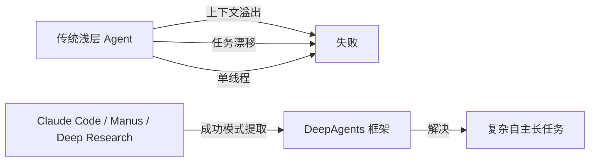
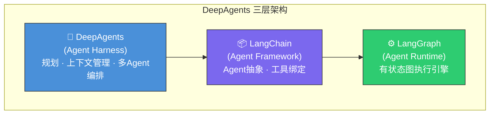
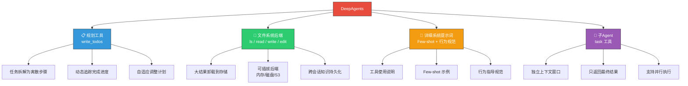
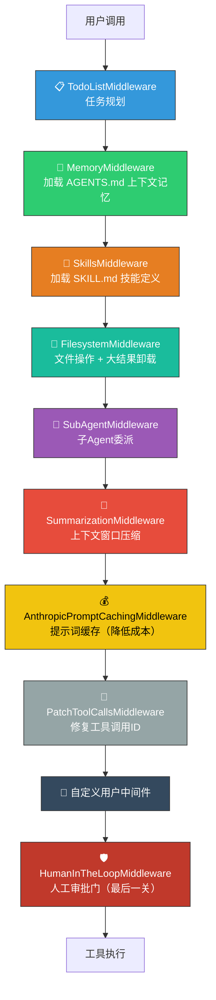
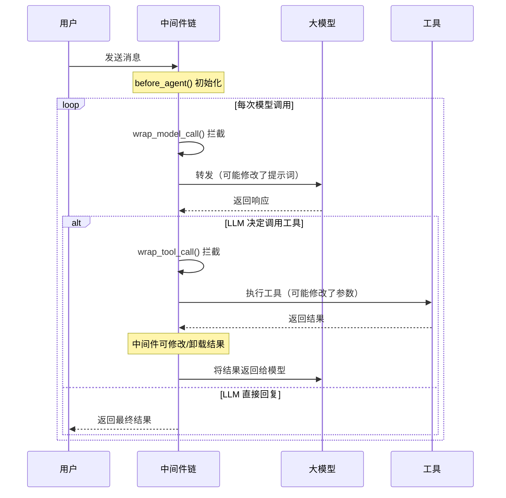
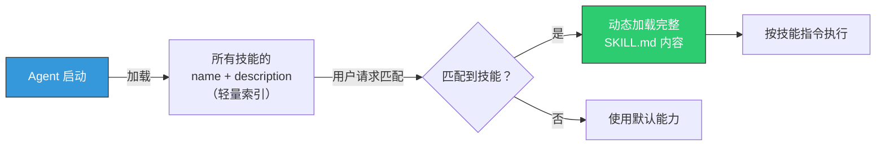
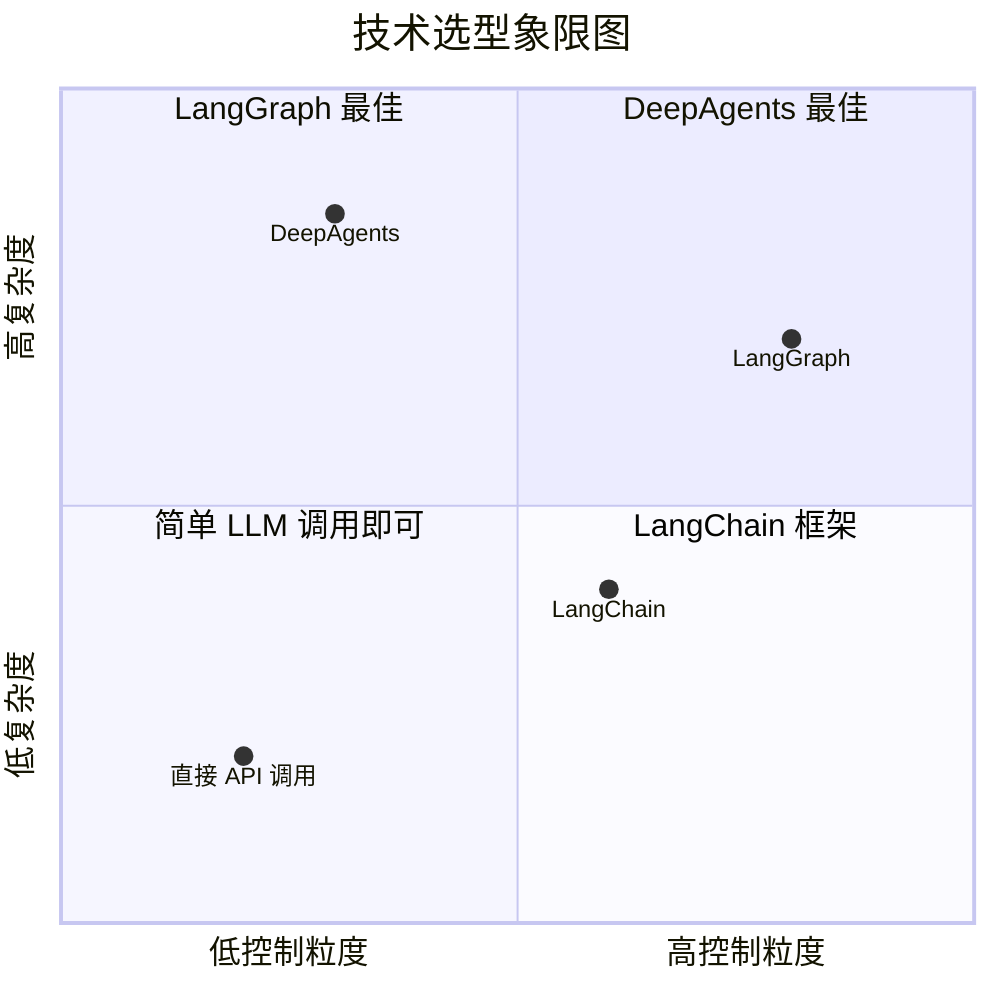
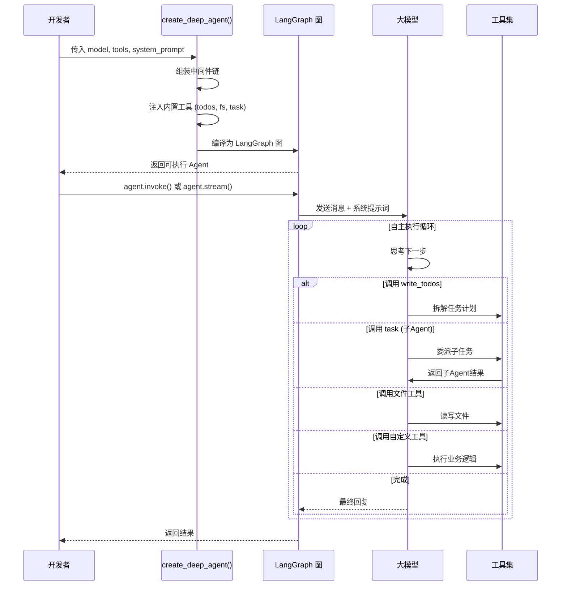
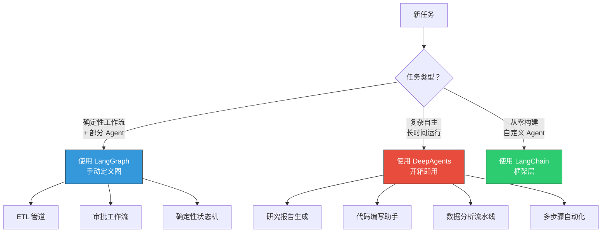

# LangGraph DeepAgent 架构深度解析

## 目录

- [背景与动机](#背景与动机)
- [三层架构总览](#三层架构总览)
- [四大核心支柱](#四大核心支柱)
- [中间件架构](#中间件架构)
- [Skills 技能系统](#skills-技能系统)
- [与普通 LangGraph Agent 对比](#与普通-langgraph-agent-对比)
- [快速上手](#快速上手)
- [使用场景决策](#使用场景决策)
- [参考资源](#参考资源)

---

## 背景与动机

传统"浅层 Agent"基于工具调用循环（tool-call loop），在复杂长周期任务中存在四大瓶颈：

| 痛点 | 说明 |
|------|------|
| 上下文溢出 | 工具返回大量中间结果，快速填满上下文窗口 |
| 任务漂移 | 缺乏规划机制，多步骤执行中偏离目标 |
| 单线程瓶颈 | 无法将复杂任务分解委托给子 Agent |
| 状态不持久 | 跨会话信息无法有效保留 |

LangChain 团队观察到 Claude Code、Manus、Deep Research 等系统的成功模式，将其系统化为 **DeepAgents** 框架。

> 核心洞察：深度不来自算法创新，而来自精心的工程设计——详细提示词 + 规划工具 + 文件系统 + 子 Agent。



---

## 三层架构总览

DeepAgents 在 LangGraph 和 LangChain 之上构建了 **Agent Harness（代理装具）层**：



**关键点**：`create_deep_agent()` 返回的是编译好的 LangGraph 图，可直接使用流式输出、Studio 调试、Checkpointer 持久化等全部能力。

---

## 四大核心支柱



### 1. 详细系统提示词（Detailed System Prompt）

类比 Claude Code 的系统提示词设计，包含详细工具使用说明、Few-shot 示例和行为指导规范，是"上下文工程"的基础层。

### 2. 规划工具（Planning Tool）

内置 `write_todos` 工具，将复杂目标拆解为离散步骤，动态追踪完成进度，随新信息出现自适应调整计划。本质上是一个"无副作用"工具，用于保持 Agent 在长时间执行中的方向感。

### 3. 文件系统后端（Filesystem Backend）

内置文件操作工具集（`ls`、`read_file`、`write_file`、`edit_file`），将大型工具返回结果卸载到存储，解决上下文溢出问题。支持可插拔后端（内存、本地磁盘、LangGraph State/Store、S3 等）。

### 4. 子 Agent（Sub-agents）

内置 `task` 工具，主 Agent 可委派任务给隔离的子 Agent。每个子 Agent 拥有独立上下文窗口，防止状态泄漏；主 Agent 只接收子 Agent 的最终结果，支持并行执行。

---

## 中间件架构

DeepAgents 的关键工程创新是将四大要素实现为**可组合的中间件层**，类似 Express.js / Django 的中间件模式。

### AgentMiddleware 协议

每个中间件实现三个生命周期钩子：

```python
class AgentMiddleware:
    def before_agent(self, state):
        """会话初始化时运行一次，用于状态设置"""
        pass

    def wrap_model_call(self, call_model, state):
        """拦截每次模型调用，可修改提示词"""
        pass

    def wrap_tool_call(self, call_tool, tool_call, state):
        """拦截工具执行，可修改参数或处理结果"""
        pass
```

### 内置中间件执行链



### 中间件拦截机制



---

## Skills 技能系统

Skills 实现了"能力渐进披露"机制，采用**按需加载**设计避免 Token 浪费。

### 加载流程



### 目录结构

```
.deepagents/
└── skills/
    ├── web-research/
    │   ├── SKILL.md        # 必需：YAML frontmatter + Markdown 指令
    │   └── helper.py       # 可选：辅助脚本
    └── code-review/
        └── SKILL.md
```

### SKILL.md 格式示例

```yaml
---
name: web-research
description: Perform comprehensive web research on any topic
version: 1.0.0
tags: [research, web, search]
---

# Web Research Skill

When the user asks to research a topic, follow these steps:
1. Identify key search queries
2. Search multiple sources
3. Synthesize findings
4. Write summary to research.md
```

---

## 与普通 LangGraph Agent 对比

| 维度 | 普通 LangGraph Agent | DeepAgents |
|------|---------------------|------------|
| **抽象层级** | 低层：手动定义图节点和边 | 高层：开箱即用的 Agent Harness |
| **控制粒度** | 精确控制每一步执行 | 信任 LLM 自主决策 |
| **规划能力** | 需手动实现 | 内置 `write_todos` |
| **上下文管理** | 需手动处理 | 自动卸载 + 自动摘要 |
| **子 Agent** | 需手动编排 | 内置 `task` 工具 |
| **Token 消耗** | 相对较少 | 约为 LangGraph 的 **20 倍** |
| **执行速度** | 相对较慢 | 并行子 Agent，Wall-time 更快 |
| **适用场景** | 确定性工作流 + Agent 混合 | 复杂自主长任务 |



---

## 快速上手

### 安装

```bash
# Python
pip install deepagents
# 或
uv add deepagents

# JavaScript/TypeScript
npm install deepagents
```

### 最简使用

```python
from deepagents import create_deep_agent

# 开箱即用
agent = create_deep_agent()

result = agent.invoke({
    "messages": [{"role": "user", "content": "Research LangGraph and write a summary to summary.md"}]
})
```

### 自定义工具和模型

```python
from langchain.chat_models import init_chat_model
from deepagents import create_deep_agent

def get_stock_price(ticker: str) -> str:
    """获取股票实时价格"""
    return f"{ticker}: $150.00"

agent = create_deep_agent(
    model=init_chat_model("openai:gpt-4o"),
    tools=[get_stock_price],
    system_prompt="你是一个专业的金融分析助手，擅长市场研究。",
)

# 支持流式输出（底层是 LangGraph 图）
for chunk in agent.stream({"messages": [{"role": "user", "content": "分析 AAPL 股票"}]}):
    print(chunk)
```

### Agent 完整生命周期



---

## 使用场景决策



---

## 参考资源

| 资源 | 链接 |
|------|------|
| 官方博客 | https://blog.langchain.com/deep-agents/ |
| GitHub 仓库 | https://github.com/langchain-ai/deepagents |
| 官方文档 | https://docs.langchain.com/oss/python/deepagents/overview |
| Skills 使用指南 | https://blog.langchain.com/using-skills-with-deep-agents/ |
| 多 Agent 应用构建 | https://blog.langchain.com/building-multi-agent-applications-with-deep-agents/ |
| DataCamp 教程 | https://www.datacamp.com/tutorial/deep-agents |
| 成本对比分析 | LangGraph vs DeepAgents Token 消耗约 1:20 |

---

*文档生成日期：2026-03-27*
