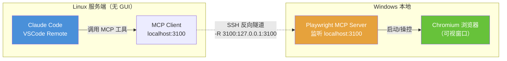
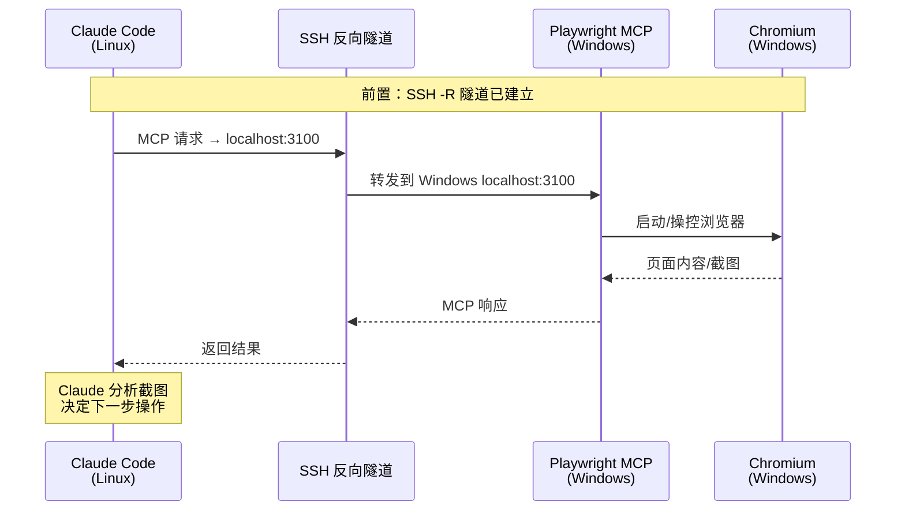
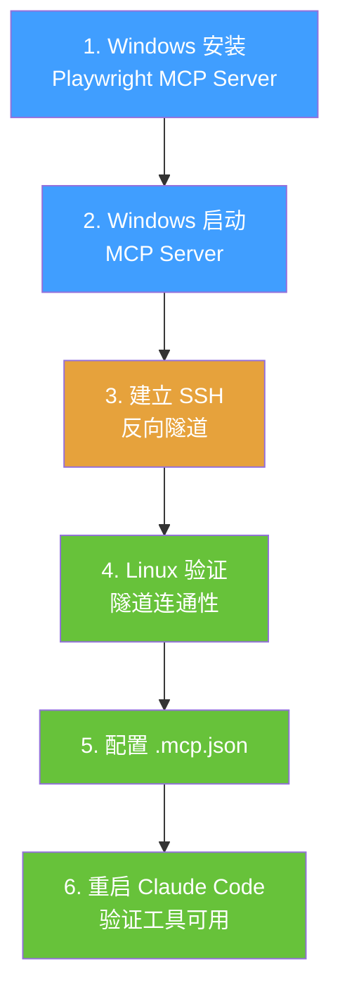
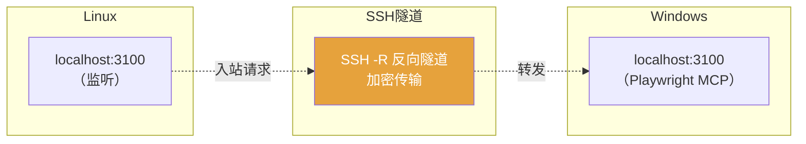
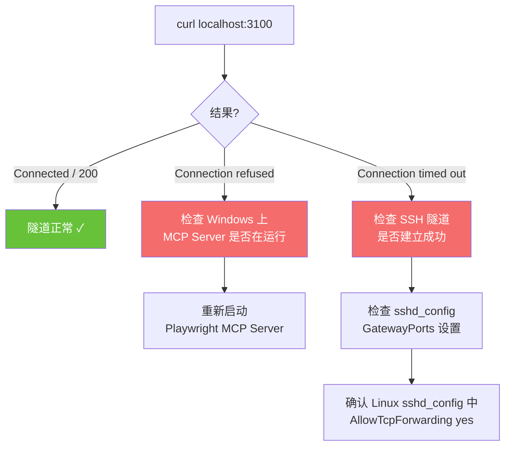
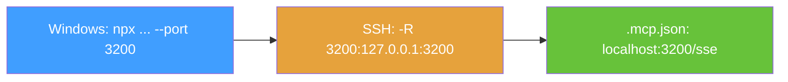
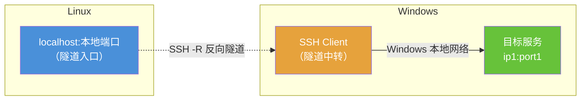
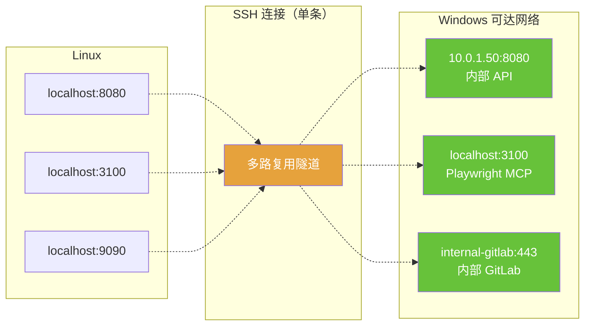
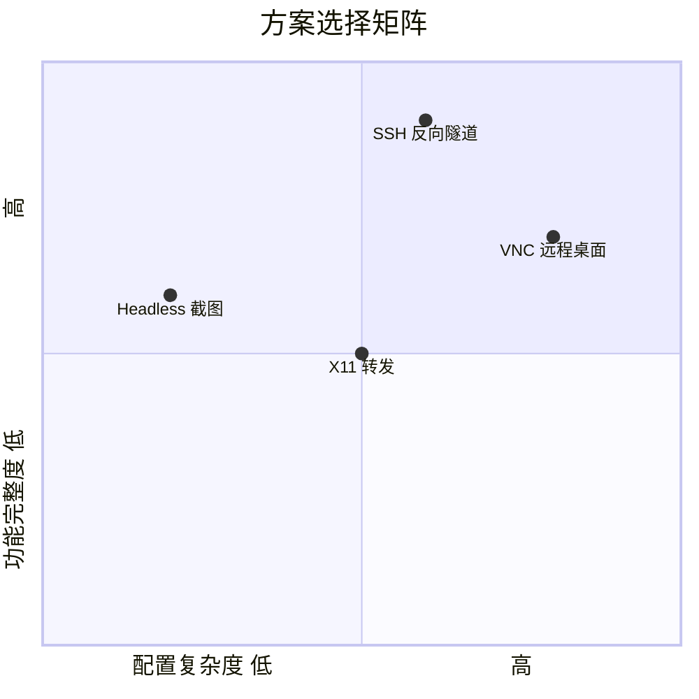

# Playwright MCP + SSH 反向隧道方案

## 场景说明

本地 Windows 通过 VSCode Remote SSH 连接远程 Linux（无 GUI 服务端），Claude Code 插件运行在 Linux 端。需要让 Claude Code 调用 Playwright MCP 操作浏览器，并在 Windows 本地看到浏览器窗口。

**核心矛盾**：Playwright MCP Server 需要运行在有 GUI 的 Windows 上，但 Claude Code 在 Linux 上发起调用，且 Linux → Windows 方向网络可能不通。

**解决思路**：利用已有的 Windows → Linux SSH 通道，建立反向隧道，将 Linux 的本地端口映射到 Windows。

---

## 整体架构



---

## 数据流



---

## 配置步骤

### 步骤总览



---

### 1. Windows 安装 Playwright MCP Server

在 Windows PowerShell 中执行：

```powershell
# 安装 MCP Server
npm install -g @anthropic-ai/mcp-playwright

# 安装 Chromium 浏览器
npx playwright install chromium
```

### 2. Windows 启动 MCP Server

```powershell
# 以 SSE 模式启动，监听 3100 端口
npx @anthropic-ai/mcp-playwright --port 3100
```

启动成功后应看到类似输出：

```
Playwright MCP Server listening on http://localhost:3100
SSE endpoint: http://localhost:3100/sse
```

> **提示**：保持此窗口运行，不要关闭。

### 3. 建立 SSH 反向隧道

在 Windows 上**新开一个终端**，执行：

```powershell
# 语法：ssh -R <远程端口>:<本地地址>:<本地端口> user@linux-server
ssh -R 3100:127.0.0.1:3100 user@linux-server
```

参数说明：

| 参数 | 含义 |
|------|------|
| `-R` | 反向隧道（Remote forwarding） |
| `3100`（第一个） | Linux 上监听的端口 |
| `127.0.0.1:3100` | Windows 本地的目标地址和端口 |
| `user@linux-server` | Linux 服务器的 SSH 连接信息 |



#### 保持隧道稳定（可选）

如果隧道经常断开，可以加参数：

```powershell
ssh -R 3100:127.0.0.1:3100 -o ServerAliveInterval=60 -o ServerAliveCountMax=3 user@linux-server
```

或使用 autossh（更健壮）：

```powershell
# 安装 autossh（通过 scoop 或 chocolatey）
scoop install autossh

# 自动重连
autossh -M 0 -R 3100:127.0.0.1:3100 -o ServerAliveInterval=60 user@linux-server
```

### 4. Linux 验证隧道连通性

在 Linux 上执行：

```bash
# 测试端口是否可达
curl -v http://127.0.0.1:3100 --connect-timeout 5

# 或者
nc -zv 127.0.0.1 3100 -w 5
```

**预期结果**：连接成功，返回响应内容。如果超时或拒绝，检查：



若端口转发被禁用，需要在 Linux 的 `/etc/ssh/sshd_config` 中确认：

```
AllowTcpForwarding yes
GatewayPorts no          # no 即可，我们只需 localhost 访问
```

修改后重启 sshd：`sudo systemctl restart sshd`

### 5. 配置 .mcp.json

在 Linux 项目目录或 `~/.claude/` 下创建/编辑 `.mcp.json`：

```json
{
  "mcpServers": {
    "playwright": {
      "type": "sse",
      "url": "http://127.0.0.1:3100/sse"
    }
  }
}
```

### 6. 重启 Claude Code 验证

重启 Claude Code 后，输入 `/mcp` 或查看工具列表，确认 Playwright 相关工具已加载：

- `browser_navigate`
- `browser_click`
- `browser_take_screenshot`
- `browser_snapshot`
- 等

---

## 端口冲突处理

如果 3100 端口已被占用，统一替换为其他端口（如 3200）：



三处端口号必须一致。

---

## 完整启动清单

每次开发前按顺序执行：

```
Windows 终端 1:  npx @anthropic-ai/mcp-playwright --port 3100
Windows 终端 2:  ssh -R 3100:127.0.0.1:3100 user@linux-server
Linux 验证:      curl http://127.0.0.1:3100 --connect-timeout 5
VSCode:          打开项目 → Claude Code 自动加载 MCP
```

---

## 通用场景：让 Linux 访问任意 Windows 可达的服务

SSH 反向隧道不仅适用于 Playwright MCP，还可以用于任何 **Windows 能访问但 Linux 不能访问** 的服务。

### 原理



**关键点**：目标地址 `ip1:port1` 是从 **Windows 的网络视角** 去解析和访问的。Linux 不需要能直接访问目标，只要 Windows 能访问就行。

### 命令格式

```powershell
# 在 Windows 上执行
ssh -R <Linux监听端口>:<目标IP>:<目标端口> user@linux-server
```

### 示例

假设 Windows 能访问 `10.0.1.50:8080`（内部 API 服务），Linux 不能：

```powershell
# Windows 上执行
ssh -R 8080:10.0.1.50:8080 user@linux-server
```

建立后，在 Linux 上：

```bash
# 等价于 Windows 上访问 10.0.1.50:8080
curl http://127.0.0.1:8080
```

### 多服务同时转发

一条 SSH 命令可以建立多条隧道：

```powershell
ssh \
  -R 8080:10.0.1.50:8080 \
  -R 3100:127.0.0.1:3100 \
  -R 9090:internal-gitlab.corp:443 \
  user@linux-server
```



### 安全提示

- 隧道仅在 Linux 的 `127.0.0.1` 上监听，其他机器无法通过 Linux 访问
- 如需让 Linux 上的其他用户也能访问，需在 `sshd_config` 中设置 `GatewayPorts yes`（谨慎使用）
- 隧道生命周期与 SSH 会话绑定，断开即关闭，不会留下永久开放的端口

---

## 备选方案对比



| 方案 | 能看到浏览器 | 配置难度 | 网络要求 | 推荐场景 |
|------|:---:|:---:|------|------|
| **Headless + 截图** | 否（仅截图） | 低 | 无 | 自动化测试、日常开发 |
| **SSH 反向隧道**（本文） | 是 | 中 | SSH 通即可 | 需要实时观察浏览器 |
| X11 转发 | 是 | 中 | SSH + X11 | Linux 有桌面环境时 |
| VNC 远程桌面 | 是 | 高 | VNC 端口 | 需要完整远程桌面 |

---

## 常见问题

### Q: SSH 断开后隧道会断吗？

会。SSH 连接断开后隧道自动关闭。建议使用 `autossh` 或 VSCode Remote SSH 自带的连接（它会保持 SSH 会话）。

### Q: 可以复用 VSCode Remote SSH 的连接吗？

VSCode Remote SSH 的连接不直接支持反向端口转发配置。需要单独建立一个 SSH 连接来承载反向隧道。

### Q: 浏览器窗口会在 Windows 哪里弹出？

在 Windows 桌面上弹出，和正常打开浏览器一样。Claude Code 操控它时你能实时看到页面变化。

### Q: 多人共用 Linux 服务器时端口会冲突吗？

会。每人应使用不同端口号（如 3101、3102），并在各自的 `.mcp.json` 中配置对应端口。
