# 远程浏览器实时查看方案设计

## 一、背景与需求

### 1.1 使用场景

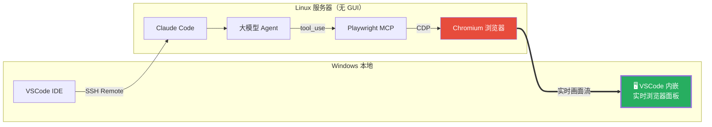

**环境**：Windows VSCode 通过 SSH Remote 连接 Linux 服务器开发。Linux 上运行 Claude Code，大模型通过 Playwright MCP 操作 Chromium。

**核心需求**：

1. 在 VSCode 中**实时**看到 Linux 上浏览器的全部操作过程（不是截图，是连续画面流）
2. Claude Code 调用浏览器 MCP 时**自动打开**查看面板
3. 嵌入 VSCode 内部，不需要切换窗口

### 1.2 约束条件

| 约束 | 说明 |
|------|------|
| Linux 无 GUI | 服务器无 X11/Wayland 桌面环境，需虚拟显示 |
| 网络通道 | SSH 连接，VSCode SSH Remote 自动端口转发 |
| 实时性 | 要求连续画面流，非轮询截图 |
| 易用性 | Claude Code MCP 操作时自动触发，无需手动操作 |

---

## 二、技术方案：noVNC 实时流 + VSCode 插件

### 2.1 整体架构

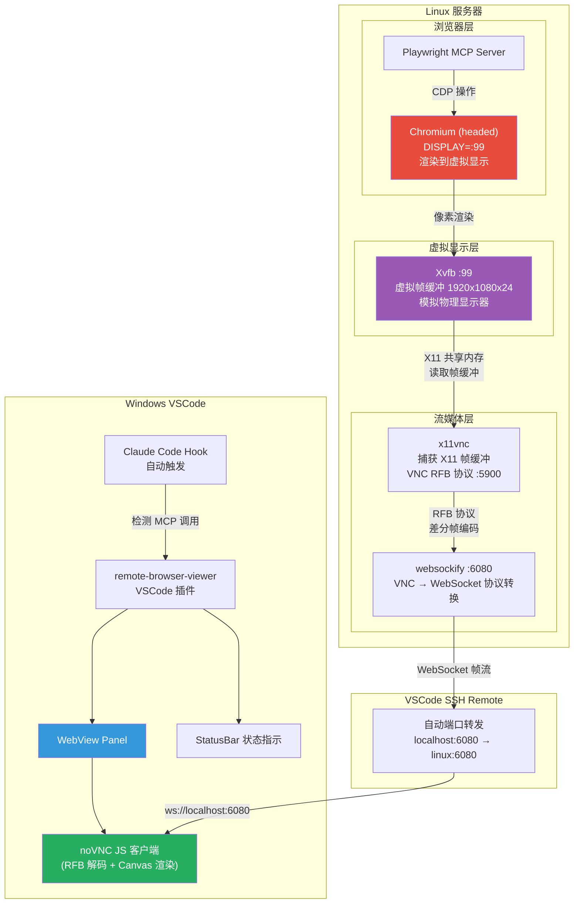

### 2.2 为什么选 noVNC 而非 CDP 截图

| 维度 | noVNC (VNC 流) | CDP captureScreenshot | CDP startScreencast |
|------|:-:|:-:|:-:|
| 传输方式 | 差分帧编码，仅传变化像素 | 每次完整截图 | 事件驱动帧 |
| 实时性 | 真实时，30-60fps | 轮询，5-10fps | 中等，15-30fps |
| 带宽效率 | 高（ZRLE/Tight 压缩） | 低（每帧 50-150KB） | 中 |
| 静态页面 | 几乎零带宽 | 仍在轮询 | 几乎零带宽 |
| 鼠标光标 | 可见（看到 AI 的操作轨迹） | 不可见 | 不可见 |
| 动画/视频 | 流畅 | 丢帧严重 | 有延迟 |
| 技术成熟度 | 20+ 年，极其成熟 | 需自建服务 | Chrome 实验性 API |

**结论**：noVNC 是唯一能提供"像本地浏览器一样流畅"体验的方案。

---

## 三、技术原理详解

### 3.1 虚拟显示层：Xvfb

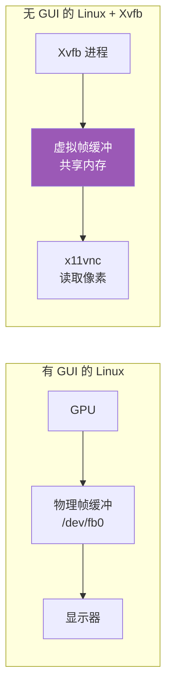

**Xvfb (X Virtual Frame Buffer)** 在内存中模拟一个 X11 显示服务器：
- 提供完整的 X11 协议实现，对应用程序完全透明
- Chromium "以为"自己在渲染到物理显示器，实际渲染到内存缓冲区
- 零 GPU 依赖，纯 CPU 软件渲染
- 支持任意分辨率和色深

### 3.2 VNC 协议流：差分帧编码

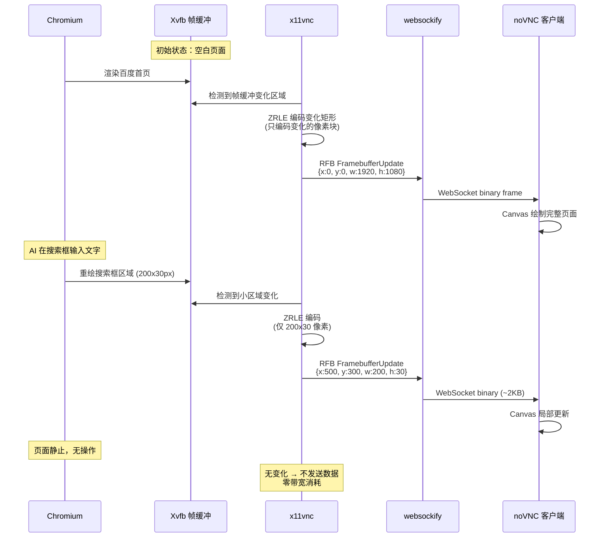

**核心优势**：VNC RFB 协议只传输屏幕上**实际变化的矩形区域**，这意味着：
- 页面加载时：全屏更新，带宽较高
- AI 输入文字时：只传几 KB 的小矩形
- 页面静止时：零传输

### 3.3 websockify 协议转换

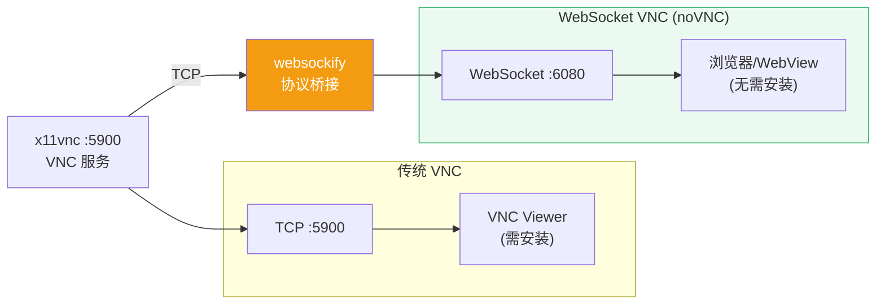

websockify 将 VNC 的 TCP RFB 协议封装为 WebSocket 帧，使浏览器/WebView 能直接连接 VNC 服务。

### 3.4 noVNC 客户端渲染

noVNC 是纯 JavaScript 实现的 VNC 客户端，核心流程：

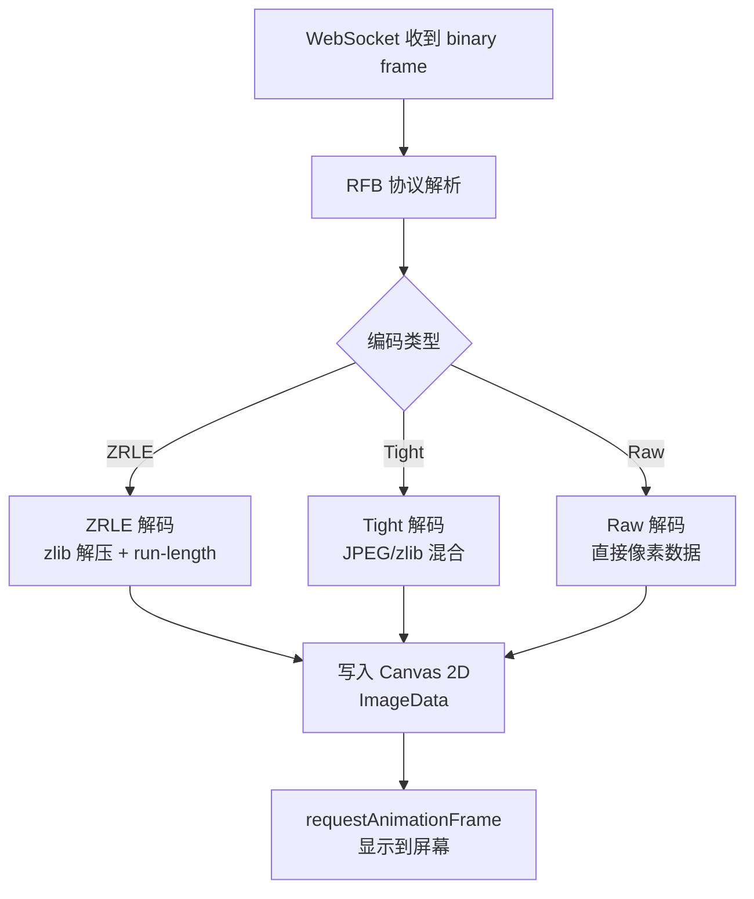

**嵌入 VSCode WebView 的关键**：noVNC 核心是 `@novnc/novnc` npm 包，可以直接在 WebView 中使用，只需要：
1. 一个 `<canvas>` 元素
2. 一个 WebSocket 连接到 `ws://localhost:6080`
3. 调用 `RFB` 类即可

---

## 四、Linux 端部署详细设计

### 4.1 服务启动流程

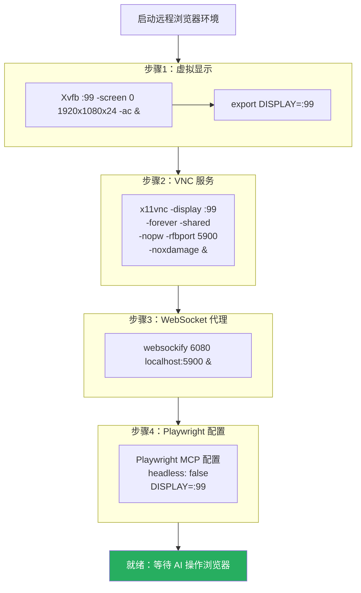

### 4.2 一键启动脚本

```bash
#!/bin/bash
# start-browser-env.sh — 在 Linux 服务器上启动远程浏览器环境

set -e

DISPLAY_NUM="${DISPLAY_NUM:-99}"
SCREEN_SIZE="${SCREEN_SIZE:-1920x1080x24}"
VNC_PORT="${VNC_PORT:-5900}"
WS_PORT="${WS_PORT:-6080}"

echo "=== Remote Browser Environment ==="
echo "Display: :${DISPLAY_NUM} (${SCREEN_SIZE})"
echo "VNC:     :${VNC_PORT}"
echo "WS:      :${WS_PORT}"
echo ""

# 清理旧进程
cleanup() {
    echo "Stopping services..."
    pkill -f "Xvfb :${DISPLAY_NUM}" 2>/dev/null || true
    pkill -f "x11vnc.*:${VNC_PORT}" 2>/dev/null || true
    pkill -f "websockify.*${WS_PORT}" 2>/dev/null || true
}
trap cleanup EXIT
cleanup

# 1. 虚拟显示
echo "[1/3] Starting Xvfb..."
Xvfb :${DISPLAY_NUM} -screen 0 ${SCREEN_SIZE} -ac +extension GLX +render -noreset &
sleep 1
export DISPLAY=:${DISPLAY_NUM}

# 验证 Xvfb
if ! xdpyinfo -display :${DISPLAY_NUM} > /dev/null 2>&1; then
    echo "ERROR: Xvfb failed to start"
    exit 1
fi
echo "  Xvfb running on :${DISPLAY_NUM}"

# 2. VNC 服务
echo "[2/3] Starting x11vnc..."
x11vnc \
    -display :${DISPLAY_NUM} \
    -forever \
    -shared \
    -nopw \
    -rfbport ${VNC_PORT} \
    -noxdamage \
    -cursor arrow \
    -xkb \
    -noxrecord \
    -noxfixes \
    -nowf \
    2>/dev/null &
sleep 1
echo "  x11vnc running on :${VNC_PORT}"

# 3. WebSocket 代理
echo "[3/3] Starting websockify..."
websockify ${WS_PORT} localhost:${VNC_PORT} > /dev/null 2>&1 &
sleep 1
echo "  websockify running on :${WS_PORT}"

echo ""
echo "=== Ready ==="
echo "Connect from VSCode plugin → ws://localhost:${WS_PORT}"
echo "Or browser → http://localhost:${WS_PORT}/vnc.html (if using --web)"
echo ""
echo "Press Ctrl+C to stop all services"

# 保持前台运行
wait
```

### 4.3 systemd 服务配置（生产部署）

```ini
# /etc/systemd/system/browser-env.service
[Unit]
Description=Remote Browser Environment (Xvfb + VNC + WebSocket)
After=network.target

[Service]
Type=forking
Environment=DISPLAY_NUM=99
Environment=SCREEN_SIZE=1920x1080x24
ExecStart=/opt/browser-env/start-browser-env.sh
ExecStop=/bin/bash -c 'pkill -f "Xvfb :99"; pkill -f "x11vnc"; pkill -f "websockify"'
Restart=on-failure
RestartSec=5

[Install]
WantedBy=multi-user.target
```

### 4.4 Docker 方案（可选）

```dockerfile
FROM ubuntu:22.04

RUN apt-get update && apt-get install -y \
    xvfb x11vnc websockify \
    fonts-wqy-zenhei fonts-noto-cjk \
    libnss3 libatk-bridge2.0-0 libdrm2 libxkbcommon0 libgbm1 \
    && rm -rf /var/lib/apt/lists/*

# Playwright 浏览器由挂载的项目自行安装

COPY start-browser-env.sh /opt/
RUN chmod +x /opt/start-browser-env.sh

EXPOSE 6080

CMD ["/opt/start-browser-env.sh"]
```

```bash
docker run -d \
    --name browser-env \
    -p 6080:6080 \
    --shm-size=2g \
    browser-env
```

### 4.5 Playwright MCP 配置

关键：Playwright 必须以 **headed 模式** 运行，浏览器窗口渲染到 Xvfb：

```json
{
  "mcpServers": {
    "playwright": {
      "command": "npx",
      "args": ["@anthropic-ai/mcp-playwright"],
      "env": {
        "DISPLAY": ":99",
        "PLAYWRIGHT_HEADLESS": "false"
      }
    }
  }
}
```

如果 Playwright MCP 不支持 `PLAYWRIGHT_HEADLESS` 环境变量，需要查看具体 MCP 实现的配置方式。大部分 Playwright MCP 实现支持 `headless` 参数：

```json
{
  "mcpServers": {
    "playwright": {
      "command": "npx",
      "args": ["@anthropic-ai/mcp-playwright", "--headless", "false"],
      "env": {
        "DISPLAY": ":99"
      }
    }
  }
}
```

---

## 五、VSCode 插件详细设计

### 5.1 插件架构

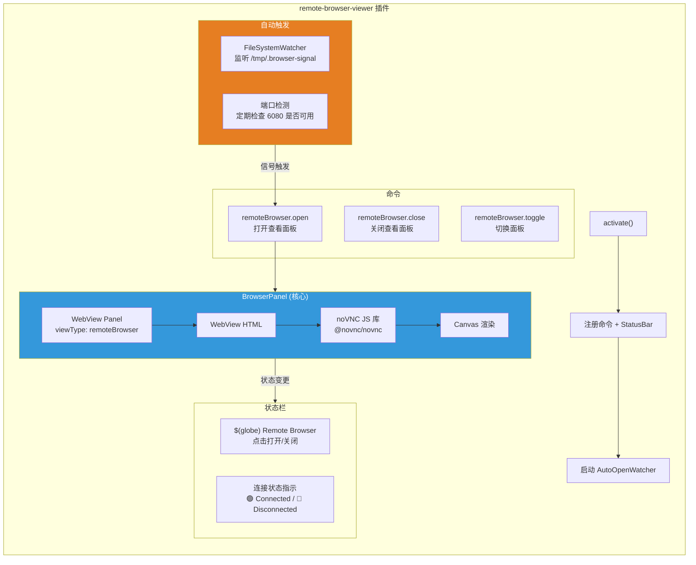

### 5.2 WebView 中嵌入 noVNC 的核心实现

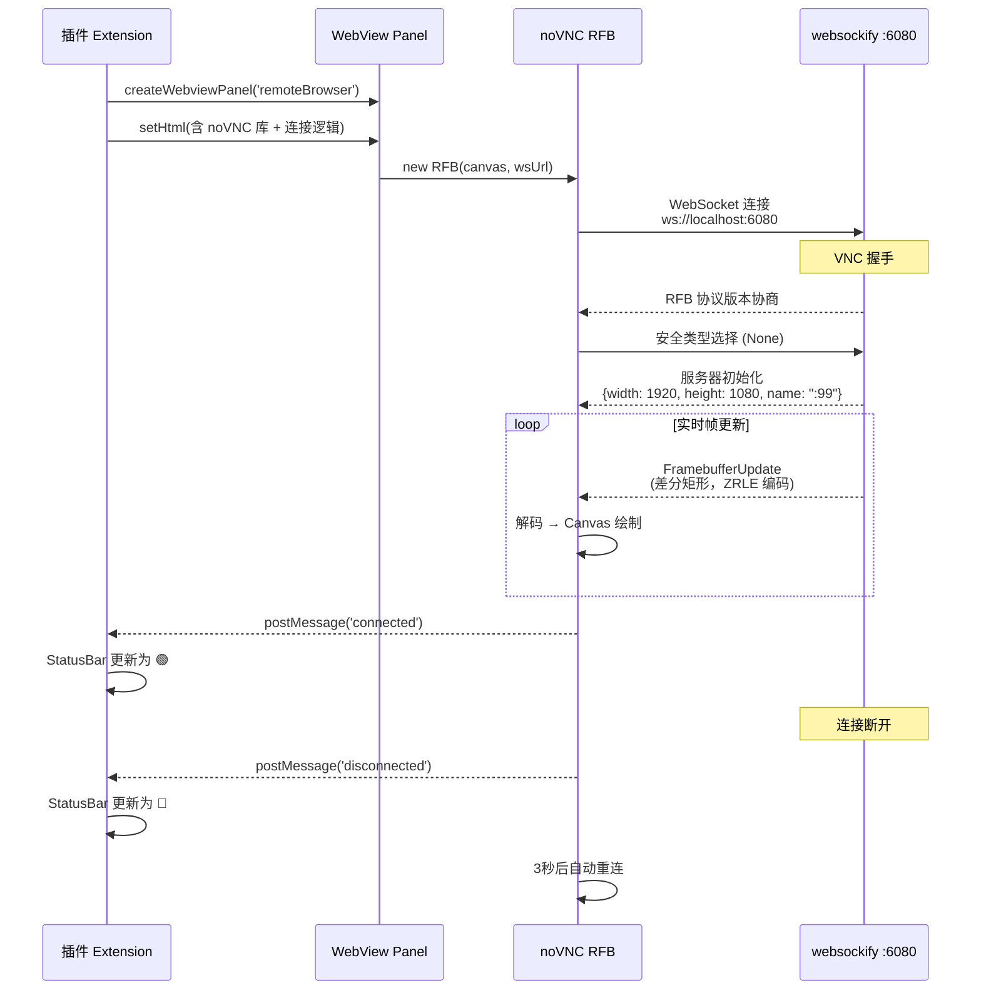

### 5.3 WebView HTML 结构

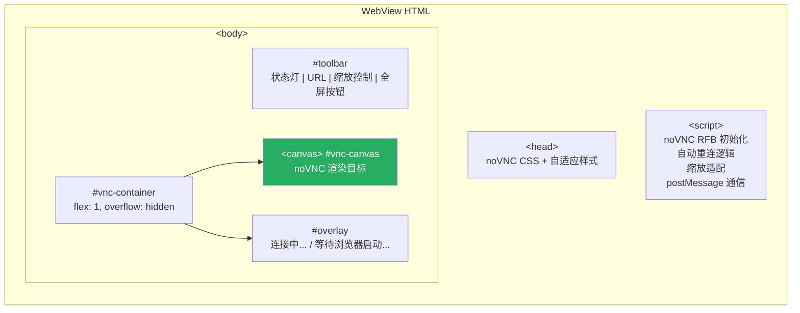

核心 JS 逻辑伪代码：

```javascript
// WebView 内部脚本
import RFB from '@novnc/novnc/core/rfb.js';

const vscode = acquireVsCodeApi();
let rfb = null;

function connect() {
    const url = 'ws://localhost:${port}';
    rfb = new RFB(document.getElementById('vnc-canvas'), url, {
        scaleViewport: true,     // 自动缩放适配面板大小
        clipViewport: false,
        resizeSession: false,
        showDotCursor: true,     // 显示远程光标
        qualityLevel: 6,         // 0-9 质量级别
        compressionLevel: 2      // 0-9 压缩级别
    });

    rfb.addEventListener('connect', () => {
        document.getElementById('overlay').style.display = 'none';
        vscode.postMessage({ type: 'status', connected: true });
    });

    rfb.addEventListener('disconnect', (e) => {
        document.getElementById('overlay').style.display = 'flex';
        vscode.postMessage({ type: 'status', connected: false });
        // 自动重连
        setTimeout(connect, 3000);
    });

    rfb.addEventListener('desktopname', (e) => {
        vscode.postMessage({ type: 'name', name: e.detail.name });
    });
}

connect();

// 监听插件消息（缩放、全屏等控制）
window.addEventListener('message', (e) => {
    if (e.data.type === 'scale') rfb.scaleViewport = e.data.value;
    if (e.data.type === 'quality') rfb.qualityLevel = e.data.value;
});
```

### 5.4 插件配置项

| 配置键 | 类型 | 默认值 | 说明 |
|--------|------|--------|------|
| `remoteBrowser.wsPort` | number | 6080 | websockify WebSocket 端口 |
| `remoteBrowser.autoOpen` | boolean | true | 检测到浏览器 MCP 操作时自动打开面板 |
| `remoteBrowser.scaleViewport` | boolean | true | 自动缩放适配面板大小 |
| `remoteBrowser.quality` | number | 6 | VNC 画质 (0-9，越高越清晰) |
| `remoteBrowser.compression` | number | 2 | VNC 压缩级别 (0-9，越高越省带宽) |
| `remoteBrowser.reconnectInterval` | number | 3000 | 断线重连间隔 (ms) |
| `remoteBrowser.panelPosition` | string | "beside" | 面板位置：beside / bottom / active |

### 5.5 命令与快捷键

| 命令 ID | 标题 | 快捷键 | 说明 |
|---------|------|--------|------|
| `remoteBrowser.open` | Remote Browser: Open | `Ctrl+Shift+B` | 打开实时浏览器面板 |
| `remoteBrowser.close` | Remote Browser: Close | - | 关闭面板 |
| `remoteBrowser.toggle` | Remote Browser: Toggle | `Ctrl+Shift+V` | 切换面板显示/隐藏 |
| `remoteBrowser.reconnect` | Remote Browser: Reconnect | - | 强制重连 |
| `remoteBrowser.screenshot` | Remote Browser: Screenshot | - | 保存当前画面截图 |

### 5.6 noVNC 库打包策略

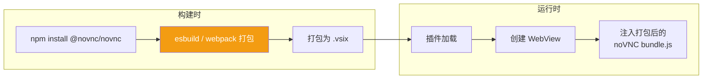

noVNC 核心文件 (`@novnc/novnc/core/rfb.js`) 约 200KB，打包后可压缩到 ~80KB，对 VSCode 插件体积影响极小。

---

## 六、自动触发机制

### 6.1 完整流程

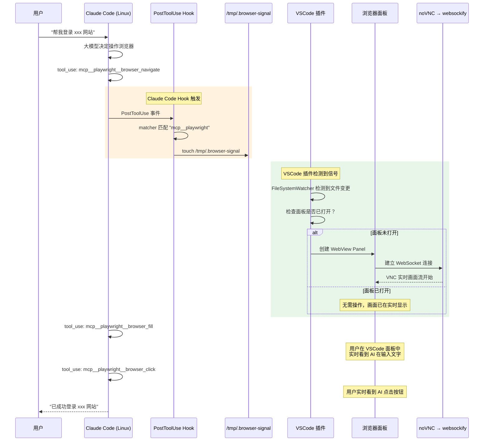

### 6.2 Claude Code Hook 配置

```json
// ~/.claude/settings.json 或项目 .claude/settings.json
{
  "hooks": {
    "PostToolUse": [
      {
        "matcher": "mcp__playwright",
        "command": "touch /tmp/.browser-signal && echo 'browser-signal-sent'"
      }
    ]
  }
}
```

### 6.3 插件端信号监听

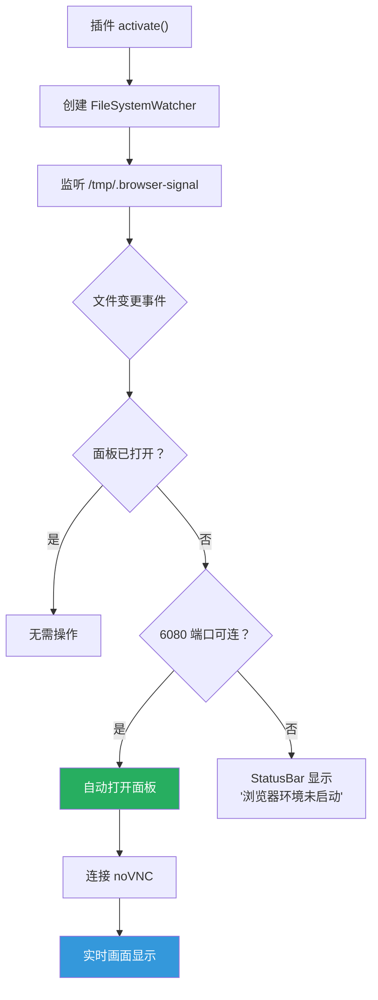

### 6.4 备选触发方式：VSCode 命令转发

如果 Claude Code 支持直接调用 VSCode 命令，可以更简洁：

```json
{
  "hooks": {
    "PostToolUse": [
      {
        "matcher": "mcp__playwright",
        "command": "code --command remoteBrowser.open"
      }
    ]
  }
}
```

---

## 七、数据流与网络

### 7.1 端口映射

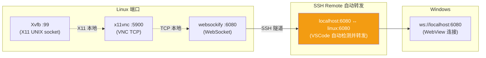

**VSCode SSH Remote 自动端口转发**：当 Linux 上有进程监听 6080 端口时，VSCode 会自动检测并转发到 Windows 的 `localhost:6080`。无需手动配置。

如果自动转发未生效，可手动配置 `.vscode/settings.json`：

```json
{
  "remote.SSH.defaultForwardedPorts": [
    { "localPort": 6080, "remotePort": 6080, "name": "noVNC" }
  ]
}
```

### 7.2 带宽估算

| 场景 | 带宽消耗 | 说明 |
|------|---------|------|
| 页面静止 | ~0 KB/s | VNC 差分编码，无变化不传输 |
| AI 输入文字 | ~5-20 KB/s | 只更新文本框区域 |
| 页面导航/加载 | ~200-500 KB/s | 全屏重绘，持续 1-3 秒 |
| 滚动页面 | ~100-300 KB/s | 大面积矩形更新 |
| 页面含动画 | ~50-150 KB/s | 持续小区域更新 |

通过 SSH 隧道，这些带宽完全可控。

---

## 八、安装依赖与环境准备

### 8.1 Linux 依赖安装

```bash
# Ubuntu/Debian
sudo apt-get update
sudo apt-get install -y \
    xvfb          \  # 虚拟帧缓冲
    x11vnc        \  # X11 VNC 服务
    websockify    \  # VNC → WebSocket 代理
    x11-utils     \  # xdpyinfo 等工具（验证用）
    fonts-wqy-zenhei fonts-noto-cjk  # 中文字体（关键！）

# CentOS/RHEL
sudo yum install -y xorg-x11-server-Xvfb x11vnc python3-websockify \
    wqy-zenhei-fonts google-noto-sans-cjk-ttc-fonts
```

### 8.2 中文字体（重要）

如果浏览器打开中文网页，必须安装中文字体，否则显示为方块：

```bash
# 验证中文字体
fc-list :lang=zh

# 如果为空，安装：
sudo apt-get install -y fonts-wqy-zenhei fonts-wqy-microhei fonts-noto-cjk
sudo fc-cache -fv
```

### 8.3 Playwright 浏览器安装

```bash
# 安装 Playwright 和 Chromium
npx playwright install chromium
npx playwright install-deps chromium  # 安装系统依赖

# 验证
DISPLAY=:99 npx playwright launch --browser chromium
```

---

## 九、项目文件结构

```
remote-browser-viewer/
├── linux/                          # Linux 端
│   ├── start-browser-env.sh        # 一键启动脚本
│   ├── stop-browser-env.sh         # 停止脚本
│   ├── browser-env.service         # systemd 服务文件
│   └── Dockerfile                  # Docker 方案（可选）
│
├── vscode-extension/               # VSCode 插件
│   ├── package.json                # 插件清单（命令、配置、激活事件）
│   ├── tsconfig.json
│   ├── esbuild.config.js           # 打包配置
│   ├── src/
│   │   ├── extension.ts            # 入口：命令注册、StatusBar、Watcher
│   │   ├── browser-panel.ts        # WebView Panel 管理
│   │   ├── auto-open.ts            # 自动触发逻辑
│   │   ├── port-checker.ts         # 端口可用性检测
│   │   └── webview/
│   │       ├── index.html           # WebView HTML 模板
│   │       └── vnc-client.js        # noVNC 初始化 + 重连 + 通信
│   ├── vendor/
│   │   └── novnc/                   # @novnc/novnc 打包后的 bundle
│   └── resources/
│       └── icon.png                 # 插件图标
│
├── claude-hooks/                    # Claude Code Hook 配置
│   └── settings.json.example        # Hook 配置示例
│
└── README.md                        # 使用文档
```

---

## 十、关键技术决策

### 10.1 为什么 noVNC 而不是自研流协议

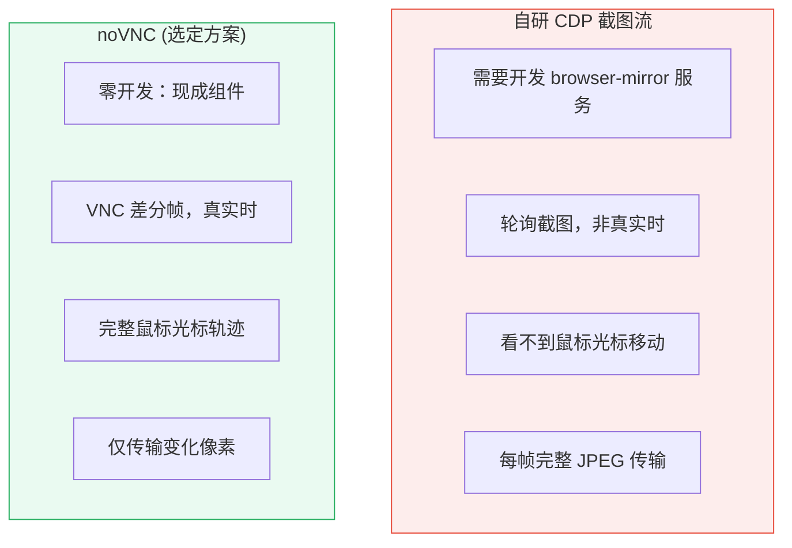

### 10.2 headed vs headless + screencast

| 方面 | headed + Xvfb (选定) | headless + CDP screencast |
|------|:-:|:-:|
| 渲染真实度 | 100% 真实 Chromium 渲染 | 受 headless 限制 |
| 字体渲染 | 完整 CJK 字体支持 | 可能有差异 |
| 弹窗/对话框 | 原生显示 | 可能不显示 |
| 光标可见 | 是 | 否 |
| 依赖 | Xvfb + x11vnc + websockify | 仅 Node.js |
| 稳定性 | 极其成熟 | Chrome 实验性 API |

选择 headed + Xvfb：**所见即所得，AI 操作的就是真实的浏览器界面**。

### 10.3 VSCode WebView 安全限制

VSCode WebView 默认有严格的 CSP (Content Security Policy)：

```
default-src 'none';
style-src ${webview.cspSource} 'unsafe-inline';
script-src 'nonce-xxx';
connect-src ws://localhost:* wss://localhost:*;
```

关键点：
- `connect-src ws://localhost:*` — 允许 WebSocket 连接到 localhost（通过 SSH 转发的端口）
- noVNC JS 需要以 `nonce` 方式加载
- Canvas 操作不受 CSP 限制

---

## 十一、开发路线图

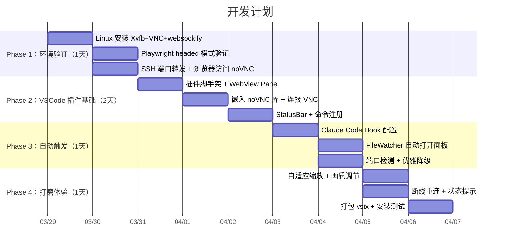

### Phase 1 快速验证步骤

```bash
# === 在 Linux 服务器上执行 ===

# 1. 安装依赖
sudo apt install -y xvfb x11vnc websockify x11-utils

# 2. 启动虚拟显示
Xvfb :99 -screen 0 1920x1080x24 -ac &
export DISPLAY=:99

# 3. 验证显示
xdpyinfo -display :99 | head -5
# 应看到: name of display: :99, version number: 11.0

# 4. 启动 VNC + WebSocket
x11vnc -display :99 -forever -shared -nopw -rfbport 5900 &
websockify --web /usr/share/novnc/ 6080 localhost:5900 &

# 5. 启动一个测试浏览器
npx playwright install chromium
DISPLAY=:99 npx playwright open https://www.baidu.com

# === 在 Windows 上验证 ===

# 6. VSCode SSH Remote 连接后
#    端口面板检查 6080 是否已转发
#    浏览器打开 http://localhost:6080/vnc.html
#    应看到 Linux 上的 Chromium 浏览器实时画面
```

---

## 十二、hello-halo 参考借鉴

hello-halo 项目中的以下设计可借鉴于本方案：

| hello-halo 特性 | 本方案借鉴 |
|------|------|
| 27 个浏览器工具通过 MCP 暴露 | Playwright MCP 已实现类似工具集 |
| Accessibility Tree + UID 快照 | Playwright MCP 的 `browser_snapshot` 同样基于 AX Tree |
| 反检测 (stealth) | 可选：在 Chromium 启动参数中加入反检测 flag |
| offscreen 隐藏窗口 | 本方案用 Xvfb 替代，对应用完全透明 |
| 内置 HTTP+WS 远程访问 | 本方案用 noVNC + SSH 端口转发替代 |
| View Live 实时预览 | 本方案的 WebView Panel 即为 View Live |
| Session partition 共享 | Chromium 本身支持 `--user-data-dir` 实现 session 持久化 |

hello-halo 基于 Electron 的浏览器操作方式（CDP 直连 WebContents）无法在无头 Linux 上使用，但其 **MCP 工具设计模式** 和 **实时预览交互设计** 是本方案 VSCode 插件的直接参考。
