# 远程浏览器实时可视化方案 — VSCode 插件开发指南

## 1. 背景与问题

### 1.1 当前工作环境

**关键理解**：VSCode Remote SSH 模式下，插件运行在远程 Linux 端，UI 渲染在 Windows 端。

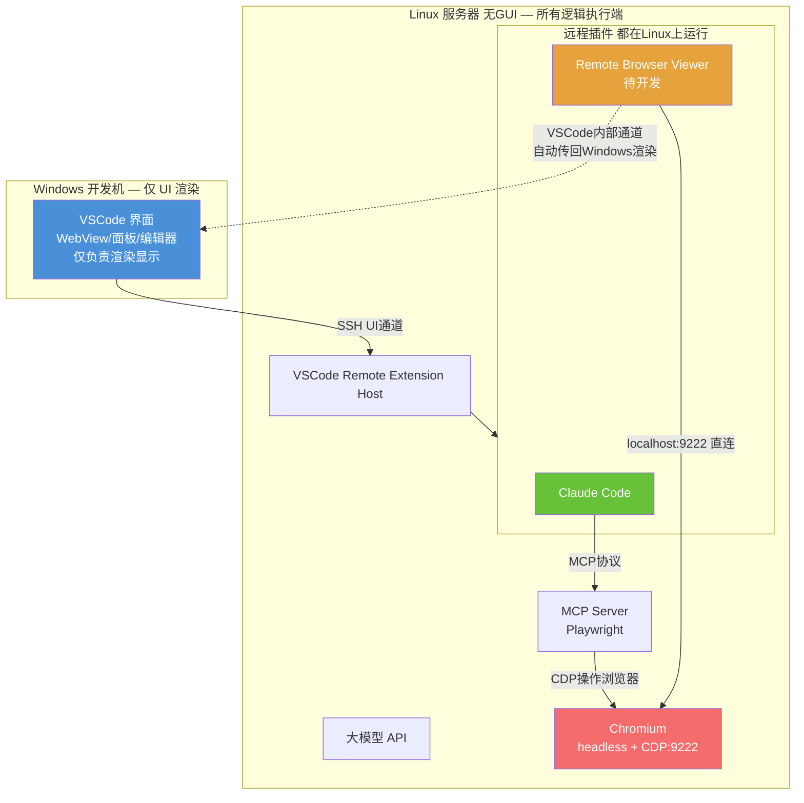
```mermaid
graph TB
    subgraph Windows["Windows 开发机 — 仅 UI 渲染"]
        VSCODE_UI["VSCode 界面<br/>WebView/面板/编辑器<br/>仅负责渲染显示"]
    end

    subgraph Linux["Linux 服务器 无GUI — 所有逻辑执行端"]
        direction TB
        EXT_HOST["VSCode Remote Extension Host"]
        subgraph Plugins["远程插件 都在Linux上运行"]
            CC["Claude Code"]
            VIEWER["Remote Browser Viewer<br/>待开发"]
        end
        LLM["大模型 API"]
        MCP["MCP Server<br/>Playwright"]
        CHROME["Chromium<br/>headless + CDP:9222"]
    end

    VSCODE_UI -->|"SSH UI通道"| EXT_HOST
    EXT_HOST --> Plugins
    CC -->|"MCP协议"| MCP
    MCP -->|"CDP操作浏览器"| CHROME
    VIEWER -->|"localhost:9222 直连"| CHROME
    VIEWER -.->|"VSCode内部通道<br/>自动传回Windows渲染"| VSCODE_UI

    style VSCODE_UI fill:#4a90d9,color:#fff
    style CC fill:#67c23a,color:#fff
    style VIEWER fill:#e6a23c,color:#fff
    style CHROME fill:#f56c6c,color:#fff
```

**VSCode Remote SSH 运行模型**：

| 组件 | 运行位置 | 说明 |
|------|----------|------|
| VSCode 工作台 UI | **Windows** | 编辑器、面板、WebView 渲染 |
| Extension Host | **Linux** | 所有远程插件在此进程运行 |
| Claude Code | **Linux** | 和代码、文件系统、MCP 在同一台机器 |
| Playwright MCP | **Linux** | 操作本机 Chromium |
| Viewer 插件（待开发） | **Linux** | 直连本机 CDP，无需端口转发 |
| WebView 面板内容 | **Windows** | VSCode 自动把 WebView 渲染在本地 |

**核心简化**：Viewer 插件和 Chromium 都在 Linux 上，连接是 **localhost 直连**，不需要端口转发。

### 1.2 核心问题

大模型通过 MCP 工具在 Linux 端操作浏览器，但 Linux 没有 GUI，用户在 Windows 端无法实时看到浏览器画面。

### 1.3 方案对比

| 方案 | 实时性 | 复杂度 | 在VSCode内 | 说明 |
|------|--------|--------|-----------|------|
| **CDP Screencast** | **5-30fps** | **低** | **是** | Chromium 内置帧流，最佳（实际帧率受页面复杂度和 JPEG 编码影响） |
| Chrome 远程调试 | 实时页面 | 最低 | 否 | Windows Chrome 直连查看 |
| noVNC + Xvfb | 实时桌面 | 高 | 否 | 全桌面共享，过重 |
| 截图轮询 | 2fps | 低 | 是 | 幻灯片，不推荐 |

---

## 2. 技术原理：CDP Screencast

### 2.1 什么是 CDP Screencast

CDP（Chrome DevTools Protocol）是 Chromium 内置的调试协议。`Page.startScreencast` 命令让 Chromium **主动推送渲染帧**，这就是 Chrome DevTools 远程调试时用的同一套机制。

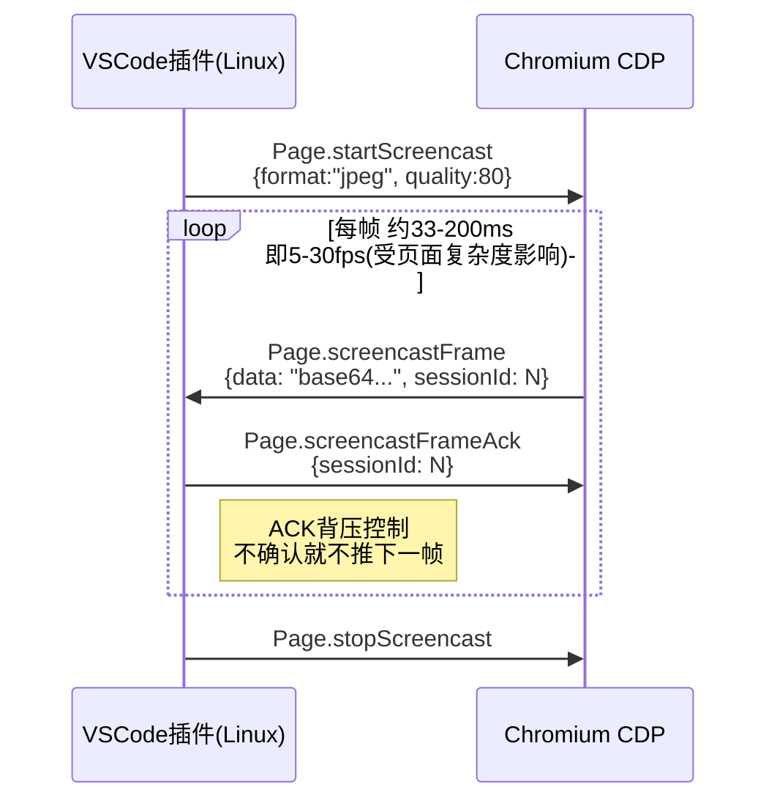
```mermaid
sequenceDiagram
    participant Client as VSCode插件(Linux)
    participant CDP as Chromium CDP

    Client->>CDP: Page.startScreencast<br/>{format:"jpeg", quality:80}

    loop 每帧 约33-200ms 即5-30fps(受页面复杂度影响)
        CDP->>Client: Page.screencastFrame<br/>{data: "base64...", sessionId: N}
        Client->>CDP: Page.screencastFrameAck<br/>{sessionId: N}
        Note right of Client: ACK背压控制<br/>不确认就不推下一帧
    end

    Client->>CDP: Page.stopScreencast
```

### 2.2 为什么比截图好

| 维度 | 截图 page.screenshot | Screencast Page.startScreencast |
|------|---------------------|-------------------------------|
| 触发方式 | 客户端主动拉取 | Chromium 主动推送 |
| 帧率 | 受轮询限制 2fps | 跟随渲染帧率 5-30fps（ACK 单缓冲机制限制上限） |
| 变化感知 | 盲等，错过过渡动画 | 有变化就推，能看到动画 |
| 带宽控制 | 无 | 有背压 ack 机制 |
| 资源消耗 | 每次完整编码 | 更高效 |

### 2.3 多客户端共享 CDP

Playwright MCP 和 Viewer 插件可以同时连接同一个 CDP 端口。Chromium 支持多客户端 CDP 连接，但需注意：Playwright 内部也使用 CDP，两个客户端对同一 target 发送命令可能存在竞态。Viewer 应尽量只做**只读操作**（Screencast、事件监听），避免发送会改变页面状态的命令：

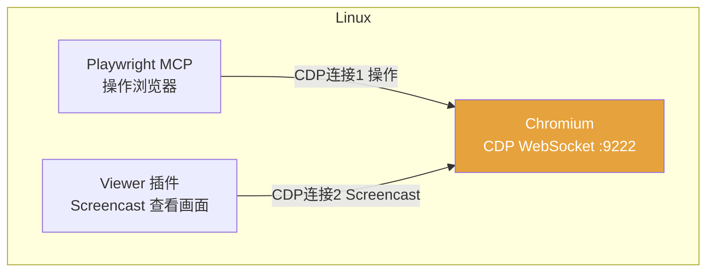
```mermaid
graph TB
    subgraph Linux
        CHROME["Chromium<br/>CDP WebSocket :9222"]
        PW["Playwright MCP<br/>操作浏览器"]
        VIEWER["Viewer 插件<br/>Screencast 查看画面"]
    end

    PW -->|"CDP连接1 操作"| CHROME
    VIEWER -->|"CDP连接2 Screencast"| CHROME

    style CHROME fill:#e6a23c,color:#fff
```

### 2.4 性能估算

| 分辨率 | JPEG质量 | 单帧大小 | 15fps带宽(典型) | 30fps带宽(峰值) |
|--------|---------|----------|----------------|----------------|
| 1280x720 | 80% | ~50-80KB | ~0.75-1.2 MB/s | ~1.5-2.4 MB/s |
| 1280x720 | 60% | ~30-50KB | ~0.45-0.75 MB/s | ~0.9-1.5 MB/s |
| 960x540 | 70% | ~20-35KB | ~0.3-0.5 MB/s | ~0.6-1.0 MB/s |

> **实际帧率说明**：CDP Screencast 使用 ACK 单缓冲机制（确认一帧后才推下一帧），加上 JPEG 编码耗时，实际帧率通常在 5-15fps（简单页面可达 20-30fps）。对于观察 AI 操作浏览器的场景已足够流畅。

SSH 隧道带宽通常 10-50 MB/s，1280x720 完全够用。

---

## 3. VSCode Remote 内部通讯原理

### 3.1 核心问题：Linux 插件如何让 Windows 显示 UI？

Viewer 插件运行在 Linux 上，但用户看到的 WebView 面板在 Windows 上。它们之间**不需要任何端口**，走的是 VSCode 自有的 IPC over SSH 通道。

### 3.2 VSCode Remote 的三层架构

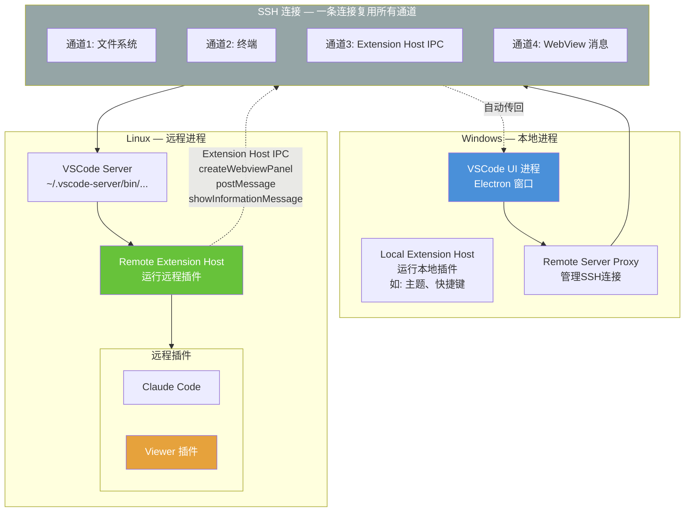
```mermaid
graph TB
    subgraph Windows["Windows — 本地进程"]
        direction TB
        CODE_UI["VSCode UI 进程<br/>Electron 窗口"]
        LOCAL_EXT["Local Extension Host<br/>运行本地插件<br/>如: 主题、快捷键"]
        REMOTE_SRV_PROXY["Remote Server Proxy<br/>管理SSH连接"]
    end

    subgraph SSH_Channel["SSH 连接 — 一条连接复用所有通道"]
        direction TB
        CH1["通道1: 文件系统"]
        CH2["通道2: 终端"]
        CH3["通道3: Extension Host IPC"]
        CH4["通道4: WebView 消息"]
    end

    subgraph Linux["Linux — 远程进程"]
        direction TB
        VSCODE_SERVER["VSCode Server<br/>~/.vscode-server/bin/..."]
        REMOTE_EXT_HOST["Remote Extension Host<br/>运行远程插件"]
        subgraph Remote_Extensions["远程插件"]
            CC["Claude Code"]
            VIEWER["Viewer 插件"]
        end
    end

    CODE_UI --> REMOTE_SRV_PROXY
    REMOTE_SRV_PROXY --> SSH_Channel
    SSH_Channel --> VSCODE_SERVER
    VSCODE_SERVER --> REMOTE_EXT_HOST
    REMOTE_EXT_HOST --> Remote_Extensions

    REMOTE_EXT_HOST -.->|"Extension Host IPC<br/>createWebviewPanel<br/>postMessage<br/>showInformationMessage"| SSH_Channel
    SSH_Channel -.->|"自动传回"| CODE_UI

    style CODE_UI fill:#4a90d9,color:#fff
    style VIEWER fill:#e6a23c,color:#fff
    style REMOTE_EXT_HOST fill:#67c23a,color:#fff
    style SSH_Channel fill:#95a5a6,color:#fff
```

### 3.3 通讯机制详解

VSCode Remote 只需要**一条 SSH 连接**，上面复用了多个逻辑通道：

| 通道 | 用途 | Viewer插件使用场景 |
|------|------|-------------------|
| 文件系统 | 读写远程文件 | 不使用 |
| 终端 | 远程终端 | 不使用 |
| Extension Host IPC | 插件和UI之间的消息 | `createWebviewPanel`、`showInformationMessage`、状态栏 |
| WebView 消息 | 插件和WebView之间的双向通信 | `postMessage` 发送帧数据给 WebView |

**Viewer 插件开发者不需要关心这些通道**。VSCode API 在本地模式和远程模式下完全一致：

```typescript
// 这段代码在本地和远程模式下都能工作
// 本地模式: 直接在 Windows Extension Host 运行
// 远程模式: 在 Linux Extension Host 运行，VSCode 框架自动处理传输
const panel = vscode.window.createWebviewPanel('id', 'Title', column, opts);
panel.webview.postMessage({ type: 'frame', data: base64 });
```

### 3.4 帧数据从 Linux 到 Windows 的完整路径

```mermaid
sequenceDiagram
    participant Chrome as Chromium(Linux)
    participant EXT as Viewer插件(Linux)
    participant IPC as Extension Host IPC
    participant SSH as SSH连接
    participant UI as VSCode UI(Windows)
    participant WV as WebView iframe(Windows)

    Chrome->>EXT: CDP Page.screencastFrame<br/>base64约50KB

    Note over EXT: 插件代码: panel.webview.postMessage(data)

    EXT->>IPC: postMessage 调用<br/>VSCode API 内部处理
    IPC->>SSH: 序列化消息 发送到SSH通道
    SSH->>UI: Windows收到消息
    UI->>WV: 路由到对应的WebView iframe

    Note over WV: WebView JS: window.onmessage<br/>img.src = data:image/jpeg;base64,...

    WV->>UI: 渲染在VSCode右侧面板

    Note over Chrome,WV: 全程约30-50ms延迟<br/>CDP本地+SSH传输+渲染
```

### 3.5 关键结论

| 问题 | 答案 |
|------|------|
| Windows 需要开发插件吗？ | **不需要**。Viewer 插件只部署在 Linux 端 |
| 用什么端口通讯？ | **不需要端口**。走 VSCode 自有的 IPC over SSH 通道 |
| WebView HTML 在哪里执行？ | **Windows**。VSCode 自动把 WebView HTML 传到本地执行 |
| 帧数据怎么传到 Windows？ | `postMessage` → VSCode IPC → SSH → Windows WebView |
| 开发者需要处理传输吗？ | **不需要**。VSCode API 自动处理，代码和本地模式一样 |
| 会不会很慢？ | 单帧 ~50KB，SSH 通道带宽充足，约 30-50ms 延迟 |

---

## 4. 方案 A：CDP Screencast（推荐）

### 4.1 架构

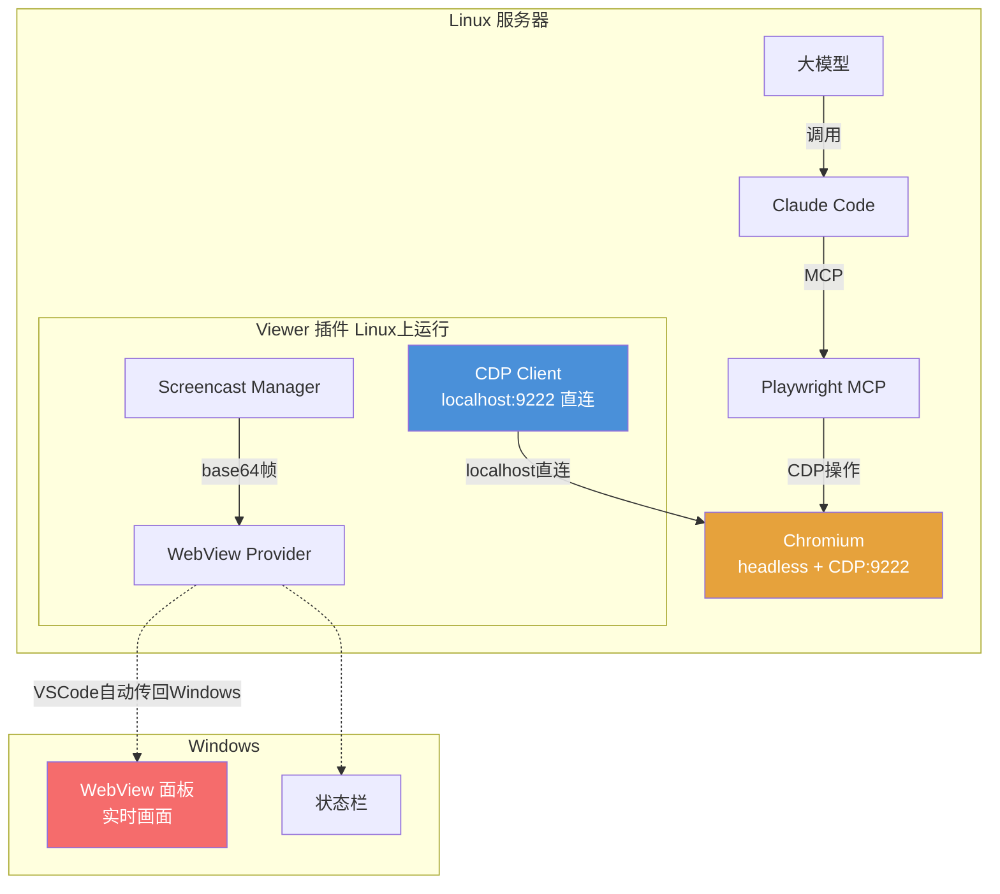
```mermaid
graph TB
    subgraph Linux["Linux 服务器"]
        direction TB
        LLM["大模型"]
        CC["Claude Code"]
        MCP["Playwright MCP"]
        CHROME["Chromium<br/>headless + CDP:9222"]

        subgraph Viewer_Plugin["Viewer 插件 Linux上运行"]
            CDP_CLIENT["CDP Client<br/>localhost:9222 直连"]
            CAST_MGR["Screencast Manager"]
            WV_PROVIDER["WebView Provider"]
        end
    end

    subgraph Windows["Windows"]
        WV["WebView 面板<br/>实时画面"]
        SB["状态栏"]
    end

    LLM -->|"调用"| CC
    CC -->|"MCP"| MCP
    MCP -->|"CDP操作"| CHROME
    CDP_CLIENT -->|"localhost直连"| CHROME
    CAST_MGR -->|"base64帧"| WV_PROVIDER
    WV_PROVIDER -.->|"VSCode自动传回Windows"| WV
    WV_PROVIDER -.-> SB

    style CHROME fill:#e6a23c,color:#fff
    style CDP_CLIENT fill:#4a90d9,color:#fff
    style WV fill:#f56c6c,color:#fff
```

**优点**：
- **真正的实时** — 5-30fps 流畅画面（满足观察 AI 操作需求）
- **零额外服务** — Linux 不需要部署额外进程
- **零端口转发** — 插件和 Chromium 同一台机器
- **无网络开销** — localhost 直连，延迟极低

### 4.2 数据流时序

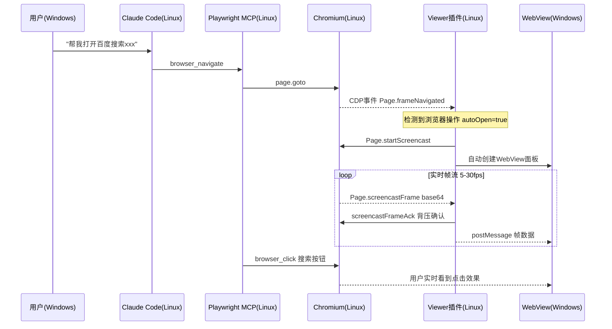
```mermaid
sequenceDiagram
    participant User as 用户(Windows)
    participant CC as Claude Code(Linux)
    participant MCP as Playwright MCP(Linux)
    participant Chrome as Chromium(Linux)
    participant EXT as Viewer插件(Linux)
    participant WV as WebView(Windows)

    User->>CC: "帮我打开百度搜索xxx"
    CC->>MCP: browser_navigate
    MCP->>Chrome: page.goto

    Chrome-->>EXT: CDP事件 Page.frameNavigated
    Note over EXT: 检测到浏览器操作 autoOpen=true

    EXT->>Chrome: Page.startScreencast
    EXT->>WV: 自动创建WebView面板

    loop 实时帧流 5-30fps
        Chrome-->>EXT: Page.screencastFrame base64
        EXT->>Chrome: screencastFrameAck 背压确认
        EXT-->>WV: postMessage 帧数据
    end

    MCP->>Chrome: browser_click 搜索按钮
    Chrome-->>WV: 用户实时看到点击效果
```

---

## 5. 方案 B：Chrome 远程调试（快速验证）

零开发方案，用 Windows Chrome 直连 Linux Chromium。

### 5.1 操作步骤

```bash
# Linux端 — 确保Playwright启动时暴露CDP端口
PLAYWRIGHT_LAUNCH_ARGS="--remote-debugging-port=9222"
```

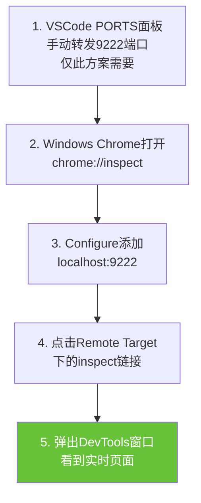
```mermaid
graph TB
    S1["1. VSCode PORTS面板<br/>手动转发9222端口<br/>仅此方案需要"] --> S2["2. Windows Chrome打开<br/>chrome://inspect"]
    S2 --> S3["3. Configure添加<br/>localhost:9222"]
    S3 --> S4["4. 点击Remote Target<br/>下的inspect链接"]
    S4 --> S5["5. 弹出DevTools窗口<br/>看到实时页面"]

    style S5 fill:#67c23a,color:#fff
```

**优点**：零开发，立即可用。**缺点**：不在VSCode内，不自动触发，需手动端口转发。

---

## 6. 方案 A 详细设计

### 6.1 CDP 连接流程

插件和 Chromium 都在 Linux，localhost 直连：

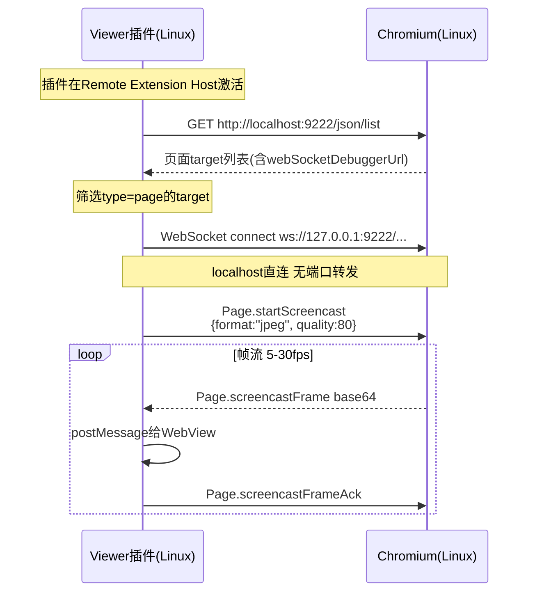
```mermaid
sequenceDiagram
    participant EXT as Viewer插件(Linux)
    participant CDP as Chromium(Linux)

    Note over EXT: 插件在Remote Extension Host激活

    EXT->>CDP: GET http://localhost:9222/json/list
    CDP-->>EXT: 页面target列表(含webSocketDebuggerUrl)
    Note over EXT: 筛选type=page的target

    EXT->>CDP: WebSocket connect ws://127.0.0.1:9222/...
    Note over EXT,CDP: localhost直连 无端口转发

    EXT->>CDP: Page.startScreencast<br/>{format:"jpeg", quality:80}

    loop 帧流 5-30fps
        CDP-->>EXT: Page.screencastFrame base64
        EXT->>EXT: postMessage给WebView
        EXT->>CDP: Page.screencastFrameAck
    end
```

### 6.2 MVP 核心代码（~150行）

```typescript
// extension.ts — 运行在 Linux Remote Extension Host
import * as vscode from 'vscode';
import WebSocket from 'ws';

let ws: WebSocket | undefined;
let panel: vscode.WebviewPanel | undefined;
let cmdId = 0;

export function activate(ctx: vscode.ExtensionContext) {
    ctx.subscriptions.push(
        vscode.commands.registerCommand('remoteBrowser.open', openViewer)
    );
}

function openViewer() {
    // CDP端口 — 插件和Chromium都在Linux localhost直连
    const port = vscode.workspace.getConfiguration()
        .get<number>('remoteBrowser.cdpPort', 9222);

    panel = vscode.window.createWebviewPanel(
        'browserView', 'Remote Browser',
        vscode.ViewColumn.Beside,
        { enableScripts: true }
    );
    panel.webview.html = getHtml();
    panel.onDidDispose(() => { ws?.close(); ws = undefined; });

    // localhost 直连 无端口转发
    // 注意：必须用 /json/list 获取页面级 target，而非 /json/version（浏览器级）
    // Page.startScreencast 是页面级命令，需要连接到具体 target 的 WebSocket
    fetch(`http://localhost:${port}/json/list`)
        .then(r => r.json())
        .then(targets => {
            const pageTarget = targets.find((t: any) => t.type === 'page');
            if (!pageTarget) throw new Error('未找到页面 target');
            connectCDP(pageTarget.webSocketDebuggerUrl);
        })
        .catch(err => vscode.window.showErrorMessage(
            `CDP 连接失败: ${err.message}`
        ));
}

function connectCDP(wsUrl: string) {
    ws = new WebSocket(wsUrl);
    ws.on('open', () => {
        sendCDP('Page.startScreencast', {
            format: 'jpeg', quality: 80,
            maxWidth: 1280, maxHeight: 720
        });
    });
    ws.on('message', (data: Buffer) => {
        const msg = JSON.parse(data.toString());
        if (msg.method === 'Page.screencastFrame') {
            panel?.webview.postMessage({
                type: 'frame', data: msg.params.data
            });
            sendCDP('Page.screencastFrameAck', {
                sessionId: msg.params.sessionId
            });
        }
        if (msg.method === 'Page.frameNavigated') {
            panel?.webview.postMessage({
                type: 'url', url: msg.params.frame.url
            });
        }
    });
}

function sendCDP(method: string, params: any) {
    ws?.send(JSON.stringify({ id: ++cmdId, method, params }));
}

function getHtml(): string {
    return `<!DOCTYPE html><html><body style="margin:0;background:#1e1e1e;
        display:flex;flex-direction:column;align-items:center;
        justify-content:center;height:100vh;">
        <div id="url" style="color:#888;font-size:12px;margin-bottom:8px;"></div>
        
        <script>
            const img = document.getElementById('screen');
            const urlEl = document.getElementById('url');
            window.addEventListener('message', e => {
                if (e.data.type === 'frame')
                    img.src = 'data:image/jpeg;base64,' + e.data.data;
                if (e.data.type === 'url')
                    urlEl.textContent = e.data.url;
            });
        </script></body></html>`;
}

export function deactivate() { ws?.close(); }
```

### 6.3 自动触发机制（核心）

**目标**：Claude Code 调用 Playwright MCP 操作浏览器时，自动在 Windows VSCode 中打开 WebView 面板显示实时画面。

#### 6.3.1 自动触发的技术链路

关键问题：Claude Code 和 Viewer 插件虽然都在 Linux Extension Host 上运行，但它们是**独立的插件**，如何感知对方在操作浏览器？

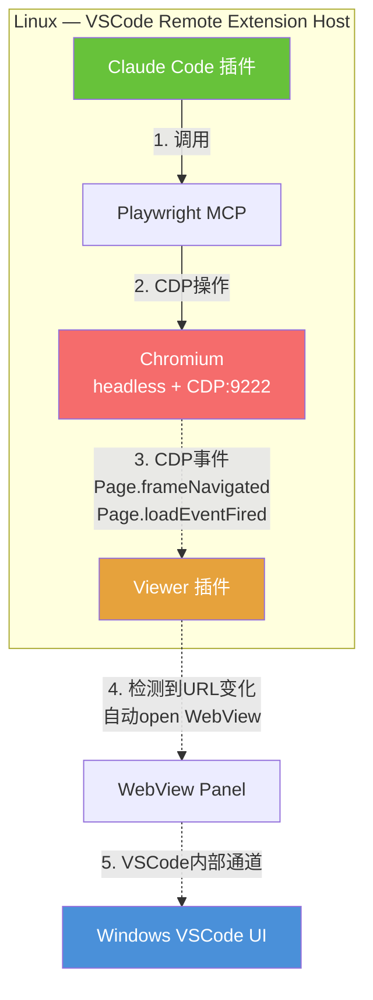
```mermaid
graph TB
    subgraph Linux["Linux — VSCode Remote Extension Host"]
        CC["Claude Code 插件"]
        VIEWER["Viewer 插件"]
        MCP["Playwright MCP"]
        CHROME["Chromium<br/>headless + CDP:9222"]
    end

    CC -->|"1. 调用"| MCP
    MCP -->|"2. CDP操作"| CHROME

    CHROME -.->|"3. CDP事件<br/>Page.frameNavigated<br/>Page.loadEventFired"| VIEWER
    VIEWER -.->|"4. 检测到URL变化<br/>自动open WebView"| VIEWER_PANEL["WebView Panel"]
    VIEWER_PANEL -.->|"5. VSCode内部通道"| WIN_UI["Windows VSCode UI"]

    style CC fill:#67c23a,color:#fff
    style VIEWER fill:#e6a23c,color:#fff
    style CHROME fill:#f56c6c,color:#fff
    style WIN_UI fill:#4a90d9,color:#fff
```

**核心思路**：Viewer 插件不需要和 Claude Code 直接通信。它只需要**监听 Chromium 的 CDP 事件**——当 Claude Code 通过 Playwright 操作浏览器时，Chromium 会发出 `Page.frameNavigated` 等事件，Viewer 插件捕获到这些事件就知道"有人在操作浏览器了"。

#### 6.3.2 实现方案对比

| 方案 | 原理 | 侵入性 | 可靠性 |
|------|------|--------|--------|
| **A. CDP 事件监听** | 监听 Chromium 的 Page.frameNavigated 等事件 | **零侵入** | 高 |
| B. Playwright MCP Hook | 修改 MCP Server，每次操作后发通知 | 需改 MCP 代码 | 高 |
| C. VSCode 插件间通信 | 通过 VSCode API 在插件间传递消息 | 需双方配合 | 中 |
| D. 文件系统 Watcher | 监听某个临时文件的变化 | 低 | 低 |

**推荐方案 A**（CDP 事件监听），因为：
- **零侵入**：不修改 Claude Code、不修改 Playwright MCP
- **同进程直连**：Viewer 和 Chromium 都在 Linux，直接监听 CDP
- **可靠性高**：Chromium 对每个操作都会发 CDP 事件

#### 6.3.3 CDP 事件监听自动触发（详细实现）

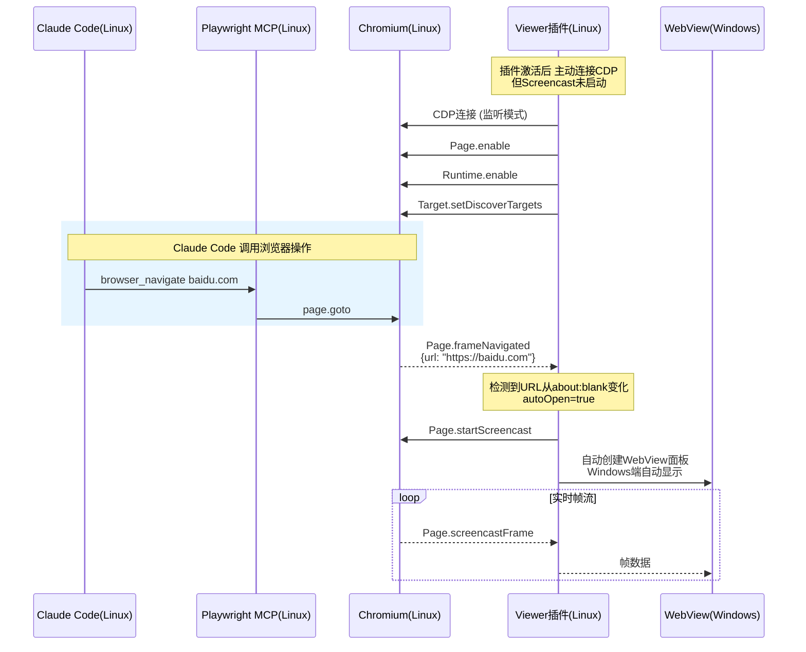
```mermaid
sequenceDiagram
    participant CC as Claude Code(Linux)
    participant MCP as Playwright MCP(Linux)
    participant Chrome as Chromium(Linux)
    participant Viewer as Viewer插件(Linux)
    participant WV as WebView(Windows)

    Note over Viewer: 插件激活后 主动连接CDP<br/>但Screencast未启动

    Viewer->>Chrome: CDP连接 (监听模式)
    Viewer->>Chrome: Page.enable
    Viewer->>Chrome: Runtime.enable
    Viewer->>Chrome: Target.setDiscoverTargets

    rect rgb(230, 245, 255)
        Note over CC,Chrome: Claude Code 调用浏览器操作
        CC->>MCP: browser_navigate baidu.com
        MCP->>Chrome: page.goto
    end

    Chrome-->>Viewer: Page.frameNavigated<br/>{url: "https://baidu.com"}

    Note over Viewer: 检测到URL从about:blank变化<br/>autoOpen=true

    Viewer->>Chrome: Page.startScreencast
    Viewer->>WV: 自动创建WebView面板<br/>Windows端自动显示

    loop 实时帧流
        Chrome-->>Viewer: Page.screencastFrame
        Viewer-->>WV: 帧数据
    end
```

#### 6.3.4 关键代码实现

**page-watcher.ts — CDP 事件监听器**：

```typescript
// page-watcher.ts — 运行在 Linux
import WebSocket from 'ws';

export class PageWatcher {
    private ws: WebSocket | undefined;
    private currentUrl: string = 'about:blank';
    private onBrowserActivated: ((url: string) => void) | null = null;
    private cmdId = 0;

    /** 设置浏览器激活时的回调 */
    setOnActivated(callback: (url: string) => void) {
        this.onBrowserActivated = callback;
    }

    /** 连接到 Chromium CDP 并监听事件 */
    async connect(port: number = 9222) {
        // 0. 关闭旧连接（防止重连时 WebSocket 泄漏）
        this.dispose();

        // 1. 发现 CDP 页面级端点（必须用 /json/list 而非 /json/version）
        // /json/version 返回浏览器级 WebSocket，Page 域命令需要页面级连接
        const resp = await fetch(`http://localhost:${port}/json/list`);
        const targets = await resp.json();
        const pageTarget = targets.find((t: any) => t.type === 'page');
        if (!pageTarget) throw new Error('未找到页面 target');

        // 2. 建立页面级 WebSocket 连接
        this.ws = new WebSocket(pageTarget.webSocketDebuggerUrl);

        this.ws.on('open', () => {
            // 启用 Page 域事件监听（不需要启动 Screencast）
            this.sendCommand('Page.enable');
            this.sendCommand('Runtime.enable');
            // 启用 Target 域事件，否则 Target.targetCreated 不会被推送
            this.sendCommand('Target.setDiscoverTargets', { discover: true });
            console.log('[PageWatcher] 已连接 CDP，监听页面事件');
        });

        this.ws.on('message', (data: Buffer) => {
            const msg = JSON.parse(data.toString());

            // 监听页面导航（仅顶层 frame，忽略 iframe）
            if (msg.method === 'Page.frameNavigated') {
                const frame = msg.params.frame;
                // parentId 存在表示是 iframe，只处理主 frame 的导航
                if (frame.parentId) return;
                const url = frame.url;
                if (url && url !== 'about:blank' && url !== this.currentUrl) {
                    this.currentUrl = url;
                    console.log(`[PageWatcher] 页面导航: ${url}`);
                    // 触发自动打开 WebView
                    this.onBrowserActivated?.(url);
                }
            }

            // 监听新页面加载完成
            if (msg.method === 'Page.loadEventFired') {
                console.log('[PageWatcher] 页面加载完成');
            }

            // 监听新建 Tab（Playwright browser.new_page）
            if (msg.method === 'Target.targetCreated') {
                const targetInfo = msg.params.targetInfo;
                if (targetInfo?.type === 'page' && targetInfo?.url !== 'about:blank') {
                    console.log(`[PageWatcher] 新标签页: ${targetInfo.url}`);
                    this.onBrowserActivated?.(targetInfo.url);
                }
            }
        });
    }

    /** 获取当前连接的 WebSocket（供 Screencast Manager 复用） */
    getWebSocket(): WebSocket | undefined {
        return this.ws;
    }

    /** 发送 CDP 命令（公开方法，供外部如 Screencast 使用统一 ID 序列） */
    sendCommand(method: string, params?: any) {
        this.ws?.send(JSON.stringify({ id: ++this.cmdId, method, params }));
    }

    dispose() {
        this.ws?.close();
        this.ws = undefined;
    }
}
```

**extension.ts — 整合自动触发**：

```typescript
// extension.ts — 完整版
import * as vscode from 'vscode';
import { PageWatcher } from './page-watcher';

let pageWatcher: PageWatcher;
let panel: vscode.WebviewPanel | undefined;
let screencastActive = false;

export function activate(ctx: vscode.ExtensionContext) {
    const config = vscode.workspace.getConfiguration('remoteBrowser');
    const autoOpen = config.get<boolean>('autoOpen', true);

    // 1. 创建页面监听器
    pageWatcher = new PageWatcher();

    if (autoOpen) {
        // 2. 注册自动触发回调
        pageWatcher.setOnActivated((url) => {
            if (panel) {
                // 面板已存在：更新标题和 URL，确保可见
                let title = 'Remote Browser';
                try { title = `Browser: ${new URL(url).hostname}`; }
                catch { title = `Browser: ${url.slice(0, 30)}`; }
                panel.title = title;
                panel.webview.postMessage({ type: 'url', url });
                if (!panel.visible) {
                    panel.reveal(vscode.ViewColumn.Beside);
                }
                return;
            }
            // 否则创建新面板并开始 Screencast
            openViewerWithScreencast(url);
        });
    }

    // 3. 启动 CDP 监听（后台运行，不消耗资源）
    const port = config.get<number>('cdpPort', 9222);
    pageWatcher.connect(port).catch(err => {
        console.warn('[Viewer] CDP 未就绪，等待 Playwright 启动:', err.message);
        // Playwright 可能还没启动 Chromium，稍后重试
        scheduleReconnect(port);
    });

    // 4. 注册手动命令
    ctx.subscriptions.push(
        vscode.commands.registerCommand('remoteBrowser.open', () => {
            openViewerWithScreencast();
        })
    );
}

let reconnectTimer: ReturnType<typeof setTimeout> | undefined;
function scheduleReconnect(port: number) {
    // 每5秒重试一次连接CDP
    if (reconnectTimer) clearTimeout(reconnectTimer);
    reconnectTimer = setTimeout(async () => {
        try {
            await pageWatcher.connect(port);
            console.log('[Viewer] CDP 连接成功');
        } catch {
            scheduleReconnect(port);
        }
    }, 5000);
}

function openViewerWithScreencast(initialUrl?: string) {
    if (panel) {
        panel.reveal(vscode.ViewColumn.Beside);
    } else {
        let title = 'Remote Browser';
        if (initialUrl) {
            try { title = `Browser: ${new URL(initialUrl).hostname}`; }
            catch { title = `Browser: ${initialUrl.slice(0, 30)}`; }
        }
        panel = vscode.window.createWebviewPanel(
            'browserView',
            title,
            vscode.ViewColumn.Beside,
            { enableScripts: true }
        );
        panel.webview.html = getHtml();
        panel.onDidDispose(() => {
            panel = undefined;
            screencastActive = false;
        });
    }

    // 开始 Screencast
    if (!screencastActive) {
        startScreencast();
        screencastActive = true;
    }
}

function startScreencast() {
    const ws = pageWatcher.getWebSocket();
    if (!ws) return;

    // 复用 PageWatcher 已建立的 CDP 连接
    // Screencast 命令发送到同一个 WebSocket
    const quality = vscode.workspace.getConfiguration('remoteBrowser')
        .get<number>('quality', 80);

    // 通过 PageWatcher 的 send 方法发送，使用统一的递增 ID 避免冲突
    // （不要用固定 ID，否则会和 PageWatcher 的递增 cmdId 碰撞）
    pageWatcher.sendCommand('Page.startScreencast', {
        format: 'jpeg', quality, maxWidth: 1280, maxHeight: 720
    });

    // 监听帧（在 PageWatcher 的 message handler 中也需要处理帧事件）
    // 见 page-watcher.ts 中补充帧处理
}

// ... getHtml(), deactivate() 同 MVP 代码
```

#### 6.3.5 生命周期管理

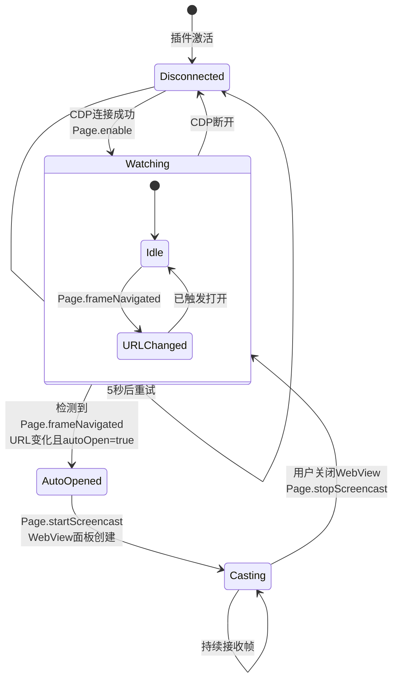
```mermaid
stateDiagram-v2
    [*] --> Disconnected: 插件激活

    Disconnected --> Watching: CDP连接成功<br/>Page.enable
    Disconnected --> Disconnected: 连接失败<br/>5秒后重试

    Watching --> AutoOpened: 检测到Page.frameNavigated<br/>URL变化且autoOpen=true

    AutoOpened --> Casting: Page.startScreencast<br/>WebView面板创建

    Casting --> Watching: 用户关闭WebView<br/>Page.stopScreencast
    Casting --> Casting: 持续接收帧

    Watching --> Disconnected: CDP断开

    state Watching {
        [*] --> Idle
        Idle --> URLChanged: Page.frameNavigated
        URLChanged --> Idle: 已触发打开
    }
```

#### 6.3.6 资源消耗

PageWatcher 后台监听模式的资源消耗极低：

| 状态 | CDP 连接 | Screencast | CPU | 内存 |
|------|----------|------------|-----|------|
| Watching（后台监听） | 保持 WebSocket | **未启动** | ~0% | ~5MB |
| Casting（推流中） | 保持 WebSocket | 5-30fps 推流 | ~2-5% | ~20MB |

**关键优化**：只在检测到浏览器操作时才启动 Screencast，平时仅保持一个轻量的 CDP 事件监听连接，几乎不消耗资源。

#### 6.3.7 与 Playwright 启动时序的协调

Playwright MCP 可能比 Viewer 插件晚启动，Chromium 还没运行。Viewer 需要处理这种时序：

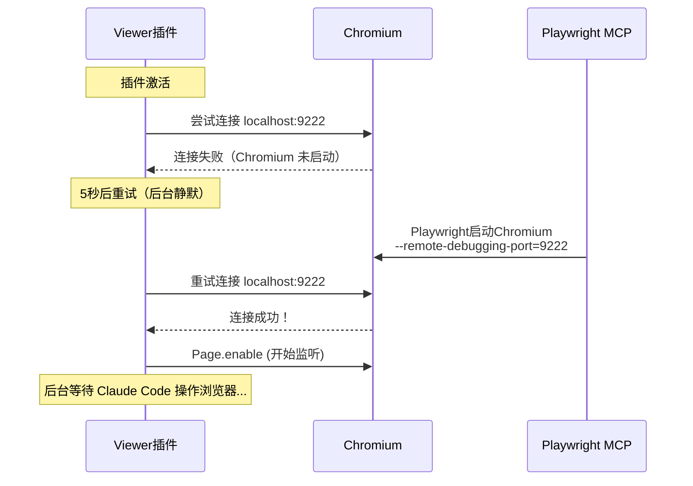
```mermaid
sequenceDiagram
    participant Viewer as Viewer插件
    participant CDP as Chromium
    participant MCP as Playwright MCP

    Note over Viewer: 插件激活
    Viewer->>CDP: 尝试连接 localhost:9222
    CDP-->>Viewer: 连接失败（Chromium 未启动）

    Note over Viewer: 5秒后重试（后台静默）

    MCP->>CDP: Playwright启动Chromium<br/>--remote-debugging-port=9222

    Viewer->>CDP: 重试连接 localhost:9222
    CDP-->>Viewer: 连接成功！
    Viewer->>CDP: Page.enable (开始监听)

    Note over Viewer: 后台等待 Claude Code 操作浏览器...
```

```typescript
// 自动重连逻辑（已在 extension.ts 的 scheduleReconnect 中实现）
// 每5秒尝试连接，连接成功后停止重试
// Playwright 启动 Chromium 后自动接上
```

### 6.4 插件项目结构

```
remote-browser-viewer/
├── package.json
├── src/
│   ├── extension.ts            # 插件入口
│   ├── cdp-client.ts           # CDP WebSocket localhost:9222 直连
│   ├── screencast-manager.ts   # Screencast 帧流管理
│   ├── webview-provider.ts     # WebView 面板
│   ├── page-watcher.ts         # 页面变化监听 → 自动触发
│   └── status-bar.ts           # 状态栏
├── webview/
│   ├── index.html              # WebView HTML
│   └── viewer.ts               # 帧渲染
└── README.md
```

### 6.5 插件配置

```jsonc
{
  "remoteBrowser.cdpPort": {
    "type": "number", "default": 9222,
    "description": "CDP端口 插件localhost直连 无需端口转发"
  },
  "remoteBrowser.autoOpen": {
    "type": "boolean", "default": true,
    "description": "检测到浏览器操作时自动打开视图"
  },
  "remoteBrowser.maxFps": {
    "type": "number", "default": 30,
    "description": "最大帧率 1-60"
  },
  "remoteBrowser.quality": {
    "type": "number", "default": 80,
    "description": "JPEG质量 1-100"
  }
}
```

---

## 7. 进阶：双向交互

MVP 只能看不能操作。进阶版支持在 WebView 中点击/输入，反向控制 Linux 浏览器：

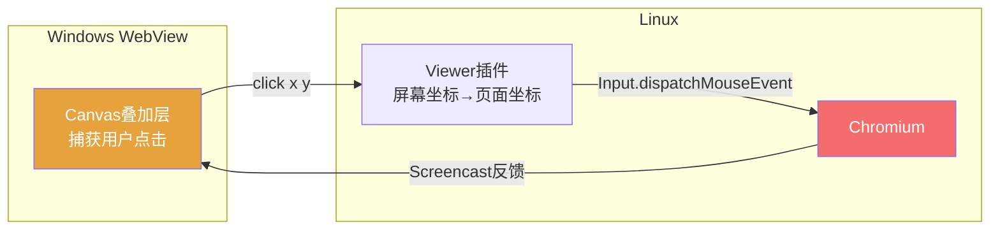
```mermaid
graph LR
    subgraph Windows["Windows WebView"]
        CANVAS["Canvas叠加层<br/>捕获用户点击"]
    end

    subgraph Linux
        EXT["Viewer插件<br/>屏幕坐标→页面坐标"]
        CHROME["Chromium"]
    end

    CANVAS -->|"click x y"| EXT
    EXT -->|"Input.dispatchMouseEvent"| CHROME
    CHROME -->|"Screencast反馈"| CANVAS

    style CANVAS fill:#e6a23c,color:#fff
    style CHROME fill:#f56c6c,color:#fff
```

```typescript
// WebView 点击 → 反向控制
canvas.addEventListener('click', (e) => {
    const rect = canvas.getBoundingClientRect();
    const x = Math.round((e.clientX - rect.left) / rect.width * metadata.deviceWidth);
    const y = Math.round((e.clientY - rect.top) / rect.height * metadata.deviceHeight);
    vscode.postMessage({ type: 'click', x, y });
});

// 插件收到 → 发 CDP 命令
panel.webview.onDidReceiveMessage(msg => {
    if (msg.type === 'click') {
        sendCDP('Input.dispatchMouseEvent', {
            type: 'mousePressed', x: msg.x, y: msg.y, button: 'left', clickCount: 1
        });
        sendCDP('Input.dispatchMouseEvent', {
            type: 'mouseReleased', x: msg.x, y: msg.y, button: 'left', clickCount: 1
        });
    }
});
```

---

## 8. 部署配置

### 8.1 MCP 配置

```jsonc
// .claude/mcp.json — 确保Playwright暴露CDP端口
// ⚠️ 注意：PLAYWRIGHT_LAUNCH_ARGS 不是 Playwright MCP 的标准配置项
// 需要确认你使用的 MCP Server 实现是否支持此环境变量
// 如果不支持，可能需要通过其他方式传递 Chrome 启动参数，例如：
//   - 修改 MCP Server 配置文件
//   - 使用 PLAYWRIGHT_CHROMIUM_EXECUTABLE_PATH 指向自定义启动脚本
{
  "mcpServers": {
    "playwright": {
      "command": "npx",
      "args": ["@anthropic-ai/mcp-playwright"],
      "env": {
        "PLAYWRIGHT_LAUNCH_ARGS": "--remote-debugging-port=9222"
      }
    }
  }
}
```

### 8.2 最终部署图

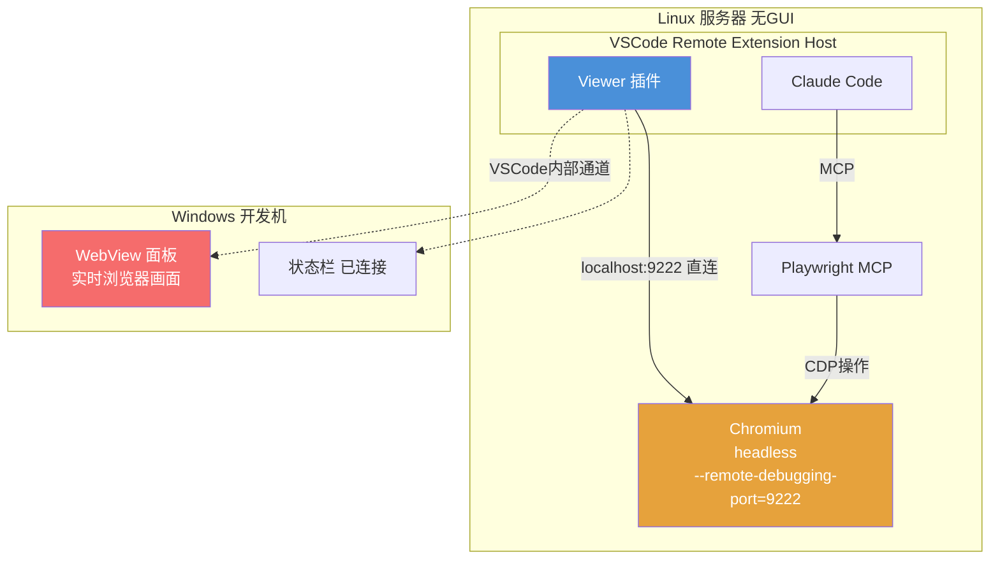
```mermaid
graph TB
    subgraph Linux["Linux 服务器 无GUI"]
        subgraph VSCode_Remote["VSCode Remote Extension Host"]
            CC["Claude Code"]
            EXT["Viewer 插件"]
        end
        MCP["Playwright MCP"]
        CHROME["Chromium<br/>headless<br/>--remote-debugging-port=9222"]
    end

    subgraph Windows["Windows 开发机"]
        WV["WebView 面板<br/>实时浏览器画面"]
        SB["状态栏 已连接"]
    end

    CC -->|"MCP"| MCP
    MCP -->|"CDP操作"| CHROME
    EXT -->|"localhost:9222 直连"| CHROME
    EXT -.->|"VSCode内部通道"| WV
    EXT -.-> SB

    style CHROME fill:#e6a23c,color:#fff
    style EXT fill:#4a90d9,color:#fff
    style WV fill:#f56c6c,color:#fff
```

**无需额外启动脚本**。Playwright MCP 启动 Chromium 时带 `--remote-debugging-port=9222`，Viewer 插件自动发现并连接。

---

## 9. 开发路线

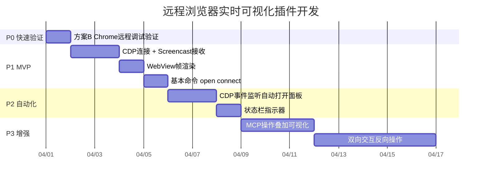
```mermaid
gantt
    title 远程浏览器实时可视化插件开发
    dateFormat YYYY-MM-DD
    axisFormat %m/%d

    section P0 快速验证
    方案B Chrome远程调试验证     :verify, 2026-04-01, 1d

    section P1 MVP
    CDP连接 + Screencast接收     :a1, after verify, 2d
    WebView帧渲染               :a2, after a1, 1d
    基本命令 open connect        :a3, after a2, 1d

    section P2 自动化
    CDP事件监听自动打开面板       :b1, after a3, 2d
    状态栏指示器                 :b2, after b1, 1d

    section P3 增强
    MCP操作叠加可视化             :c1, after b2, 3d
    双向交互反向操作              :c2, after c1, 5d
```

| Step | 内容 | 时间 |
|------|------|------|
| **Step 1** | 方案B快速验证（VSCode转发9222 → Chrome inspect） | 1小时 |
| **Step 2** | 方案A MVP（CDP Screencast → WebView实时渲染） | 3-5天 |
| **Step 3** | 自动触发+操作叠加（CDP事件监听 → 高亮AI操作） | 3天 |
| **Step 4** | 双向交互（WebView点击 → 反向控制Linux浏览器） | 5天 |

---

## 10. 开发清单：需要开发什么插件

### 10.1 核心结论：只需要开发一个 Linux 端插件

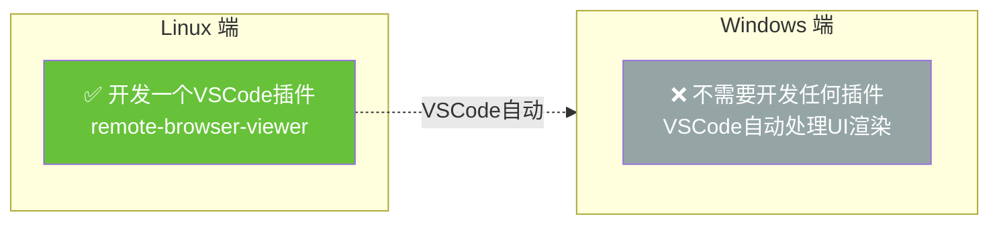
```mermaid
graph LR
    subgraph Windows["Windows 端"]
        NO_PLUGIN["❌ 不需要开发任何插件<br/>VSCode自动处理UI渲染"]
    end

    subgraph Linux["Linux 端"]
        PLUGIN["✅ 开发一个VSCode插件<br/>remote-browser-viewer"]
    end

    PLUGIN -.->|"VSCode自动"| Windows

    style NO_PLUGIN fill:#95a5a6,color:#fff
    style PLUGIN fill:#67c23a,color:#fff
```

**Windows 端**：不需要开发任何东西。VSCode Remote SSH 框架自动把远程插件的 WebView 面板渲染在本地。

**Linux 端**：只需要开发一个 VSCode 插件 `remote-browser-viewer`，它同时负责：
- 连接 Chromium CDP
- 监听浏览器操作事件
- 管理 Screencast 帧流
- 创建 WebView 面板（VSCode 自动传到 Windows 显示）

### 10.2 插件开发形式

| 项目 | 说明 |
|------|------|
| 插件类型 | VSCode Extension（TypeScript） |
| 运行环境 | `extensionKind: ["workspace"]` — 只在远程工作区运行 |
| 打包方式 | 标准 `.vsix` 文件 |
| 安装位置 | Linux 端 `~/.vscode-server/extensions/` |
| 开发调试 | 本地 `npm run watch` + F5 启动 Extension Development Host |

### 10.3 package.json 关键配置

```jsonc
{
  "name": "remote-browser-viewer",
  "displayName": "Remote Browser Viewer",
  "version": "0.1.0",
  "engines": { "vscode": "^1.85.0" },

  // 关键：声明为 workspace 插件，只在 Linux Remote 端运行
  "extensionKind": ["workspace"],

  "activationEvents": [
    "onStartupFinished"  // 插件激活后自动启动CDP监听
  ],

  "main": "./out/extension.js",

  "contributes": {
    "commands": [
      {
        "command": "remoteBrowser.open",
        "title": "Remote Browser: Open Viewer"
      },
      {
        "command": "remoteBrowser.toggleScreencast",
        "title": "Remote Browser: Toggle Screencast"
      }
    ],
    "configuration": {
      "title": "Remote Browser Viewer",
      "properties": {
        "remoteBrowser.cdpPort": {
          "type": "number", "default": 9222,
          "description": "CDP端口 localhost直连"
        },
        "remoteBrowser.autoOpen": {
          "type": "boolean", "default": true,
          "description": "检测到浏览器操作时自动打开视图"
        },
        "remoteBrowser.quality": {
          "type": "number", "default": 80,
          "description": "JPEG质量 1-100"
        }
      }
    }
  },

  "dependencies": {
    "ws": "^8.18.0"  // WebSocket客户端 连接CDP
  },
  "devDependencies": {
    "@types/vscode": "^1.85.0",
    "@types/ws": "^8.5.0",
    "typescript": "^5.0.0"
  }
}
```

### 10.4 开发步骤

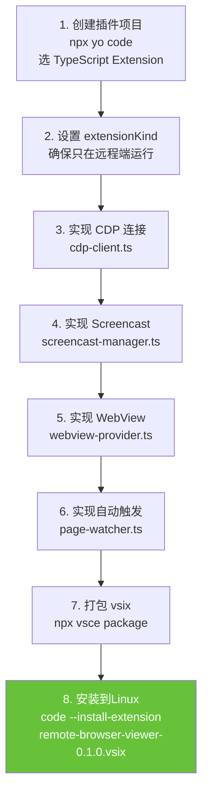
```mermaid
graph TB
    S1["1. 创建插件项目<br/>npx yo code<br/>选 TypeScript Extension"] --> S2["2. 设置 extensionKind<br/>确保只在远程端运行"]
    S2 --> S3["3. 实现 CDP 连接<br/>cdp-client.ts"]
    S3 --> S4["4. 实现 Screencast<br/>screencast-manager.ts"]
    S4 --> S5["5. 实现 WebView<br/>webview-provider.ts"]
    S5 --> S6["6. 实现自动触发<br/>page-watcher.ts"]
    S6 --> S7["7. 打包 vsix<br/>npx vsce package"]
    S7 --> S8["8. 安装到Linux<br/>code --install-extension<br/>remote-browser-viewer-0.1.0.vsix"]

    style S8 fill:#67c23a,color:#fff
```

### 10.5 安装方式

```bash
# 方式1: VSCode命令安装（推荐）
# Windows VSCode → Ctrl+Shift+P → Extensions: Install from VSIX...
# 选择 .vsix 文件，VSCode自动安装到远程Linux端

# 方式2: 命令行安装
# 在Linux上执行
code --install-extension remote-browser-viewer-0.1.0.vix

# 方式3: 开发模式（调试用）
# 在项目目录下按F5，自动启动Extension Development Host
```

---

## 11. 用户操作流程

### 11.1 一次性配置（安装后只需做一次）

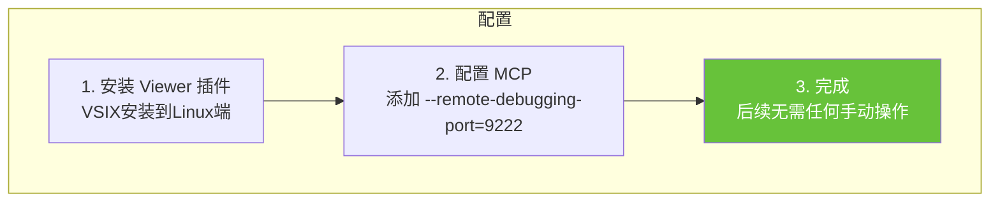
```mermaid
graph TB
    subgraph 配置
        C1["1. 安装 Viewer 插件<br/>VSIX安装到Linux端"] --> C2["2. 配置 MCP<br/>添加 --remote-debugging-port=9222"]
        C2 --> C3["3. 完成<br/>后续无需任何手动操作"]
    end

    style C3 fill:#67c23a,color:#fff
```

**具体操作**：

```
Step 1: Windows VSCode → Extensions → ... → Install from VSIX → 选择 remote-browser-viewer.vsix
        VSCode 自动将插件安装到 Linux Remote 端

Step 2: 在 Linux 项目目录下编辑 .claude/mcp.json，确保 Playwright 暴露 CDP 端口：
        {
          "mcpServers": {
            "playwright": {
              "env": { "PLAYWRIGHT_LAUNCH_ARGS": "--remote-debugging-port=9222" }
            }
          }
        }

Step 3: 重新加载 VSCode 窗口（Ctrl+Shift+P → Reload Window）
```

### 11.2 日常使用流程（全自动）

配置完成后，用户**不需要做任何额外操作**，完全自动：

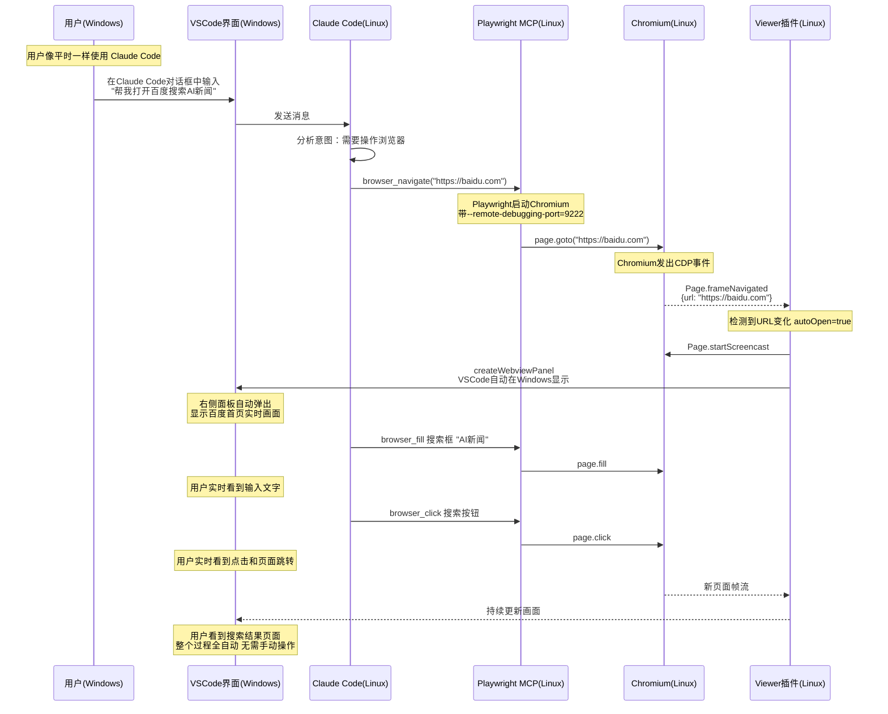
```mermaid
sequenceDiagram
    participant User as 用户(Windows)
    participant VSCode as VSCode界面(Windows)
    participant CC as Claude Code(Linux)
    participant MCP as Playwright MCP(Linux)
    participant Chrome as Chromium(Linux)
    participant Viewer as Viewer插件(Linux)

    Note over User: 用户像平时一样使用 Claude Code
    User->>VSCode: 在Claude Code对话框中输入<br/>"帮我打开百度搜索AI新闻"

    VSCode->>CC: 发送消息
    CC->>CC: 分析意图：需要操作浏览器
    CC->>MCP: browser_navigate("https://baidu.com")

    Note over MCP: Playwright启动Chromium<br/>带--remote-debugging-port=9222

    MCP->>Chrome: page.goto("https://baidu.com")

    Note over Chrome: Chromium发出CDP事件

    Chrome-->>Viewer: Page.frameNavigated<br/>{url: "https://baidu.com"}

    Note over Viewer: 检测到URL变化 autoOpen=true

    Viewer->>Chrome: Page.startScreencast
    Viewer->>VSCode: createWebviewPanel<br/>VSCode自动在Windows显示

    Note over VSCode: 右侧面板自动弹出<br/>显示百度首页实时画面

    CC->>MCP: browser_fill 搜索框 "AI新闻"
    MCP->>Chrome: page.fill
    Note over VSCode: 用户实时看到输入文字

    CC->>MCP: browser_click 搜索按钮
    MCP->>Chrome: page.click
    Note over VSCode: 用户实时看到点击和页面跳转

    Chrome-->>Viewer: 新页面帧流
    Viewer-->>VSCode: 持续更新画面

    Note over VSCode: 用户看到搜索结果页面<br/>整个过程全自动 无需手动操作
```

### 11.3 用户视角的界面变化

```mermaid
graph TB
    subgraph Before["Claude Code调用浏览器前"]
        direction LR
        EDITOR1["编辑器<br/>用户写代码"] --- CHAT1["Claude Code<br/>对话面板"]
    end

    subgraph After["Claude Code调用浏览器后 自动变化"]
        direction LR
        EDITOR2["编辑器"] --- CHAT2["Claude Code<br/>正在操作浏览器..."] --- BROWSER["WebView面板<br/>🟢 实时浏览器画面"]
    end

    Before -->|"全自动<br/>无需手动操作"| After

    style BROWSER fill:#67c23a,color:#fff
    style After fill:#f0f9eb,stroke:#67c23a
```

### 11.4 具体场景示例

**场景1：Claude Code 打开网页**

```
用户: "打开百度"
Claude Code: 调用 browser_navigate("https://baidu.com")

→ Windows VSCode 右侧自动弹出 WebView 面板
→ 面板中显示百度首页的实时画面
→ 状态栏显示 "🟢 Remote Browser | baidu.com"
```

**场景2：Claude Code 搜索信息**

```
用户: "搜索一下最新的AI新闻"
Claude Code:
  1. browser_fill 搜索框 "最新AI新闻"
  2. browser_click 搜索按钮

→ WebView 面板中实时看到：输入文字 → 点击 → 搜索结果页面
→ 用户可以实时看到每一步操作的视觉反馈
```

**场景3：Claude Code 抓取网页数据**

```
用户: "帮我看看这个GitHub仓库的star数"
Claude Code:
  1. browser_navigate("https://github.com/xxx")
  2. browser_snapshot 获取页面内容
  3. 从snapshot中提取star数

→ WebView 面板显示GitHub仓库页面
→ Claude Code 同时返回star数给用户
```

**场景4：操作完成，关闭面板**

```
用户关闭 WebView 面板（点击X）
→ Viewer 插件自动停止 Screencast（节省资源）
→ CDP 监听继续运行（等待下次浏览器操作）
→ 状态栏变为 "⚪ Remote Browser | watching"

下次 Claude Code 操作浏览器时，面板自动再次弹出
```

### 11.5 手动操作（可选）

用户也可以手动控制 Viewer：

| 操作 | 方式 | 说明 |
|------|------|------|
| 手动打开 | `Ctrl+Shift+P` → `Remote Browser: Open` | 不等自动触发，手动打开 |
| 暂停推流 | `Ctrl+Shift+P` → `Remote Browser: Toggle` | 暂停/恢复 Screencast |
| 调整质量 | `Settings` → `Remote Browser` | 调 FPS、JPEG质量、分辨率 |
| 关闭面板 | 点击面板上的 X | 停止推流，回到监听模式 |

