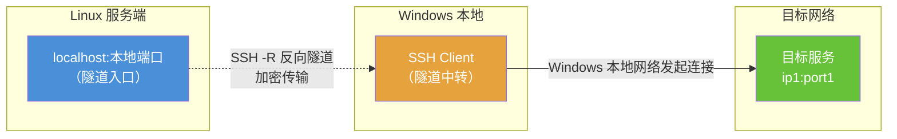
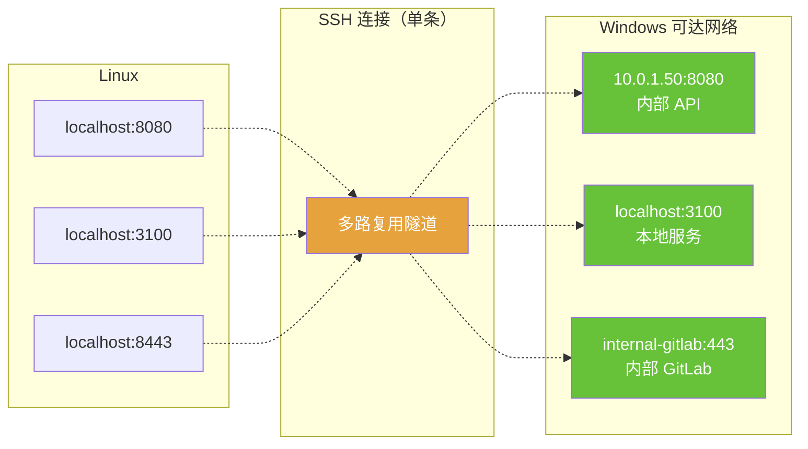
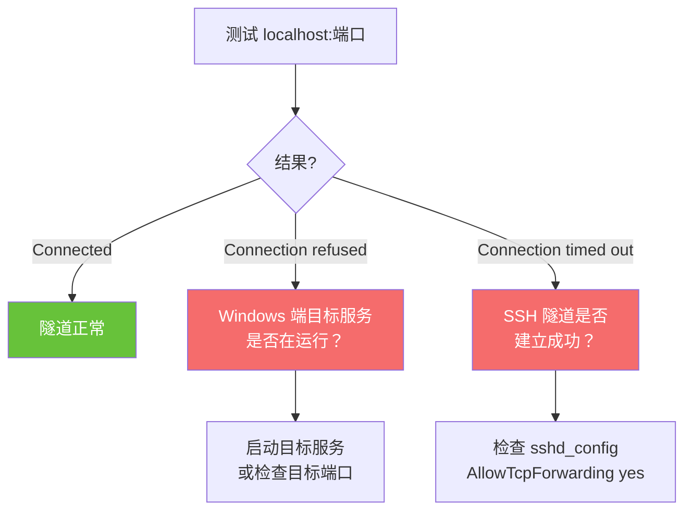
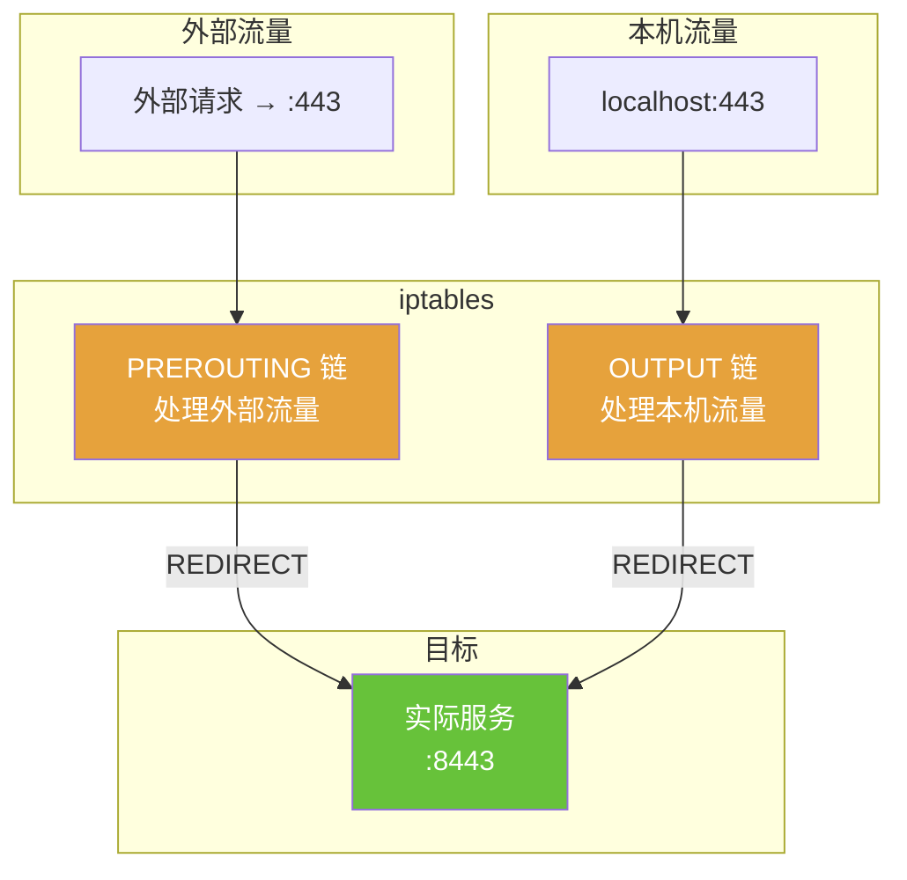
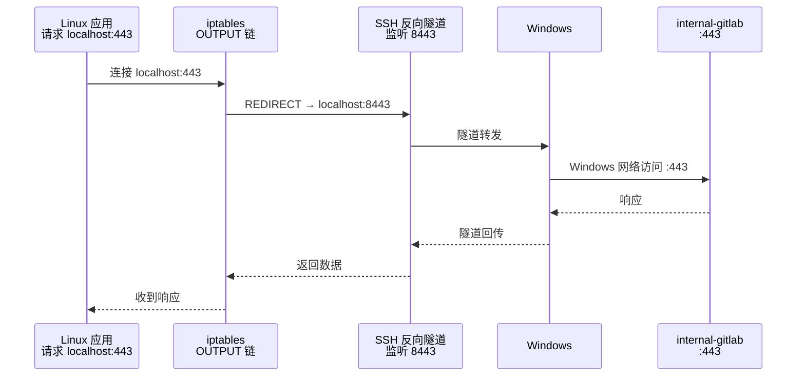

# SSH 反向隧道 & iptables 端口转发指南

## 场景

本地 Windows 通过 VSCode Remote SSH 连接远程 Linux 服务端。Windows 能访问某些内网服务（如 `ip1:port1`），但 Linux 无法直接访问。通过 SSH 反向隧道，让 Linux 借助 Windows 的网络访问这些服务。

---

## SSH 反向隧道

### 原理



**关键点**：目标地址从 **Windows 的网络视角** 解析，Linux 不需要能直接访问目标。

### 命令格式

在 Windows 上执行：

```powershell
ssh -R <Linux监听端口>:<目标IP>:<目标端口> user@linux-server
```

### 基础示例

Windows 能访问 `10.0.1.50:8080`，Linux 不能：

```powershell
# Windows 上执行
ssh -R 8080:10.0.1.50:8080 user@linux-server
```

Linux 上验证：

```bash
# 等价于 Windows 上访问 10.0.1.50:8080
curl http://127.0.0.1:8080
```

### 多服务同时转发

一条 SSH 命令可以带多个 `-R`：

```powershell
ssh ^
  -R 8080:10.0.1.50:8080 ^
  -R 3100:127.0.0.1:3100 ^
  -R 8443:internal-gitlab.corp:443 ^
  user@linux-server
```



### 保持隧道稳定

```powershell
# 心跳保活
ssh -R 8080:10.0.1.50:8080 -o ServerAliveInterval=60 -o ServerAliveCountMax=3 user@linux-server
```

或使用 autossh 自动重连：

```powershell
# 安装（通过 scoop 或 chocolatey）
scoop install autossh

# 自动重连
autossh -M 0 -R 8080:10.0.1.50:8080 -o ServerAliveInterval=60 user@linux-server
```

### 隧道连通性验证

```bash
# 测试端口
curl -v http://127.0.0.1:8080 --connect-timeout 5

# 或
nc -zv 127.0.0.1 8080 -w 5

# 或
telnet 127.0.0.1 8080
```



### Linux sshd 配置要求

确认 `/etc/ssh/sshd_config`：

```
AllowTcpForwarding yes
GatewayPorts no          # no 即可，仅 localhost 访问
```

修改后重启：`sudo systemctl restart sshd`

---

## 特权端口问题（< 1024）

Linux 中端口号 < 1024 为特权端口，只有 root 才能绑定。SSH 反向隧道中如果 `-R 443:...`，普通用户会失败。

**最简单的做法**：用高位端口替代（如 8443 代替 443），无需任何额外配置。

如果确实需要让 `localhost:443` 可用（比如程序硬编码了 443），可以用 iptables 转发。

---

## iptables 端口转发（443 → 8443）

### 原理



**两条规则缺一不可**：

| 规则 | 处理的流量 | 不加的后果 |
|------|-----------|-----------|
| `PREROUTING` | 外部机器访问本机 443 | 外部访问 443 不通 |
| `OUTPUT` | 本机访问自己的 443（localhost） | `telnet localhost 443` 拒绝连接 |

### 添加规则

```bash
# 规则1：外部流量 443 → 8443
sudo iptables -t nat -A PREROUTING -p tcp --dport 443 -j REDIRECT --to-port 8443

# 规则2：本机流量 443 → 8443（localhost 访问必需）
sudo iptables -t nat -A OUTPUT -p tcp --dport 443 -o lo -j REDIRECT --to-port 8443
```

### 验证

```bash
# 前提：8443 端口有服务在监听（比如 SSH 反向隧道）
telnet localhost 443       # 应该连接成功
curl http://localhost:443  # 应该有响应
```

### 查看当前规则

```bash
# 查看 NAT 表所有规则（带行号）
sudo iptables -t nat -L --line-numbers -n

# 仅查看 PREROUTING
sudo iptables -t nat -L PREROUTING --line-numbers -n

# 仅查看 OUTPUT
sudo iptables -t nat -L OUTPUT --line-numbers -n
```

### 删除规则

**方式1：精确匹配删除**（把 `-A` 换成 `-D`）

```bash
sudo iptables -t nat -D PREROUTING -p tcp --dport 443 -j REDIRECT --to-port 8443
sudo iptables -t nat -D OUTPUT -p tcp --dport 443 -o lo -j REDIRECT --to-port 8443
```

**方式2：按行号删除**

```bash
# 先查行号
sudo iptables -t nat -L PREROUTING --line-numbers -n
sudo iptables -t nat -L OUTPUT --line-numbers -n

# 删除指定行（假设都是第 1 条）
sudo iptables -t nat -D PREROUTING 1
sudo iptables -t nat -D OUTPUT 1
```

### 持久化说明

iptables 规则默认 **不持久化**，重启机器后自动消失。如需持久化：

```bash
# Debian/Ubuntu
sudo apt install iptables-persistent
sudo netfilter-persistent save

# CentOS/RHEL
sudo service iptables save
```

---

## 完整示例：SSH 隧道 + iptables 组合

场景：让 Linux 通过 `localhost:443` 访问 Windows 可达的 `internal-gitlab.corp:443`。



### 操作步骤

```bash
# ===== Windows 端 =====

# 1. 建立反向隧道（443 映射到 Linux 的 8443）
ssh -R 8443:internal-gitlab.corp:443 -o ServerAliveInterval=60 user@linux-server


# ===== Linux 端 =====

# 2. 验证隧道
curl -k https://127.0.0.1:8443 --connect-timeout 5

# 3. 添加 iptables 转发（443 → 8443）
sudo iptables -t nat -A PREROUTING -p tcp --dport 443 -j REDIRECT --to-port 8443
sudo iptables -t nat -A OUTPUT -p tcp --dport 443 -o lo -j REDIRECT --to-port 8443

# 4. 验证 443 可用
curl -k https://localhost:443 --connect-timeout 5

# ===== 清理（用完后） =====

# 5. 删除 iptables 规则
sudo iptables -t nat -D PREROUTING -p tcp --dport 443 -j REDIRECT --to-port 8443
sudo iptables -t nat -D OUTPUT -p tcp --dport 443 -o lo -j REDIRECT --to-port 8443
```

---

## 快速参考

| 操作 | 命令 |
|------|------|
| 建立反向隧道 | `ssh -R <Linux端口>:<目标IP>:<目标端口> user@linux` |
| 多端口转发 | `ssh -R 8080:ip1:80 -R 8443:ip2:443 user@linux` |
| 保活 | 加 `-o ServerAliveInterval=60` |
| iptables 转发（外部） | `sudo iptables -t nat -A PREROUTING -p tcp --dport 443 -j REDIRECT --to-port 8443` |
| iptables 转发（本机） | `sudo iptables -t nat -A OUTPUT -p tcp --dport 443 -o lo -j REDIRECT --to-port 8443` |
| 查看 NAT 规则 | `sudo iptables -t nat -L --line-numbers -n` |
| 删除规则（精确） | 把添加命令中的 `-A` 换成 `-D` |
| 删除规则（行号） | `sudo iptables -t nat -D <链名> <行号>` |
