# Tailscale + VS Code SSH Remote 完全指南

> 无公网 IP 环境下，通过 Tailscale 组建安全隧道，实现 VS Code Remote-SSH 远程开发。

## 目录

- [场景与问题](#场景与问题)
- [技术原理](#技术原理)
- [架构总览](#架构总览)
- [环境准备](#环境准备)
- [操作步骤：Linux 后端](#操作步骤linux-后端)
- [操作步骤：Mac 后端](#操作步骤mac-后端)
- [Windows 前端配置](#windows-前端配置)
- [VS Code 连接](#vs-code-连接)
- [高级配置](#高级配置)
- [故障排查](#故障排查)
- [安全加固](#安全加固)
- [附录：与其他方案对比](#附录与其他方案对比)

---

## 场景与问题

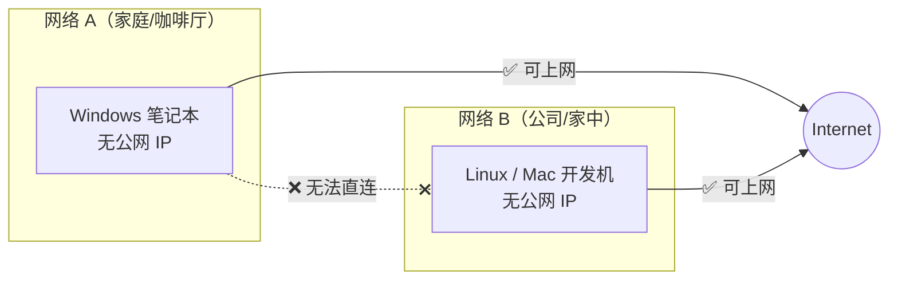

**痛点**：两台机器分处不同局域网，均无公网 IP，传统 SSH 直连不可行。

**目标**：在 Windows 上用 VS Code Remote-SSH 安全连接到远程 Linux/Mac 进行开发。

---

## 技术原理

### Tailscale 是什么

Tailscale 是基于 **WireGuard** 协议的零配置组网工具（Mesh VPN）。它不是传统的中心化 VPN，而是让每台设备之间建立**点对点加密隧道**。

### 核心技术栈

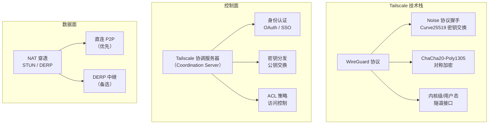

### 连接建立流程

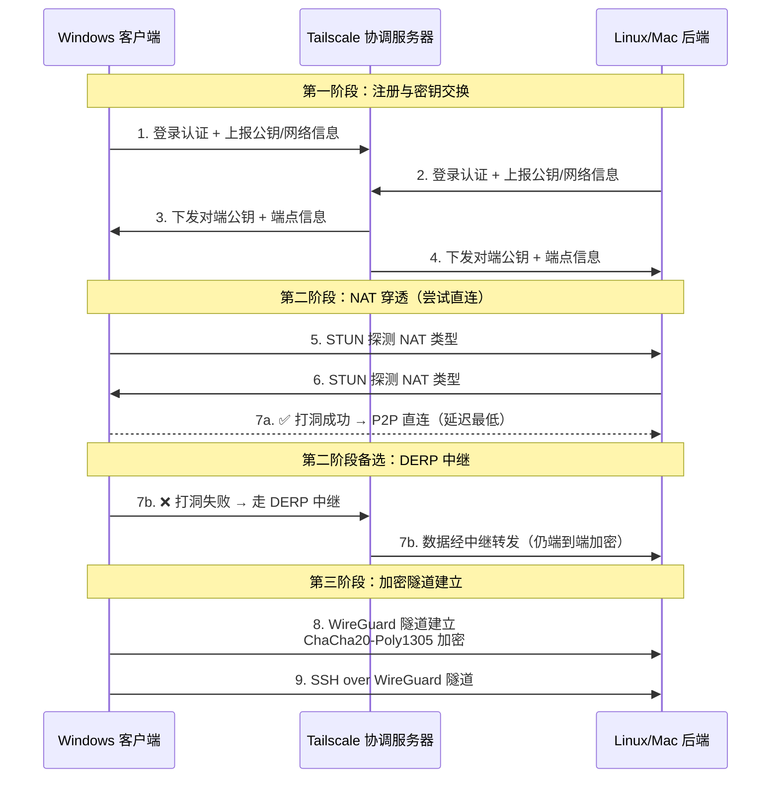

### NAT 穿透原理

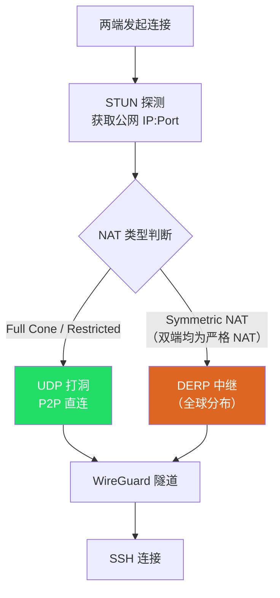

**关键点**：

| 概念 | 说明 |
|------|------|
| **STUN** | 探测设备的公网映射地址和 NAT 类型 |
| **UDP 打洞** | 双方同时向对方发包，在 NAT 上打开映射，约 90% 场景可直连 |
| **DERP** | Tailscale 自建的加密中继服务器（Designated Encrypted Relay for Packets），打洞失败时自动使用 |
| **100.x.x.x** | Tailscale 分配的虚拟 IP（CGNAT 地址段），全局唯一且稳定 |
| **MagicDNS** | 可用 `hostname.tailnet-name.ts.net` 替代 IP |

### 数据安全保证

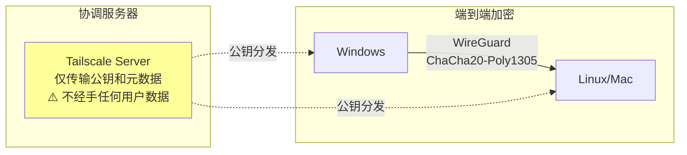

- 私钥**仅存储在本地设备**，协调服务器不持有
- 数据传输全程端到端加密，即使走 DERP 中继也无法被解密
- WireGuard 协议经过形式化验证，代码量极小（~4000 行），攻击面小

---

## 架构总览

### 方案 A：Linux 后端

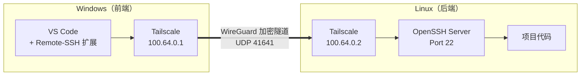

### 方案 B：Mac 后端

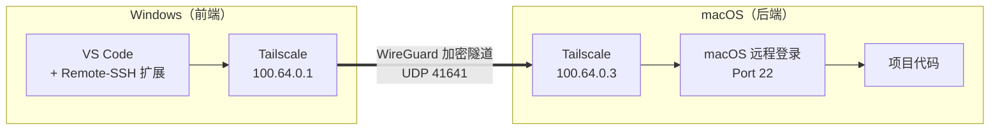

---

## 环境准备

### 前置条件

| 项目 | Windows（前端） | Linux（后端） | Mac（后端） |
|------|----------------|--------------|------------|
| 操作系统 | Windows 10/11 | Ubuntu 20.04+ / CentOS 8+ / Debian 11+ | macOS 12+ |
| VS Code | 已安装 | — | — |
| Remote-SSH 扩展 | 已安装 | — | — |
| 网络 | 可访问外网 | 可访问外网 | 可访问外网 |
| 账号 | Tailscale 账号（GitHub/Google/Microsoft 登录） | 同左（同一账号） | 同左 |

### 注册 Tailscale 账号

1. 访问 [https://login.tailscale.com/start](https://login.tailscale.com/start)
2. 使用 GitHub / Google / Microsoft 账号登录
3. 免费 Personal 计划支持最多 **100 台设备**、**3 个用户**

---

## 操作步骤：Linux 后端

### Step 1：安装 Tailscale

```bash
# 一键安装（官方脚本，支持主流发行版）
curl -fsSL https://tailscale.com/install.sh | sh
```

手动安装（以 Ubuntu/Debian 为例）：

```bash
# 添加官方源
curl -fsSL https://pkgs.tailscale.com/stable/ubuntu/jammy.nodesource.gpg | sudo gpg --dearmor -o /usr/share/keyrings/tailscale-archive-keyring.gpg
curl -fsSL https://pkgs.tailscale.com/stable/ubuntu/jammy.tailscale-keyring.list | sudo tee /etc/apt/sources.list.d/tailscale.list

# 安装
sudo apt update
sudo apt install -y tailscale
```

### Step 2：启动 Tailscale 并认证

```bash
# 启动并获取认证链接
sudo tailscale up

# 终端会输出类似：
# To authenticate, visit:
#   https://login.tailscale.com/a/xxxxxxxxxxxx
```

在浏览器中打开该链接，登录同一 Tailscale 账号完成认证。

> **无图形界面的服务器**：可在任意有浏览器的设备上打开该链接完成认证。

### Step 3：验证 Tailscale 状态

```bash
# 查看分配的 Tailscale IP
tailscale ip -4
# 输出示例: 100.64.0.2

# 查看网络中的所有设备
tailscale status
# 输出示例:
# 100.64.0.1   windows-pc   user@github   windows   -
# 100.64.0.2   linux-dev    user@github   linux     -

# 查看详细连接信息
tailscale status --peers
```

### Step 4：确保 SSH 服务运行

```bash
# 检查 SSH 服务状态
sudo systemctl status sshd

# 如未安装
sudo apt install -y openssh-server   # Debian/Ubuntu
sudo dnf install -y openssh-server   # Fedora/RHEL

# 启动并设置开机自启
sudo systemctl enable --now sshd
```

### Step 5：配置 Tailscale 开机自启

```bash
# 通常安装时已自动配置，验证一下
sudo systemctl enable tailscaled
sudo systemctl status tailscaled
```

### Step 6：防火墙放行（如适用）

```bash
# Tailscale 创建的 tailscale0 接口上放行 SSH
# UFW (Ubuntu)
sudo ufw allow in on tailscale0 to any port 22

# firewalld (CentOS/Fedora)
sudo firewall-cmd --zone=trusted --add-interface=tailscale0 --permanent
sudo firewall-cmd --reload
```

> **安全提示**：仅在 `tailscale0` 接口上放行 SSH，不对公网暴露。

---

## 操作步骤：Mac 后端

### Step 1：安装 Tailscale

**方式一：App Store（推荐）**

在 Mac App Store 搜索 "Tailscale" 并安装。

**方式二：Homebrew**

```bash
brew install --cask tailscale
```

### Step 2：启动并认证

1. 从启动台或应用程序中打开 Tailscale
2. 点击菜单栏中的 Tailscale 图标
3. 点击 **Log in** → 浏览器自动打开认证页面
4. 登录同一 Tailscale 账号

或使用命令行：

```bash
# 如果通过 Homebrew 安装了 CLI
tailscale up
```

### Step 3：验证状态

```bash
# 查看 Tailscale IP
tailscale ip -4
# 输出示例: 100.64.0.3

# 查看设备列表
tailscale status
```

### Step 4：开启 macOS 远程登录（SSH）

macOS 默认未开启 SSH 服务，需手动开启：

**方式一：系统设置（GUI）**

```
macOS 13+: 系统设置 → 通用 → 共享 → 远程登录 → 开启
macOS 12:  系统偏好设置 → 共享 → 勾选"远程登录"
```

**方式二：命令行**

```bash
# 开启远程登录
sudo systemsetup -setremotelogin on

# 验证
sudo systemsetup -getremotelogin
# 输出: Remote Login: On
```

### Step 5：限制 SSH 仅允许 Tailscale 接口

编辑 `/etc/ssh/sshd_config`（macOS 上可能位于 `/etc/ssh/sshd_config.d/`）：

```bash
# 查看 Tailscale IP
tailscale ip -4
# 假设输出 100.64.0.3

# 编辑 SSH 配置，仅监听 Tailscale IP
sudo tee /etc/ssh/sshd_config.d/tailscale.conf << 'EOF'
# 仅监听 Tailscale 接口
ListenAddress 100.64.0.3
EOF

# macOS 没有 systemctl，使用 launchctl 重启
sudo launchctl unload /System/Library/LaunchDaemons/ssh.plist
sudo launchctl load -w /System/Library/LaunchDaemons/ssh.plist
```

> **注意**：这样配置后，SSH 仅接受来自 Tailscale 网络的连接，局域网和公网均无法直连 SSH。

### Step 6：防止 Mac 休眠

远程开发时需确保 Mac 不休眠：

```bash
# 设置永不休眠（接通电源时）
sudo pmset -c sleep 0 displaysleep 0 disksleep 0

# 或使用 caffeinate 临时阻止休眠
caffeinate -s &
```

在系统设置中：`系统设置 → 电池 → 选项 → 唤醒以供网络访问 → 始终`

---

## Windows 前端配置

### Step 1：安装 Tailscale

从 [https://tailscale.com/download/windows](https://tailscale.com/download/windows) 下载安装包，或使用 winget：

```powershell
winget install Tailscale.Tailscale
```

### Step 2：登录认证

1. 运行 Tailscale → 系统托盘出现图标
2. 点击图标 → **Log in**
3. 浏览器中登录**同一 Tailscale 账号**

### Step 3：验证连通性

```powershell
# PowerShell 中测试连通性
tailscale status

# ping 后端设备
ping 100.64.0.2    # Linux 后端
ping 100.64.0.3    # Mac 后端

# 或使用 MagicDNS 名称
ping linux-dev
ping mac-dev
```

### Step 4：配置 SSH 密钥

```powershell
# 生成 SSH 密钥（如还没有）
ssh-keygen -t ed25519 -C "your-email@example.com"

# 将公钥复制到后端（Linux）
type $env:USERPROFILE\.ssh\id_ed25519.pub | ssh user@100.64.0.2 "mkdir -p ~/.ssh && cat >> ~/.ssh/authorized_keys"

# 将公钥复制到后端（Mac）
type $env:USERPROFILE\.ssh\id_ed25519.pub | ssh user@100.64.0.3 "mkdir -p ~/.ssh && cat >> ~/.ssh/authorized_keys"
```

### Step 5：配置 SSH Config

编辑 `C:\Users\<你的用户名>\.ssh\config`：

```ssh-config
# ===== Linux 后端 =====
Host linux-dev
    HostName 100.64.0.2
    # 或使用 MagicDNS: linux-dev.tailnet-xxxx.ts.net
    User your-username
    IdentityFile ~/.ssh/id_ed25519
    ServerAliveInterval 60
    ServerAliveCountMax 3

# ===== Mac 后端 =====
Host mac-dev
    HostName 100.64.0.3
    # 或使用 MagicDNS: mac-dev.tailnet-xxxx.ts.net
    User your-username
    IdentityFile ~/.ssh/id_ed25519
    ServerAliveInterval 60
    ServerAliveCountMax 3
```

### Step 6：测试 SSH 连接

```powershell
# 测试连接
ssh linux-dev
ssh mac-dev
```

---

## VS Code 连接

### 连接步骤

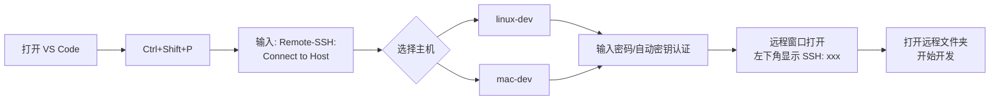

1. 打开 VS Code
2. `Ctrl+Shift+P` → 输入 `Remote-SSH: Connect to Host`
3. 选择 `linux-dev` 或 `mac-dev`
4. 首次连接会在远程安装 VS Code Server（自动完成）
5. 左下角显示绿色连接标识即为成功

### 推荐扩展

在远程端安装以下扩展（会自动装在远程机器上）：

- 语言相关扩展（Python、Go、Rust 等）
- GitLens
- 项目相关的 Linter / Formatter

---

## 高级配置

### 1. Tailscale SSH（免 SSH 密钥管理）

Tailscale 提供内置 SSH 功能，无需管理 `authorized_keys`：

```bash
# Linux 后端启用 Tailscale SSH
sudo tailscale up --ssh

# Mac 后端（需 CLI 版本）
tailscale up --ssh
```

在 [Tailscale Admin Console](https://login.tailscale.com/admin/acls) 中配置 ACL：

```json
{
  "ssh": [
    {
      "action": "accept",
      "src": ["autogroup:members"],
      "dst": ["autogroup:self"],
      "users": ["autogroup:nonroot", "root"]
    }
  ]
}
```

VS Code SSH Config 中使用 `ProxyCommand`：

```ssh-config
Host linux-dev-ts
    HostName linux-dev
    ProxyCommand tailscale ssh --proxy %h
    User your-username
```

### 2. 子网路由（访问后端局域网其他设备）

```bash
# 在 Linux 后端开启子网路由
sudo tailscale up --advertise-routes=192.168.1.0/24

# 在 Tailscale Admin Console 中批准路由
```

### 3. Exit Node（通过后端上网）

```bash
# 将后端设为出口节点
sudo tailscale up --advertise-exit-node

# Windows 端使用出口节点
tailscale up --exit-node=linux-dev
```

### 4. MagicDNS 自定义

在 Admin Console 中可启用 MagicDNS，之后可用主机名代替 IP：

```ssh-config
Host linux-dev
    HostName linux-dev.tailnet-xxxx.ts.net
    User your-username
```

---

## 故障排查

### 排查流程

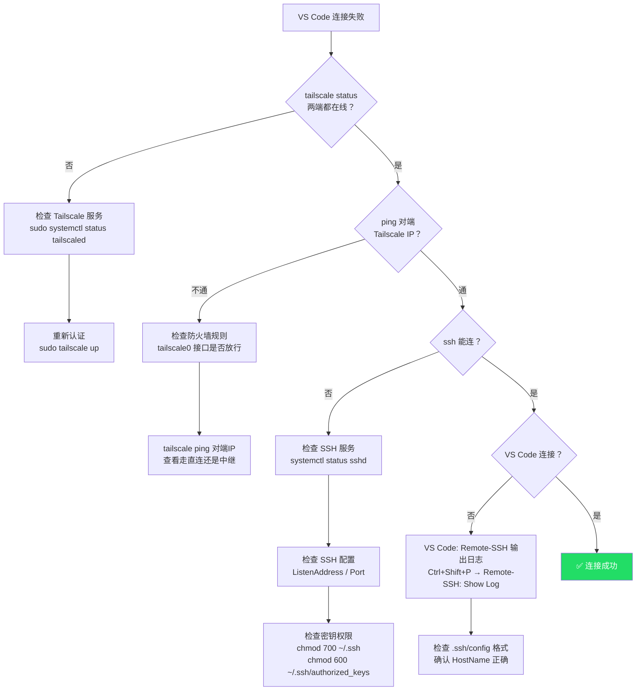

### 常见问题

| 问题 | 原因 | 解决方案 |
|------|------|---------|
| `tailscale up` 无响应 | 服务未启动 | `sudo systemctl start tailscaled` |
| ping 不通 | 防火墙阻止 | 放行 `tailscale0` 接口 |
| SSH 拒绝连接 | SSH 未运行或未监听 | 启动 sshd，检查 `ListenAddress` |
| SSH 密码被拒 | 密钥未配置 | 检查 `authorized_keys` 和文件权限 |
| VS Code 卡在连接 | VS Code Server 下载慢 | 后端手动下载 VS Code Server 或配置代理 |
| 连接频繁断开 | 网络不稳 | 增大 `ServerAliveInterval`；检查 `tailscale ping` 延迟 |
| Mac 休眠后断连 | 节能设置 | `sudo pmset -c sleep 0`；开启网络唤醒 |

### 诊断命令速查

```bash
# 查看 Tailscale 连接详情（直连 vs 中继）
tailscale ping <对端IP>
# pong from linux-dev (100.64.0.2) via 1.2.3.4:41641 in 12ms  ← P2P 直连
# pong from linux-dev (100.64.0.2) via DERP(tok) in 45ms       ← 走东京中继

# 查看网络路径详情
tailscale netcheck

# 查看调试信息
tailscale debug netmap

# SSH 调试模式
ssh -vvv linux-dev
```

---

## 安全加固

### 整体安全架构

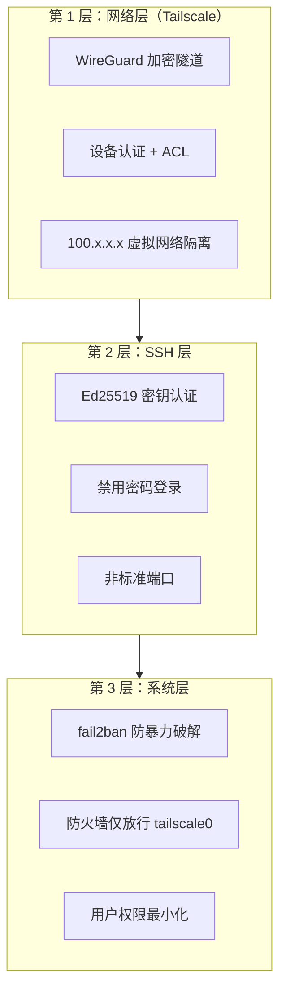

### SSH 安全配置（后端）

编辑 `/etc/ssh/sshd_config`：

```bash
# 禁用密码登录，仅允许密钥
PasswordAuthentication no
PubkeyAuthentication yes

# 禁用 root 登录
PermitRootLogin no

# 限制登录用户
AllowUsers your-username

# 可选：修改默认端口
Port 2222

# 限制认证尝试次数
MaxAuthTries 3

# 空闲超时断开
ClientAliveInterval 300
ClientAliveCountMax 2
```

重启 SSH 服务：

```bash
# Linux
sudo systemctl restart sshd

# macOS
sudo launchctl unload /System/Library/LaunchDaemons/ssh.plist
sudo launchctl load -w /System/Library/LaunchDaemons/ssh.plist
```

### Tailscale ACL 配置

在 [Admin Console → Access Controls](https://login.tailscale.com/admin/acls) 中配置最小权限：

```json
{
  "acls": [
    {
      "action": "accept",
      "src": ["user@github"],
      "dst": ["tag:dev:22"]
    }
  ],
  "tagOwners": {
    "tag:dev": ["user@github"]
  }
}
```

### 安装 fail2ban（Linux 后端）

```bash
sudo apt install -y fail2ban

sudo tee /etc/fail2ban/jail.local << 'EOF'
[sshd]
enabled = true
port = ssh
filter = sshd
logpath = /var/log/auth.log
maxretry = 3
bantime = 3600
findtime = 600
EOF

sudo systemctl enable --now fail2ban
```

---

## 附录：与其他方案对比

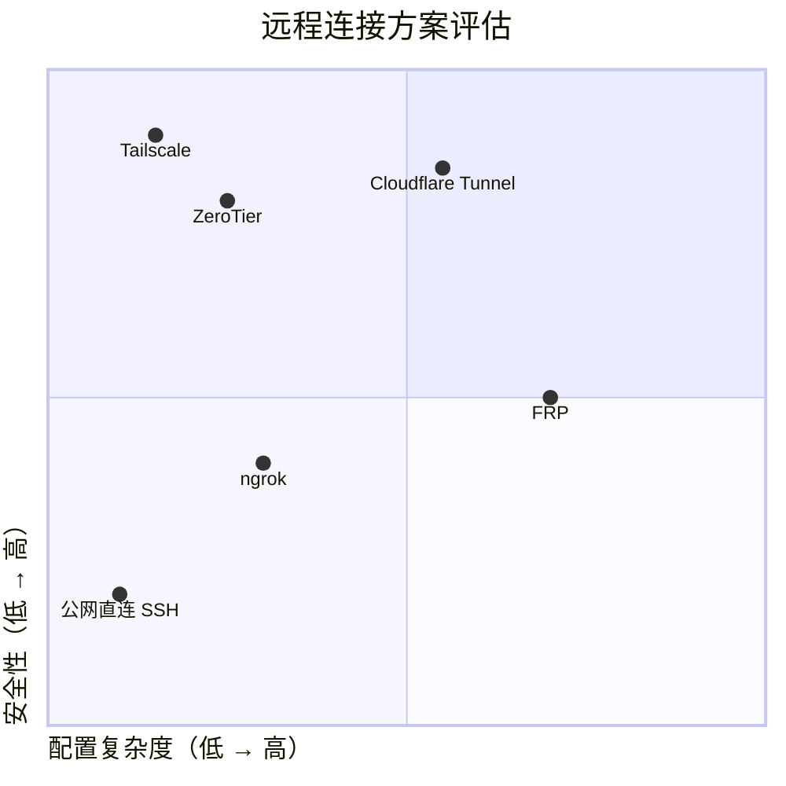

| 维度 | Tailscale | ZeroTier | Cloudflare Tunnel | FRP | ngrok |
|------|-----------|----------|-------------------|-----|-------|
| **需要服务器** | 否 | 否 | 否（需域名） | 是（VPS） | 否 |
| **配置难度** | 极低 | 低 | 中 | 中 | 低 |
| **安全性** | WireGuard E2E | 自定义加密 | TLS | 依赖配置 | TLS |
| **延迟** | 低（P2P 直连） | 低 | 中 | 中-高 | 中 |
| **免费额度** | 100 设备 | 25 设备 | 无限隧道 | 自建 | 1 隧道 |
| **稳定性** | 高 | 高 | 高 | 依赖 VPS | 中（免费版） |
| **中国可用性** | 需确认 | 需确认 | 需域名备案 | VPS 可控 | 可能被封 |

---

> **最后更新**：2026-03-30
>
> **适用场景**：Windows ↔ Linux/Mac 跨网络远程开发
>
> **Tailscale 版本**：1.76+
