# WSS 隧道代理方案 — 详细设计文档

## 1. 问题背景

```
Windows (有网络) ──SSH──→ Linux (网络隔离)
```

- Windows 通过 VSCode Remote SSH 连接 Linux
- Linux 无法直接访问外部网络
- Linux 上的应用（curl、Chrome、Java 等）需要借助 Windows 网络访问外部服务

### 现有方案的问题

现有方案使用 SSH 反向隧道（`ssh -R`）+ Python 正向代理，功能完整但存在安全扫描风险：

| 风险点 | 说明 |
|--------|------|
| SSH 隧道特征 | `AllowTcpForwarding` 痕迹、`ss -tlnp` 可见隧道端口 |
| 端口扫描暴露 | 监听端口返回 HTTP 代理响应，特征明显 |
| 流量可分析 | 明文 HTTP 代理流量，深度包检测可识别 |

### 设计目标

| 目标 | 要求 |
|------|------|
| 功能等价 | 所有 HTTP/HTTPS 请求统一走代理出网，零代码改动 |
| 端口扫描隐蔽 | 扫描器看到的是普通 HTTPS 服务（TLS 握手 + 网页响应） |
| 流量不可分析 | TLS 加密，深度包检测无法识别隧道流量 |
| 无 SSH 依赖 | 不使用 `ssh -R`，无 SSH 隧道特征 |
| 部署简单 | 纯 Python，仅依赖 `websockets` 库 |

---

## 2. 方案架构

### 2.1 整体拓扑

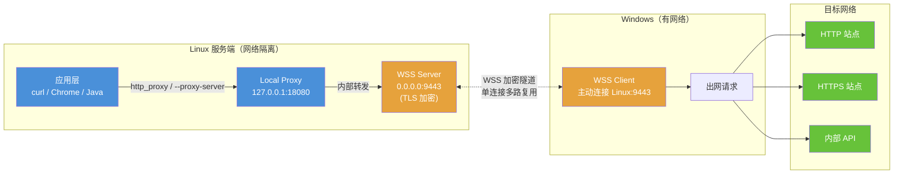

### 2.2 核心角色

| 组件 | 运行位置 | 监听地址 | 职责 |
|------|----------|----------|------|
| **WSS Server** | Linux | `0.0.0.0:9443` | TLS 加密端点；接受 Windows 客户端连接；对普通访问返回伪装网页 |
| **Local Proxy** | Linux | `127.0.0.1:18080` | HTTP/HTTPS 代理入口；应用层统一配置此地址 |
| **WSS Client** | Windows | — (主动连接) | 连接 Linux WSS Server；接收代理请求并执行出网 |

### 2.3 与现有方案对比

| | SSH -R + proxy_server.py | WSS 隧道方案 |
|---|---|---|
| 依赖 SSH 隧道 | 是（`ssh -R`） | **否** |
| 端口扫描特征 | HTTP 代理响应 | **TLS/HTTPS 网页** |
| 流量可分析 | 明文代理流量 | **TLS 加密，不可分析** |
| 连接方向 | Windows → Linux (SSH) | **Windows → Linux (WSS)** |
| 新增端口 | 18080（明文代理） | 9443（TLS）+ 18080（仅 127.0.0.1） |
| 杀软/EDR 风险 | 低 | **低（纯 Python 脚本，合法库）** |

---

## 3. 通信协议

### 3.1 消息格式

WSS 隧道内部使用 JSON 文本消息。每条消息包含 `type` 和 `id` 字段：

```json
{
    "type": "connect",
    "id": "a1b2c3",
    "host": "example.com",
    "port": 443
}
```

### 3.2 消息类型

| type | 方向 | 用途 | 字段 |
|------|------|------|------|
| `connect` | Linux → Windows | 请求建立到目标的 TCP 连接 | `id`, `host`, `port` |
| `connect_ok` | Windows → Linux | 连接目标成功 | `id` |
| `connect_fail` | Windows → Linux | 连接目标失败 | `id`, `error` |
| `data` | 双向 | 传输数据（base64 编码） | `id`, `payload` |
| `close` | 双向 | 关闭某个连接 | `id` |
| `ping` / `pong` | 双向 | 心跳保活 | — |

### 3.3 多路复用

单条 WSS 连接上通过 `id` 字段区分多个并发代理请求：

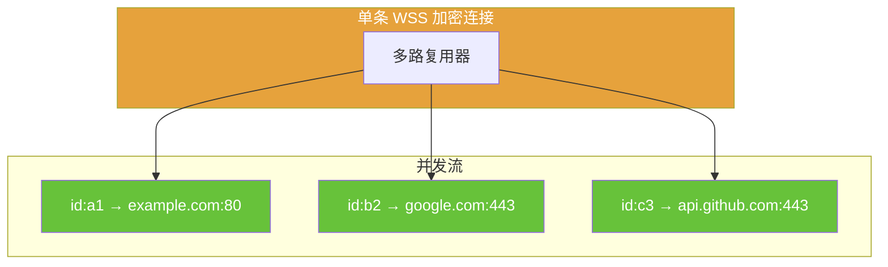

### 3.4 HTTP 请求流程

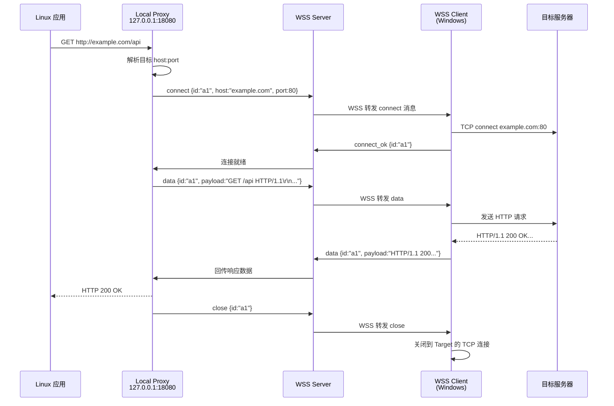

### 3.5 HTTPS CONNECT 隧道流程

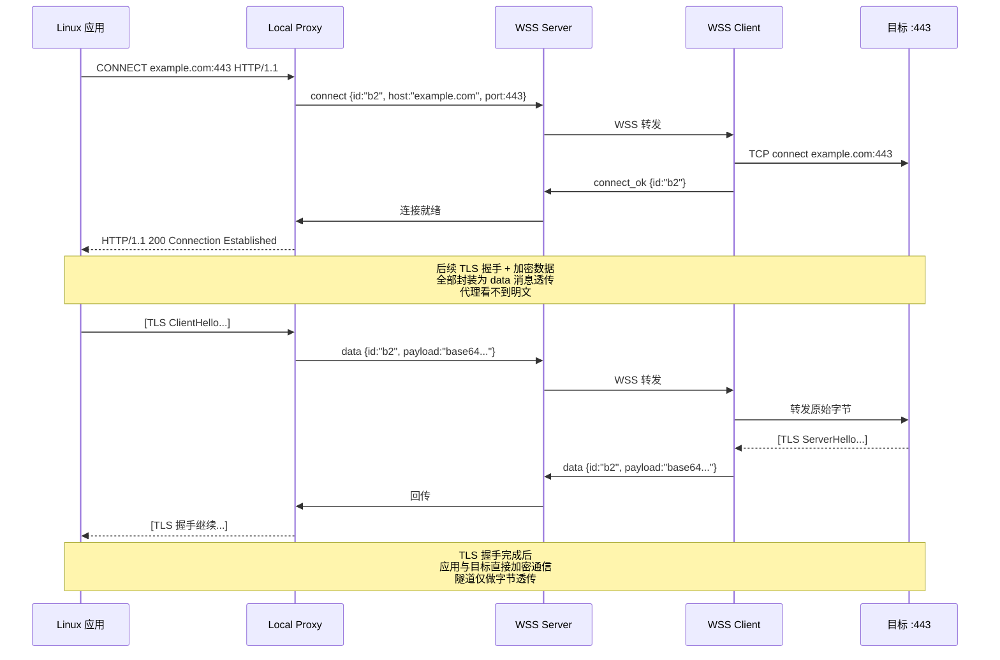

---

## 4. 安全设计

### 4.1 认证与鉴权

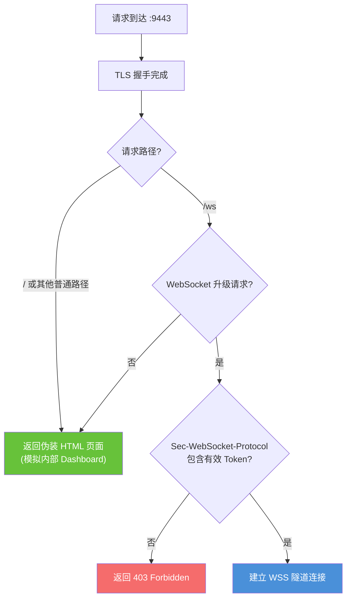

**Token 机制说明：**

- Token 在首次初始化时随机生成（32 字节 hex），存储在配置文件中
- 客户端连接时通过 `Sec-WebSocket-Protocol` 头传递（WS 标准字段，不会引起注意）
- Token 错误直接返回 403，与普通 HTTPS 网站行为一致

### 4.2 TLS 证书管理

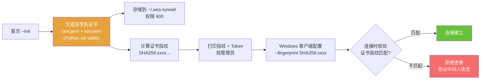

- **不依赖 CA 体系**，通过证书指纹 pinning 验证身份
- 自签证书有效期默认 365 天，可通过 `--init` 重新生成
- 证书文件权限 `600`，仅 owner 可读

### 4.3 伪装策略

当扫描器或浏览器直接访问 `:9443` 时，返回一个静态 HTML 页面：

```
HTTP/1.1 200 OK
Content-Type: text/html; charset=utf-8
Server: nginx/1.24.0

<!DOCTYPE html>
<html>
<head><title>Internal Dashboard</title></head>
<body>
    <h1>System Status</h1>
    <p>All services operational.</p>
    <p>Last updated: 2024-01-15 10:30:00 UTC</p>
</body>
</html>
```

伪装要点：

| 细节 | 实现 |
|------|------|
| Server 头 | 返回 `nginx/1.24.0`，不暴露 Python |
| 响应结构 | 标准 HTML，看起来像内部监控页面 |
| 404 处理 | 未知路径返回标准 404 页面 |
| WS 升级无 Token | 返回 403，和普通网站行为一致 |

### 4.4 安全层级总览

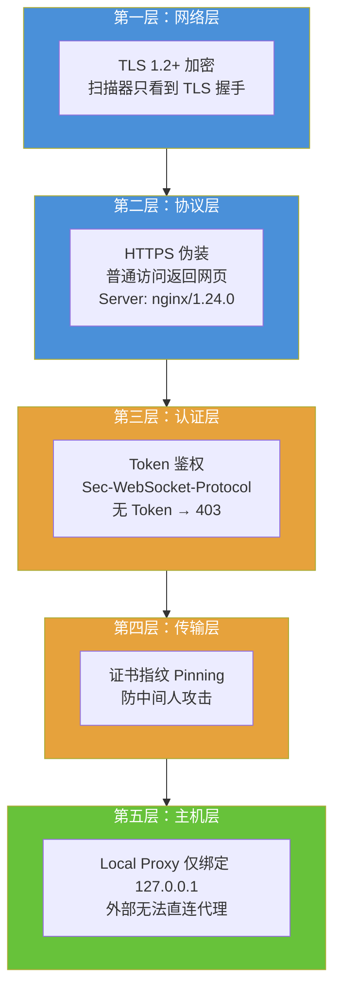

---

## 5. 组件详细设计

### 5.1 文件结构

```
dev_project/proxy-tunnel/
├── proxy-tunnel-guide.md          # 现有文档（SSH 方案）
├── proxy_server.py                # 现有 SSH 方案代理
├── linux-setup.sh                 # 现有 Linux 配置脚本
├── wss-tunnel-design.md           # 本设计文档
│
└── wss-tunnel/                    # WSS 隧道方案
    ├── tunnel_server.py           # Linux 端：WSS Server + Local Proxy
    ├── tunnel_client.py           # Windows 端：WSS Client + 出网执行
    ├── tunnel_common.py           # 共享：消息协议、证书生成、Token 工具
    └── setup_linux.sh             # Linux 端启动辅助脚本
```

### 5.2 tunnel_common.py — 共享模块

**职责**：消息协议、证书工具、Token 管理

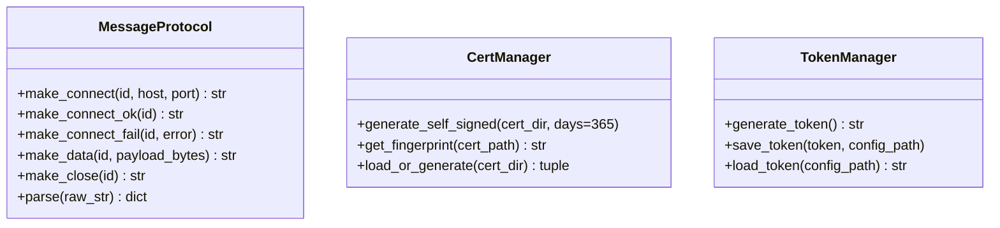

**消息协议详细定义：**

```python
# connect: 请求建立到目标的 TCP 连接
{"type": "connect", "id": "a1b2c3", "host": "example.com", "port": 443}

# connect_ok: 目标连接成功
{"type": "connect_ok", "id": "a1b2c3"}

# connect_fail: 目标连接失败
{"type": "connect_fail", "id": "a1b2c3", "error": "Connection refused"}

# data: 传输数据（base64 编码的原始字节）
{"type": "data", "id": "a1b2c3", "payload": "R0VUIi8gSFRUUC8xLjE..."}

# close: 关闭连接
{"type": "close", "id": "a1b2c3"}
```

**证书生成**（使用 Python ssl stdlib）：

```python
# 基于 ssl 模块生成自签名证书
# 有效期：365 天
# 密钥：RSA 2048
# 存储路径：~/.wss-tunnel/cert.pem, ~/.wss-tunnel/key.pem
# 文件权限：600
```

### 5.3 tunnel_server.py — Linux 端

**职责**：WSS Server（接受 Windows 连接）+ Local Proxy（接受应用代理请求）

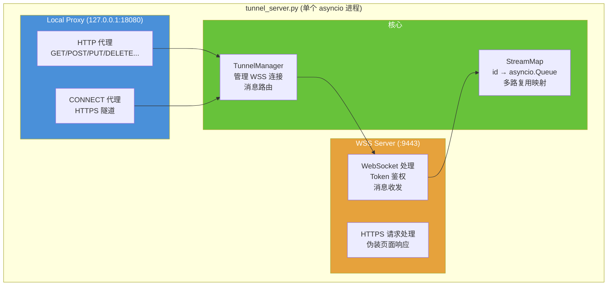

**核心类设计：**

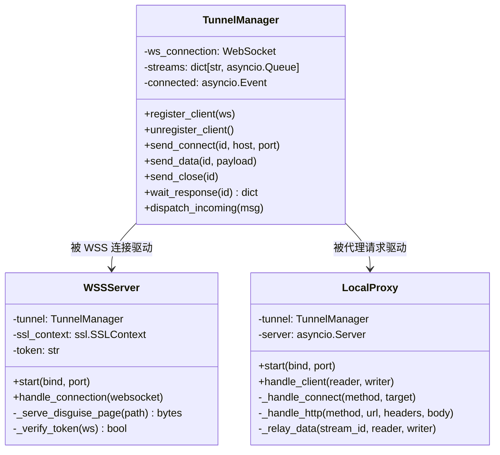

**Local Proxy 处理逻辑：**

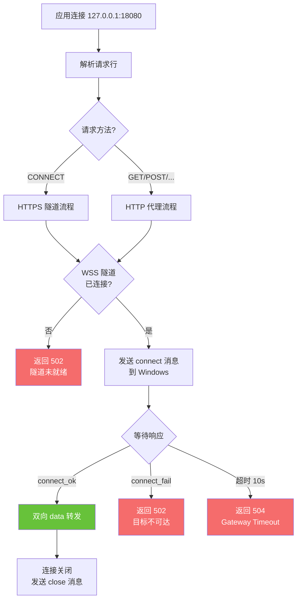

### 5.4 tunnel_client.py — Windows 端

**职责**：WSS Client（连接 Linux）+ 出网执行

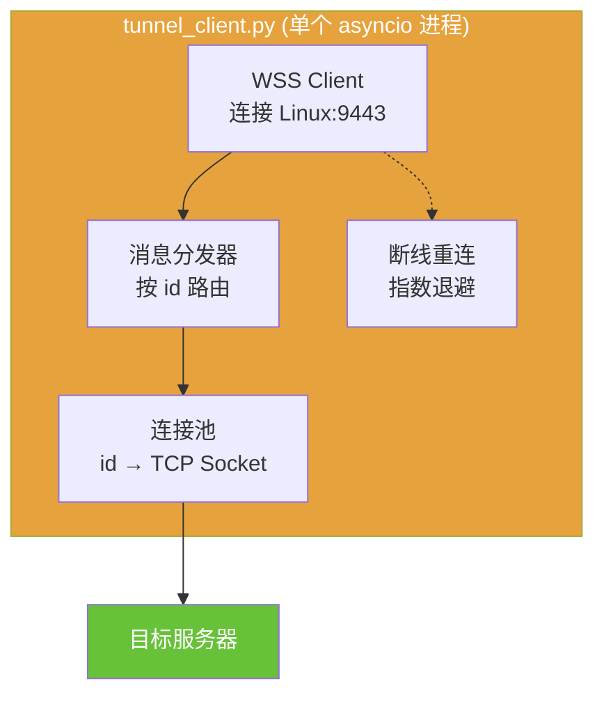

**消息处理逻辑：**

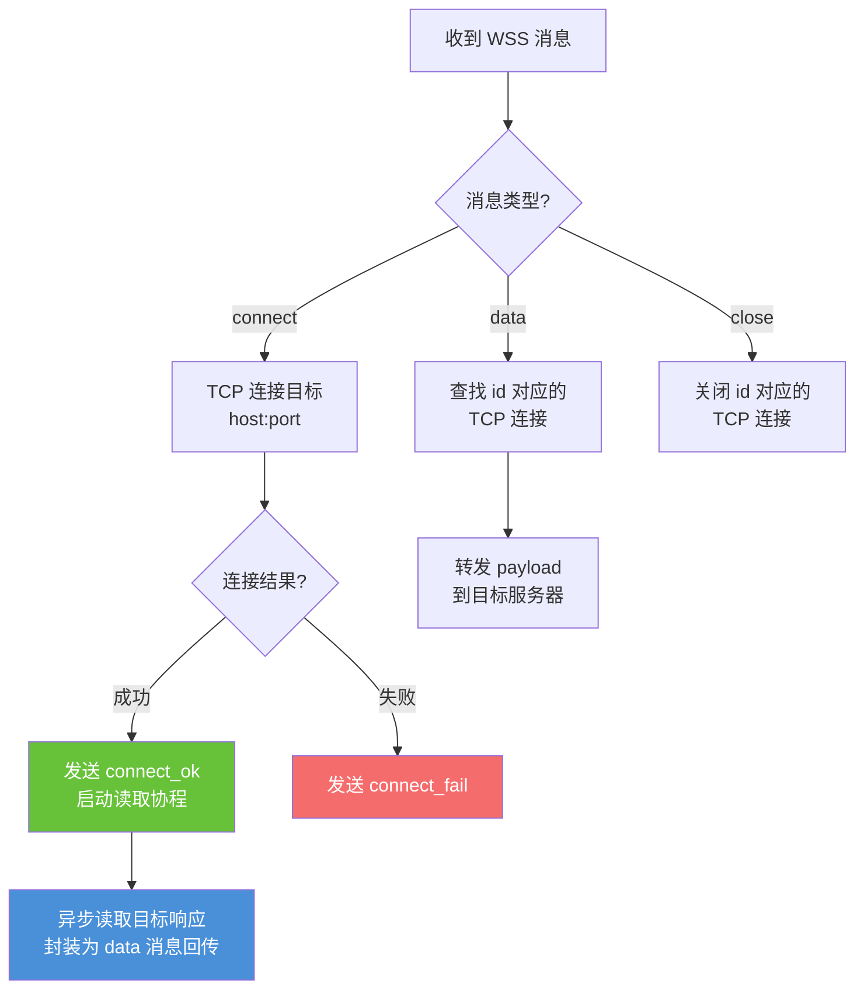

**断线重连策略：**

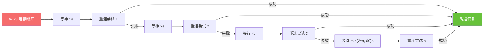

---

## 6. 启动与部署

### 6.1 首次初始化

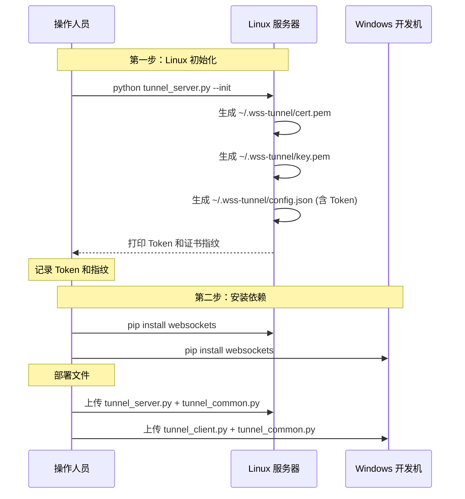

### 6.2 日常使用

```bash
# ===== Linux 端 =====
python tunnel_server.py
# 输出:
# WSS Server listening on 0.0.0.0:9443 (TLS)
# Local Proxy listening on 127.0.0.1:18080
# Waiting for tunnel client...

# ===== Windows 端 =====
python tunnel_client.py --host <linux-ip> --port 9443 \
    --token <token> --fingerprint <SHA256:xxxx>
# 输出:
# Connected to wss://linux-ip:9443/ws
# Tunnel established, ready to relay.

# ===== Linux 端验证 =====
curl -x http://127.0.0.1:18080 http://httpbin.org/ip
curl -x http://127.0.0.1:18080 https://httpbin.org/ip
```

### 6.3 命令行参数

**tunnel_server.py (Linux):**

| 参数 | 默认值 | 说明 |
|------|--------|------|
| `--init` | — | 首次初始化：生成证书和 Token |
| `--wss-port` | 9443 | WSS Server 监听端口 |
| `--wss-bind` | 0.0.0.0 | WSS Server 绑定地址 |
| `--proxy-port` | 18080 | Local Proxy 监听端口 |
| `--proxy-bind` | 127.0.0.1 | Local Proxy 绑定地址（仅本机） |
| `--cert-dir` | ~/.wss-tunnel | 证书和配置存储目录 |

**tunnel_client.py (Windows):**

| 参数 | 默认值 | 说明 |
|------|--------|------|
| `--host` | （必填） | Linux 服务器地址 |
| `--port` | 9443 | WSS Server 端口 |
| `--token` | （必填） | 鉴权 Token |
| `--fingerprint` | （必填） | 证书指纹（SHA256） |
| `--reconnect` | true | 断线自动重连 |
| `--max-retry` | 0 (无限) | 最大重连次数 |

### 6.4 应用配置

应用层配置与现有 SSH 方案**完全一致**，无需改动：

```bash
# 环境变量（curl / wget / pip / npm）
export http_proxy=http://127.0.0.1:18080
export https_proxy=http://127.0.0.1:18080
export no_proxy=localhost,127.0.0.1,::1

# Playwright MCP（Chromium）
--proxy-server http://127.0.0.1:18080

# Java
-Dhttp.proxyHost=127.0.0.1 -Dhttp.proxyPort=18080

# Git
git config --global http.proxy http://127.0.0.1:18080
```

> **注意**：WSS 方案的 Local Proxy 不需要认证（仅绑定 127.0.0.1），所以代理 URL 中无需 `user:pass@`，比 SSH 方案更简洁。

---

## 7. 错误处理

### 7.1 错误场景与处理

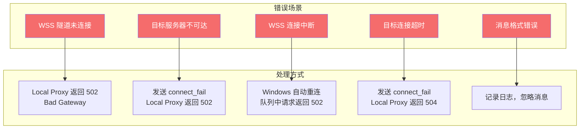

### 7.2 资源清理

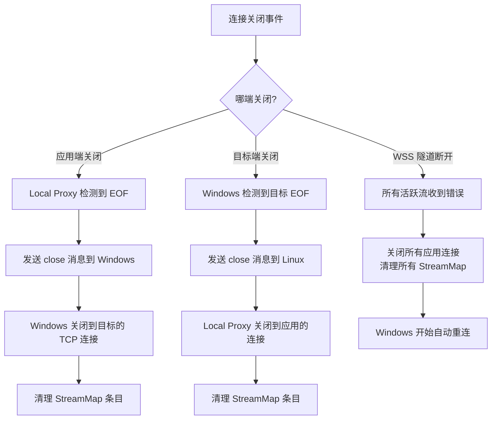

---

## 8. 性能考量

### 8.1 开销分析

| 层 | 开销 | 说明 |
|----|------|------|
| TLS 加密 | ~5% CPU | 仅握手阶段较重，后续对称加密开销小 |
| JSON 消息解析 | ~1% | 消息头很小，payload 是 base64 |
| base64 编码 | ~33% 体积膨胀 | 文本 WebSocket 帧的代价 |
| asyncio 调度 | 极低 | 事件驱动，无线程切换开销 |

### 8.2 优化选项

| 优化 | 方式 | 效果 |
|------|------|------|
| 减少体积膨胀 | 使用 binary WebSocket 帧代替 text | payload 无需 base64，体积 -33% |
| 大文件传输 | 分片发送，避免单帧过大 | 降低内存峰值 |
| 并发连接 | asyncio 天然支持数千并发 | 无需线程池 |

> 对于日常开发使用场景（curl、浏览器、API 调用），性能开销可忽略不计。

---

## 9. 故障排查

### 9.1 排查流程图

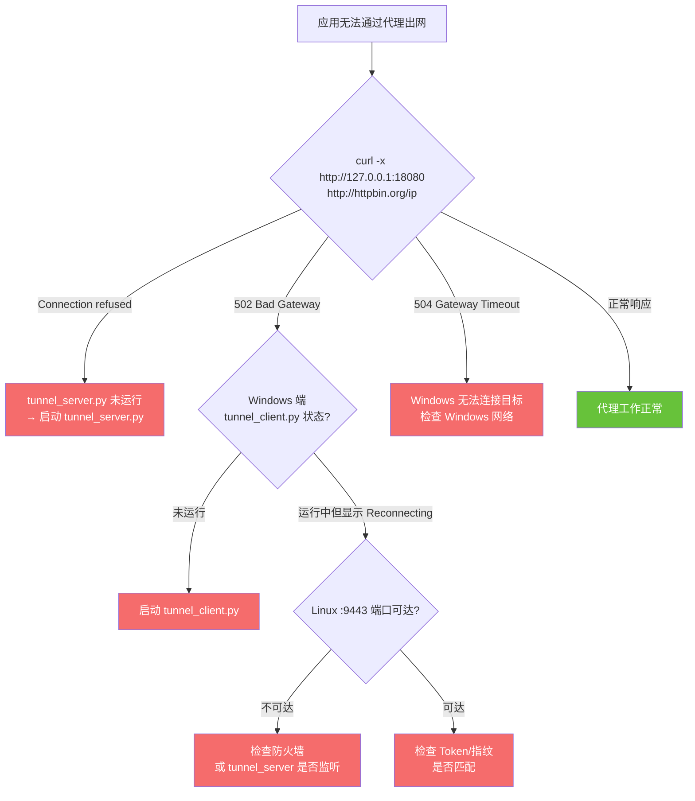

### 9.2 常用诊断命令

```bash
# Linux 端 —— 检查服务是否在运行
ps aux | grep tunnel_server

# Linux 端 —— 检查 WSS 端口
nc -z 127.0.0.1 9443 -w 3 && echo "WSS OK" || echo "WSS FAIL"

# Linux 端 —— 检查代理端口
nc -z 127.0.0.1 18080 -w 3 && echo "Proxy OK" || echo "Proxy FAIL"

# Linux 端 —— 测试伪装页面（应该看到 HTML）
curl -k https://127.0.0.1:9443/

# Linux 端 —— 测试代理
curl -x http://127.0.0.1:18080 http://httpbin.org/ip
curl -x http://127.0.0.1:18080 https://httpbin.org/ip

# Windows 端 —— 检查到 Linux 的连通性
Test-NetConnection -ComputerName <linux-ip> -Port 9443
```

---

## 10. 安全总览

| 威胁 | 缓解措施 |
|------|----------|
| 端口扫描发现代理 | TLS 加密 + 伪装 HTML 页面 + `Server: nginx/1.24.0` |
| 流量深度分析 | TLS 加密，内部协议不可见 |
| SSH 隧道特征检测 | 完全不使用 SSH 隧道 |
| 中间人攻击 | 证书指纹 pinning |
| 未授权使用隧道 | Token 鉴权 + TLS 双向加密 |
| 本地代理被滥用 | 绑定 `127.0.0.1`，仅本机可达 |
| Token 泄露 | 存储在 `~/.wss-tunnel/config.json`，权限 600 |
| 杀软/EDR 误报 | 纯 Python 脚本运行，不打包 exe；合法 PyPI 库 |

---

## 11. 快速参考

```bash
# ===== 首次部署 =====

# Linux: 初始化证书和 Token
python tunnel_server.py --init
# → 记录输出的 Token 和 Fingerprint

# 安装依赖（两端）
pip install websockets

# ===== 日常使用 =====

# Linux: 启动服务
python tunnel_server.py

# Windows: 连接隧道
python tunnel_client.py --host <linux-ip> --token <token> --fingerprint <fingerprint>

# Linux: 配置代理
export http_proxy=http://127.0.0.1:18080
export https_proxy=http://127.0.0.1:18080
export no_proxy=localhost,127.0.0.1,::1

# Linux: 验证
curl -x http://127.0.0.1:18080 http://httpbin.org/ip
curl -x http://127.0.0.1:18080 https://httpbin.org/ip
```
